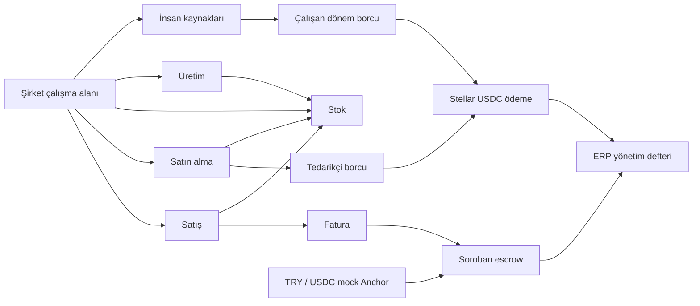

# Centerp — güncel ürün kapsamı

> 18 Eylül 2026 kullanıcı düzeltmesi: Ana ürün şirketin ERP çalışma alanıdır. Stellar, bu ERP'nin ödeme, escrow ve mutabakat altyapısıdır. Önceki Invoice Bridge uygulaması finans modülü olarak korunmuştur.

## 1. Ürün neyi çözüyor?

İşletmede müşteri siparişi, üretim, stok, tedarikçi borcu, çalışan ödeme planı ve tahsilat farklı kayıtlarda kopuk durmasın. Ortak şirket ve iş kaydı üzerinden bütün temel modüller birbirini beslesin. Para hareketi gerektiğinde şirketin cüzdanı Stellar Testnet ile işlemi imzalasın; doğrulanmış sonuç ERP'ye geri dönsün.

Hackathon prototipi bu modeli küçük ve çalışan bir ERP olarak gösterir. SAP/Logo düzeyinde bütün kurumsal fonksiyonları kapsama iddiası yoktur. Modüller sadece görsel menü değildir: satış siparişi gerçek fatura bağlantısı, satın alma gerçek stok girişi, üretim gerçek stok tüketimi, personel gerçek dönem borcu ve ödeme bağlantısı oluşturur.

## 2. Modüller ve bağlantıları

| Modül | Mevcut çalışan davranış | Stellar bağlantısı |
|---|---|---|
| Şirket profili | Şirket adı, ortak çalışma alanı, tarayıcı oturumu | İmzalı cüzdan oturumu ile şirket cüzdanı eşleştirme |
| Müşteri/tedarikçi | Tür, ad, iletişim, public key ekleme ve düzenleme | Fatura müşterisi veya USDC ödeme alıcısı |
| Satış | Çok kalemli sipariş, sunucuda hassas toplam, ayrı sevkiyat ve finans durumu | Sipariş toplamı ve müşteri key'i sabitlenerek Soroban faturası |
| Satın alma | Tedarikçi siparişi, mal kabulü, stoğa giriş, ödeme yükümlülüğü | Kaynak satın alma kaydına bağlı exact-amount USDC ödeme |
| Stok/depo | SKU, hammadde/mamul, miktar, sipariş seviyesi, stok hareket defteri | Para hareketi stok işlemini otomatik yapmaz; ortak kaynak ID ile ilişki kurulur |
| Üretim | Çıktı miktarı, çok girdili birim reçete, plan/tamamlama | Üretim sonucu satış ve teslim sürecini besler; üretim verisi on-chain'e taşınmaz |
| İnsan kaynakları | Çalışan, departman, görev, USDC referans ödeme planı | Çalışan + dönem borcuna bağlı USDC transferi |
| Muhasebe/finans | Borç/alacak eşit tutarlı yönetim kayıtları; işlem kaynağı ve varsa hash | Create/fund/release/refund ve USDC ödeme sonuçlarının yönetim defterine aktarımı |
| Stellar finansı | Freighter, bakiye, trustline, invoice, escrow, Anchor, işlem defteri | Gerçek Stellar Testnet işlemleri; TRY/banka/KYC mock |

## 3. Ana iş akışları

### Satıştan tahsilata

1. Müşteri public key'i ve ürün kayıtları oluşturulur.
2. Satış siparişinde ürün, adet ve USDC birim referans fiyatları belirlenir.
3. Sipariş toplamı sunucuda decimal aritmetiğiyle hesaplanır.
4. Şirketin doğrulanmış cüzdanıyla `Stellar ile faturala` seçilir.
5. Backend şirket, sipariş sahipliği, toplam, müşteri key'i ve henüz başka faturaya bağlanmamış olma koşullarını kontrol eder.
6. Fatura taahhüdüne ERP sipariş ID'si ve ürün kalemlerinin snapshot'ı da eklenir.
7. On-chain create doğrulanınca sipariş faturalanır; müşteri alacağı/satış geliri kaydı oluşur.
8. Müşteri Anchor üzerinden TRY simülasyonu ile USDC alabilir.
9. Fund doğrulanınca müşteri alacağı escrow alacağına dönüşür. Şirket henüz tahsilat yapmamıştır.
10. Sevkiyat ERP'de yapılınca stok düşer. **Bu adım escrow'u serbest bırakmaz.**
11. Müşteri teslimatı onaylayınca on-chain release satıcıya USDC aktarır.
12. Doğrulanmış release siparişi tahsil edildi yapar; USDC cüzdanı/escrow alacağı kaydı oluşur.

### Satın almadan tedarikçi ödemesine

1. Tedarikçi ve ürün seçilerek çok kalemli satın alma siparişi açılır.
2. Mal kabulü stok miktarını artırır, tedarikçi borcu oluşturur ve stok/tedarikçi borçları yönetim kaydı atar.
3. Aynı sipariş ikinci kez kabul edilemez.
4. Finans modülü tutarı ve alıcı public key'ini ERP kaydından alır; frontend'den serbest destination/tutar kabul etmez.
5. Şirket cüzdanı Memo.text(ERP ödeme kodu) ile USDC transferini imzalar.
6. Horizon sonucu başarılıysa borç `paid` olur ve hash saklanır.
7. Tekrar ödeme hazırlığı reddedilir. Belirsiz ağ sonucu borcu ödenmiş saymaz.

### Üretimden stoğa

1. İş emrinde çıktı ürünü, adet ve bir çıktı için gereken girdiler kaydedilir.
2. Planlama sırasında stok tüketilmez veya rezerve edilmez.
3. Tamamlama bütün girdilerin mevcut stoklarını kontrol eder.
4. Tüketim hareketleri, çıktı hareketi ve iş emri durumu tek SQLite transaction'ında yazılır.
5. Sonraki bir girdide stok yetersizse önceki tüketimler de geri alınır.
6. Tamamlanmış iş emri tekrar tamamlanamaz.
7. Üretilen stok satış sevkiyatında kullanılabilir.

### Çalışandan dönemlik ödemeye

1. Çalışan adı, görev, departman, aylık USDC referans tutarı ve alıcı key'i kaydedilir.
2. Dönem seçildiğinde her çalışan için bir ödeme yükümlülüğü oluşturulur.
3. Aynı çalışan + ay yeniden borçlandırılmaz; daha sonra eklenen çalışan için o ayın eksik kaydı eklenebilir.
4. Dönem borcu tutarı snapshot'tır; çalışanın ödeme planı değişse bile geçmiş borç değişmez.
5. Şirket cüzdanı finans modülünden bireysel USDC ödemesini imzalar.
6. Zincir başarısı sonrası borç ve muhasebe kaydı güncellenir.

Bu özellik bir **ödeme planıdır**; resmi bordro, SGK, stopaj, net/brüt ücret, izin veya yan hak hesabı yapmaz.

## 4. Veriler nerede tutuluyor?

Normal ERP verileri SQLite'dadır: şirket, iş ortağı iletişimi, çalışan/görev, reçete, stok, sipariş ve yönetim kayıtları.

Zincirde public key'ler, USDC tutarları, escrow fatura taahhüdü/durumları ve ödeme işlemleri bulunur. İletişim bilgileri ve çalışanın İK dosyası blockchain'e yazılmaz. Tedarikçi/çalışan ödemelerinde kısa ERP ödeme kodu memo'ya girer; kişi adı, departman veya aylık ödeme dönemi memo'ya yazılmaz.

## 5. Şirket kimliği ile cüzdan kimliği farklı

ERP çalışma alanı `erp_workspace` HttpOnly/SameSite cookie'sindeki güçlü rastgele bearer token ile açılır; veritabanında token hash'i saklanır. Her tarayıcı oturumu ayrı bir şirket alanı görür. Referansla başka şirketin ürününe, siparişine veya çalışanına yazma engellenir.

Stellar yetkisi ayrıca `bridge_session` ile doğrulanır. Şirket cüzdanını eşleştirmek ve para transferi hazırlamak için gerçek imzalı cüzdan oturumu gerekir. ERP cookie'si tek başına Stellar para hareketi yetkisi vermez.

Bu model **yerel hackathon prototipine** uygundur; üyelik/davet, RBAC, şirket sahibi kurtarma akışı ve çok çalışanlı enterprise kimlik yönetimi yoktur. Tarayıcı cookie'si kaybedilirse aynı ERP çalışma alanına self-service giriş şu an bulunmaz. Yeni profil ayrı şirket oluşturur. Müşteri, finans modülünden kendisine ait Stellar faturalarını görebilir; satıcının ERP operasyon verilerini göremez.

## 6. Muhasebe kayıtları

| Olay | Borç hesabı | Alacak hesabı |
|---|---|---|
| Mal kabulü | Stok | Tedarikçi borçları |
| Çalışan dönem tahakkuku | Personel giderleri | Çalışan borçları |
| Doğrulanmış satış faturası | Müşteri alacakları | Satış gelirleri |
| Doğrulanmış escrow fund | Escrow alacakları | Müşteri alacakları |
| Doğrulanmış release | USDC cüzdanı | Escrow alacakları |
| Doğrulanmış refund | Müşteri alacakları | Escrow alacakları |
| Refund satış kapatma | Satış gelirleri | Müşteri alacakları |
| Ödenmeden iptal/vade kapatma | Satış gelirleri | Müşteri alacakları |
| Doğrulanmış tedarikçi ödemesi | Tedarikçi borçları | USDC cüzdanı |
| Doğrulanmış çalışan ödemesi | Çalışan borçları | USDC cüzdanı |

Kayıt kimliği şirket + kaynak + olaydan türetilir; aynı doğrulama tekrarlandığında ikinci fiş oluşmaz. Tüm tutarlar USDC referansındadır. TRY kur farkı, Anchor komisyon muhasebesi, stok değerleme, COGS, vergi ve yasal hesap planı yoktur. Bu defter banka ekstresi veya yasal bilanço yerine kullanılmaz. Fiziksel iade stok hareketi bu sürümde ayrıca desteklenmediği için escrow iadesi stok miktarını otomatik geri artırmaz.

## 7. Örnek veriler ve doğruluk

Örnek kayıtlar yalnızca boş workspace'te kullanıcının seçimiyle eklenir. Kayıt adlarında örnek/demo işareti ve workspace'te uyarı vardır. Örnek veri yüklemek ödeme, on-chain fatura, tahsilat, başarılı chain operation veya transaction hash oluşturmaz.

Örnek sipariş tutarı operasyon referansıdır; doğrulanmış Stellar tahsilatı ayrı kartta gösterilir. Kaydedilmemiş veya doğrulanmamış para hareketi başarı gibi sunulmaz.

## 8. Doğrulama ve kanıt

`npm test`: 11 TypeScript testi; şirket izolasyonu, decimal aritmetiği, imzalı oturum, DB, mal kabulü, atomik sevkiyat/üretim, dönem borcu tekilliği, ERP fatura ve ödeme eşleşmesi.

`npm run contract:test`: mevcut escrow için 6 Rust testi.

`npm run test:erp`: iki yeni geçici Testnet hesabıyla ERP → Stellar uçtan uca test.

18 Eylül 2026 test sonucu:
- Satın alma kabul edildi; stok ve tedarikçi borcu oluştu.
- Üretim girdileri tüketildi, üç mamul üretildi.
- Üç USDC'lik satış siparişi doğru tutarla faturalandı; farklı tutarlı giriş reddedildi.
- TRY banka simülasyonu ve escrow fund tamamlandı.
- ERP sevkiyatının fonu serbest bırakmadığı doğrulandı.
- Müşteri release yaptı; ERP siparişi tahsil edildi.
- Bir USDC tedarikçi borcu ve 0,5 USDC çalışan borcu gerçek Testnet işlemleriyle ödendi.
- Yinelenen mal kabulü, dönem borcu, yetkisiz ve tekrar ödeme reddedildi.
- Yedi kaynak bağlantılı yönetim kaydı oluştu.

Public kanıt: [artifacts/erp-testnet-proof.json](artifacts/erp-testnet-proof.json).

## 9. Sonraki kapsam

Öncelik sırasıyla: şirket üyeliği ve rol yetkisi, session kurtarma, business audit log, satış/tedarik onay adımları, fiziksel iade, kısmi teslimat, lot/seri/depo, maliyetlendirme, gerçek ERP adapter'ı ve export. Bunlar mevcut hackathon prototipinde tamamlanmış özellik gibi sunulmaz.

Stellar kısmında: gönderim journal'ı, webhook/worker ile arka planda mutabakat, çok imzalı şirket hesabı, toplu ödeme, fee sponsorship ve ileride gerçek anchor entegrasyonu. Şimdiki ağ yalnızca Testnet'tir.
