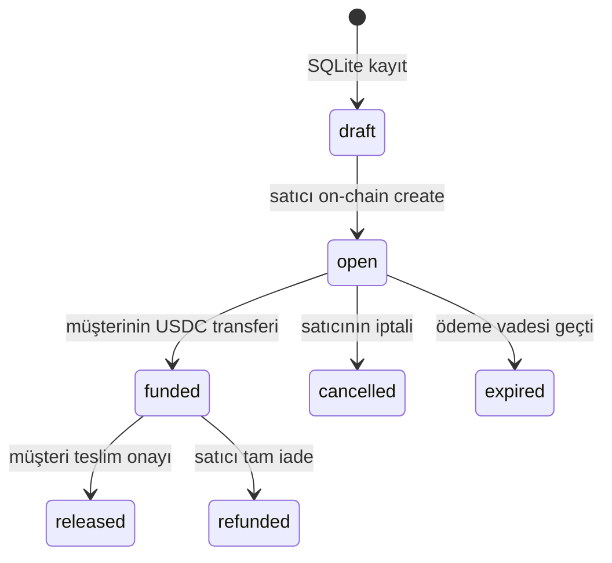
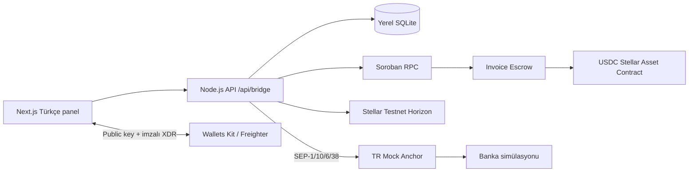

# StellarPay ERP

Ana ürün şirketin ERP çalışma alanıdır: müşteri/tedarikçi, satış, satın alma, stok, üretim, insan kaynakları ve muhasebe aynı kaydı paylaşır. Stellar bu ERP’nin ödeme, escrow ve mutabakat altyapısıdır. Fatura → TRY banka simülasyonu → USDC → Soroban escrow → teslim onayı → tahsilat → TRY çekim akışı finans modülündedir. Rise In × Stellar Pro Hackathon 2026 Genesis Track için geliştirilen **yalnızca Testnet** uygulaması.

Profesyonel Türkçe panel, açık/koyu tema ve mobil görünüm içerir. Banka ve KYC mock’tur; USDC transferleri ve escrow gerçek Stellar Testnet üzerinde çalışır. Secret key hiçbir zaman frontend’e veya uygulama sunucusuna kullanıcı tarafından gönderilmez. İşlemler Freighter’da imzalanır.

## ERP modülleri ve Stellar bağlantısı

Ana panel `/`, Stellar finans modülü `/finance` adresindedir. ERP iş verileri şirket cookie’siyle ayrılır; para hareketleri ayrıca Freighter imzası ister.

- **Satış:** Çok kalemli sipariş → aynı tutarlı Stellar faturası → escrow → teslim onayı → yönetim muhasebesi kaydı. Sipariş toplamı veya müşteri key’i frontend’de değiştirilemez.
- **Satın alma:** Mal kabulü stoğu ve tedarikçi borcunu birlikte oluşturur. Finans modülündeki gerçek USDC ödemesi doğrulanınca borç kapanır.
- **Stok/üretim:** SKU, yeniden sipariş seviyesi, hareketler ve çok girdili reçete. Tamamlama/sevkiyat atomiktir; yetersiz stokta hiçbir hareket kalmaz.
- **İnsan kaynakları:** Çalışan, departman, görev ve dönemlik USDC ödeme planı. Aynı çalışan/ay için ikinci borç engellenir; gerçek ödeme ilgili kayıtla eşleşir.
- **Muhasebe:** İş kaynağı ve zincir hash’i bağlı basit borç/alacak yönetim kayıtları. Resmi muhasebe, vergi ve bordro motoru içermez.

İlk açılışta boş şirket alanı oluşturulur. **Örnek operasyon verilerini yükle** ile müşteri, tedarikçi, ürün ve çalışan örnekleri eklenebilir. Örnek veri ödeme/tahsilat oluşturmaz ve açıkça işaretlenir. Kayıtların cüzdan alanına gerçek Testnet public key’i ekleyip şirket cüzdanını finans modülünde eşleştirin.

[ERP ürün kapsamı ve mimarisi](ERP_PROJE_KAPSAMI.md) güncel ürün tanımıdır. [Arayüz renk sistemi ve araştırması](docs/UI_DESIGN_SYSTEM.md) kırmızı paletin tokenlarını, semantik rollerini ve kaynaklarını açıklar. Önceki kapsamlı Invoice Bridge araştırması finans modülünün teknik referansı olarak korunmuştur.

**ERP–Stellar doğrulaması:** `npm run test:erp` gerçek Testnet’te geçti. Satın alma → üretim → satış faturası → escrow tahsilatı → tedarikçi ve çalışan ödemesi → yedi muhasebe kaydı doğrulandı. [ERP Testnet kanıtı](artifacts/erp-testnet-proof.json).

## Kurulum ve çalıştırma

Node.js **24+** gerekir; kalıcı kayıtlar yerel `node:sqlite` veritabanında tutulur.

```sh
npm ci
cp .env.example .env.local
npm run dev
```

Panel: **http://127.0.0.1:3000**. Freighter uzantısını kurup ağı **Testnet** olarak seçin. Mevcut `.env.local`, bu çalışma sırasında yapılan Testnet deployment’ının public contract ID’sini içerir. Henüz deployment yoksa fatura taslakları kaydedilir ve on-chain işlemler açıkça bekletilir.

```env
NEXT_PUBLIC_STELLAR_NETWORK=TESTNET
NEXT_PUBLIC_ESCROW_CONTRACT_ID=C...
DATABASE_PATH=./data/bridge.sqlite
APP_ORIGIN=http://127.0.0.1:3000
```

Contract ID public’tir. `NEXT_PUBLIC_STELLAR_NETWORK` yalnızca açıklayıcıdır: uygulamadaki ağ passphrase’i ve servis adresleri Testnet’e sabittir; bu değişkenle Mainnet’e geçilemez.

## Sözleşme derleme ve deployment

Rust stable, `wasm32v1-none` hedefi ve Stellar CLI **28** kullanılır. SDK **28.0.0** sabitlenmiştir. Canlı RPC’nin `getVersionInfo` sonucu 18 Eylül 2026’da protokol **28** olarak doğrulanmıştır. SDK 28’de spec optimizasyonu nedeniyle `stellar contract build` gerekir; doğrudan `cargo build` kullanmayın.

```sh
rustup target add wasm32v1-none
npm run contract:test
npm run contract:build
npm run contract:deploy
```

Bu workspace’te araçlar global ayarlar değiştirilmeden `.toolchain/` içine kuruldu. `scripts/toolchain.sh` bunları varsa otomatik seçer. Başka makinede normal global Rust/CLI kurulumu kullanılır. `.toolchain` Git’e eklenmez.

Deployment script’i geçici bir Testnet hesabını Friendbot ile fonlar, USDC SAC varlığını kontrol eder, Wasm’ı yükler ve sabit token constructor’ıyla escrow’u kurar. Ürettiği private key bellekte kalır ve kaydedilmez. Contract’ta yönetici, upgrade veya fon süpürme yetkisi bulunmaz. Public deployment kanıtı `artifacts/deployment.json` dosyasına yazılır.

**Dikkat:** `contract:deploy`, yeni contract ID’siyle `.env.local` dosyasını yeniden yazar. Mevcut SQLite dosyasındaki eski sözleşmeye ait faturalar taşınmaz. Yeni bir deployment için ayrı `DATABASE_PATH` seçin. Uygulama sunucusunu yeniden başlatın. Testnet reset sonrası sözleşmeyi yeniden deploy edip yeni bir DB ile demo hazırlayın.

## Jüri demosu: ERP'den Stellar'a

1. ERP'de şirket adını belirleyin. Müşteri, tedarikçi, çalışan ve ürünleri ekleyin; ilgili kayıtlara Testnet public key'lerini girin.
2. Finans modülünde şirket cüzdanını bağlayın, imzalı oturumu doğrulayın ve **Şirket cüzdanı olarak bağla** seçeneğiyle eşleştirin. XLM ve USDC trustline'ını hazırlayın.
3. Satın alma siparişi oluşturun ve mal kabulü yapın. Stok artışını, tedarikçi borcunu ve muhasebe kaydını gösterin.
4. Hammadde girdileri ve mamul çıktısıyla üretim iş emri açın. Tamamlayınca tüketim/çıktı stok hareketlerini gösterin.
5. Mamul için satış siparişi açın. **Stellar ile faturala** ile değiştirilemeyen müşteri ve sipariş toplamından faturayı oluşturup imzalayın.
6. Ayrı müşteri profili/cüzdanıyla finans modülünü açın. Anchor'dan TRY banka simülasyonu yapıp USDC alın; faturayı escrow'a ödeyin.
7. Şirket profilinde siparişi sevk edin. Stok düşer; escrow hâlâ fonlanmıştır.
8. Müşteri teslimatı onaylasın. USDC şirket cüzdanına geçsin; ERP satış ve muhasebe kayıtlarında doğrulanmış tahsilatı gösterin.
9. Şirket cüzdanıyla tedarikçi borcunu ödeyin. Çalışan dönem ödeme planı oluşturup onun borcunu da ödeyin. Borçların gerçek Stellar işlem hash'leriyle kapandığını gösterin.

Örnek kayıtlarla başlıyorsanız cüzdan alanları bilinçli olarak boştur; ödeme için gerçek Testnet alıcı key'leri girilmelidir. Aşağıdaki ayrıntılı finans demosu Anchor ve escrow adımlarını açar.

## Ayrıntılı finans demosu: iki cüzdan

Satıcı ve müşteri için iki farklı Freighter hesabı gerekir. Aynı tarayıcıda hesap değiştirirken uygulamadan **Bağlantıyı kes** deyip yeni hesabı yeniden bağlayın. İki tarayıcı profiliyle paralel kullanım daha kolaydır.

1. **Satıcı:** Cüzdan bağla. Oturum kanıtını imzala. TRY ↔ USDC ekranında gerekiyorsa Testnet XLM al ve USDC trustline oluştur.
2. **Satıcı:** Yeni fatura aç. Müşterinin public key’ini, USDC tutarını, açıklamayı, ödeme vadesini ve teslim tarihini gir. Oluşturma işlemini Freighter’da imzala. Fatura `draft → open` olur.
3. **Müşteri:** Cüzdanı bağla. XLM ve USDC trustline’ını hazırla. Anchor’a bağlan; SEP-10 challenge’ını imzala.
4. **Müşteri:** TRY → USDC ekranından örneğin **250 TRY** gir. İlgili faturayı seç. Kilitli kur al ve banka talimatı oluştur.
5. **Müşteri:** İşlem kartındaki **Banka transferini simüle et** düğmesine bas. `completed` durumunu ve USDC bakiyesini bekle. Bu adım faturayı ödemez.
6. **Müşteri:** Faturayı açıp **Escrow’a öde** düğmesine bas. Tutar sözleşmeye gider; fatura `funded` olur. Satıcının bakiyesi henüz artmaz.
7. **Müşteri:** Teslimatı aldıktan sonra **Teslimatı onayla & serbest bırak** düğmesine bas. USDC satıcıya geçer, fatura `released` olur.
8. **Satıcı:** USDC → TRY ekranından çekim başlat. Faturaya bağla, kur al, talimat oluştur. **USDC gönder & imzala** ile Anchor’ın hesap + memo ID talimatına ödeme yap. Anchor tamamlandığında TRY banka çıkışı simüle edilir.
9. **Mutabakat:** Fatura detayında deposit, escrow ve withdraw kanıtlarını, Ödemeler ekranında Stellar hash’lerini göster. Hash linkleri Stellar Expert **Testnet** explorer’ına gider.

## Uygulanan özellikler

| Alan | Davranış |
|---|---|
| Cüzdan | Stellar Wallets Kit’in Freighter modülü; imzadan önce passphrase ve aktif hesap kontrolü |
| Oturum | Tek kullanımlık, 5 dakika geçerli imzalı XDR challenge; 12 saatlik HttpOnly/SameSite cookie |
| Bakiye | Horizon’dan XLM ve **code + issuer** eşleşmeli USDC; Friendbot; gerçek changeTrust işlemi |
| Fatura | Kalıcı SQLite; müşteri ve satıcı aynı kaydı görür; otomatik ID; değişmez SHA-256 taahhüt |
| Anchor | SEP-1 TOML keşfi, signing key/ağ/endpoint/issuer kontrolü, SEP-10 doğrulama ve server-side token |
| Deposit | SEP-38 kilitli kur → SEP-6 deposit-exchange → banka talimatı → simulate-bank-transfer → polling |
| Withdraw | SEP-38 → SEP-6 withdraw-exchange → tam tutar, asset ve Memo.id ile Stellar ödeme → polling |
| Escrow | Gerçek Rust Soroban sözleşmesi: create, fund, release, refund, cancel, expire, get, token |
| Kanıt | İmzalı transaction hash’i hazırlanan hash ile karşılaştırılır; pending sonuçlar başarılı sayılmaz |
| Panel | Genel bakış, fatura arama/filtre, işlem defteri, Anchor geçmişi ve ağ bağlantıları |

## Durum modeli



Bankadan USDC gelmesi `open → funded` yapmaz. `funded` tahsilat değildir. `released`, banka hesabına TRY çıktığı anlamına gelmez. Dashboard bu ayrımları korur.

**Timeout:** Yalnızca ödeme yapılmamış fatura vade sonrası permissionless `expire` ile kapatılır. Fonlanmış faturada teslim tarihinin geçmesi uyarı verir; otomatik ödeme veya otomatik iade yapmaz. Uyuşmazlık çözücüsü yoktur; müşteri onay vermez ve satıcı iade etmezse fon escrow’da kalabilir. Bu davranış MVP’de bilinçli olarak açık gösterilir.

## Teknik mimari



Frontend işlem isteğini gönderir. Backend oturum, rol, tutar ve mevcut durumu kontrol ederek XDR hazırlar; Soroban işlemlerini simulate/prepare eder. Freighter imzalar. Backend imzalı XDR’nin hash’ini kayıtlı unsigned XDR hash’iyle karşılaştırır; böylece source, network, fee, timebounds, operation ve arguments değiştirilemez. Cüzdan imzasını ayrıca doğrular. İşlem hash’i gönderimden önce kaydedilir. RPC `SUCCESS` sonrası sözleşme durumu okunup merchant, buyer, amount ve commitment kontrol edilir; ancak bundan sonra fatura güncellenir.

Başarılı klasik işlemler Horizon sonucu ile doğrulanır. Belirsiz gönderim/timeouts `pending` olarak saklanır ve hash ile yeniden kontrol edilir. Bilinmeyen sonuç otomatik yeni bir ödeme başlatmaz. Aktif pending işlemler ve devam eden Anchor transferleri panel açıkken 8 saniyede bir kontrol edilir. Bağımsız daemon/webhook worker yoktur.

### Soroban sözleşmesi

Fatura persistent storage’da `(merchant, invoice_id)` anahtarıyla tutulur. Global token instance storage’dadır. Business deadline ledger timestamp’idir; TTL ile karıştırılmaz. Okuma/yazmalarda TTL uzatılır. Constructor tek sefer çalışır ve token sabittir.

- `create`: merchant auth; farklı buyer; pozitif ve sınırlı tutar; gelecekte vade; duplicate engeli.
- `fund`: kayıttaki buyer auth; yalnızca open; vade geçmemiş; tam tutar buyer → contract.
- `release`: kayıttaki buyer auth; yalnızca funded; contract → kayıttaki merchant.
- `refund`: kayıttaki merchant auth; yalnızca funded; contract → kayıttaki buyer.
- `cancel`: merchant auth; yalnızca open; para hareketi yok.
- `expire`: yalnızca open ve vade sonrası; para hareketi yok.
- Tüm token transferleri ve durum değişiklikleri tek transaction içinde atomiktir. Başarısız transfer durum yazımını da geri alır. Terminal durumlar tekrar transferi engeller.

### Anchor bağlantı bilgileri

```text
Home domain: tr-mock-anchor.fly.dev
TOML: https://tr-mock-anchor.fly.dev/.well-known/stellar.toml
SEP-10: https://tr-mock-anchor.fly.dev/auth
SEP-6: https://tr-mock-anchor.fly.dev/sep6
SEP-38: https://tr-mock-anchor.fly.dev/sep38
Asset: USDC
Issuer: GBBD47IF6LWK7P7MDEVSCWR7DPUWV3NY3DTQEVFL4NAT4AQH3ZLLFLA5
Signing key: GDXYO6FJCNXZEWGXD54GT76FGFYLOLSOGSOJLNQ6WGHCGEQPO7NTE73M
```

SEP-38 varlık tanımları `iso4217:TRY` ve `stellar:USDC:ISSUER` biçimindedir. SEP-6 exchange endpoint’lerinde Stellar tarafı **yalnızca `USDC`** asset code kullanır. Deposit’te `funding_method=bank_account`, withdraw’da `type=bank_account` gönderilir. `quote_id` miktar, yön, hesap ve expiration ile kontrol edilir. SEP-24 popup akışı kullanılmaz.

Anchor JWT’leri frontend veya localStorage’a verilmez; yerel DB’de hesap bazında saklanır. `data/` Git’ten hariçtir. Bu yerel hackathon kurulumunda DB şifrelenmemiştir; klasörü paylaşmayın. Gerçek banka/kimlik verisi formu yoktur.

## Dosya yapısı

```text
app/                         Next.js App Router, arayüz ve API
components/ui/button.tsx     shadcn tarzı Button / Radix Slot / cva
lib/                         ERP, auth, anchor, stellar, exact amounts, types, SQLite
contracts/invoice-escrow/    Rust sözleşmesi, Cargo.lock ve birim testleri
scripts/                     deploy, uçtan uca Testnet testi, araç seçimi
tests/                       ERP iş akışları, tutar, oturum ve DB testleri
artifacts/                   Public deployment ve Testnet doğrulama kanıtları
docs/hackathon-tracks.md     Kullanıcının eklediği organizatör rehberi
docs/anchor-reference.md     Kullanıcının eklediği mock Anchor referansı
STELLAR_INVOICE_BRIDGE_PROJE_ARASTIRMASI.md  Kapsamlı proje araştırması
data/                        Git dışı kalıcı SQLite
.toolchain/                  Git dışı yerel Rust ve Stellar CLI
```

## Doğrulama

```sh
npm run typecheck
npm test
npm run contract:test
npm run build
# Uygulama çalışırken gerçek Testnet ve mock Anchor uçtan uca testi:
npm run test:integration
npm run test:erp
```

Entegrasyon testi kendi iki geçici Testnet cüzdanını oluşturur; kullanıcı cüzdanı kullanmaz. Public ID ve hash’leri `artifacts/testnet-proof.json` dosyasına yazar; secret kaydetmez. Test faturaları yalnızca bu test public key’leri tarafından görünür. Ayrı test DB kullanmak isterseniz sunucuyu farklı `DATABASE_PATH` ile başlatın. Ağ ve Anchor kullanılabilirliği gerekir; çevrimdışı koşulda testi başarıyla bitmiş gibi göstermeyin.

**18 Eylül 2026 doğrulama sonucu:** Gerçek Testnet uçtan uca test geçti. 250 TRY mock yatırma ile USDC alındı, 3 USDC’lik fatura escrow’a ödendi, teslim onayından önce satıcı bakiyesinin artmadığı kontrol edildi, onayla satıcıya 3 USDC geçti ve 1 USDC → TRY mock çekim tamamlandı. Onay tekrarının reddedildiği doğrulandı. [Public işlem kanıtı](artifacts/testnet-proof.json) ve [deployment kaydı](artifacts/deployment.json) repo içinde bulunur. Freighter uzantısıyla kullanıcı etkileşimi için gerçek tarayıcıda Testnet hesabı bağlamak gerekir; otomatik test imzaları geçici SDK keypair’leriyle üretildi.

## Mevcut sınırlar ve sonraki işler

- Temel süreçleri bağlayan ERP prototipidir. Kurumsal ERP’nin bütün fonksiyonlarını, GİB e-Fatura/e-Arşiv, vergi/bordro hesabı, stok değerleme veya gerçek banka entegrasyonunu içermez.
- Şirket workspace cookie’si 30 gün geçerlidir. Üyelik/davet, rol yetkisi ve cookie kaybında şirket kurtarma akışı ilk sürümde yoktur. Sunucu localhost’a bağlıdır; gerçek şirket verisiyle public enterprise servis olarak açılmaz.
- Cüzdan oturumu tek master key imzası kullanan standart Freighter hesabını hedefler; multisig/muxed/passkey account oturumu ilk sürümde yoktur.
- SQLite kalıcı yerel Node sunucusu gerektirir. Vercel’in geçici filesystem’i üzerine bu haliyle deploy edilmez; hosted demo için kalıcı volume veya Postgres adapter gerekir.
- Escrow’un tek token’ı organizer Anchor’ın Testnet USDC SAC’ıdır. Mainnet USDC kullanılmaz.
- Locked quote süresi dolduğunda yeniden kur alın. Anchor POST/create sırasında network timeout oluşursa dış serviste talep oluşmuş olabilir; kontrol etmeden aynı talebi yeniden başlatmayın. Anchor’a idempotency desteği ekleme ve request journal sonraki sağlamlaştırma işidir.
- Worker/webhook, export, çok şirketli organizasyon ve gerçek ERP adapter’ı sonraki adımlardır. Mevcut fatura taahhüdünde müşteri görüntüleme adı değil, taraf adresleri/USDC tutarı/açıklama/vadeler bağlanır.

## Kullanılan resmi kaynaklar ve skills

- [Organizatör Stellar Türkiye SKILL.md](https://github.com/yigitcangokmen/stellar-hackathon-turkiye/blob/main/SKILL.md)
- [Stellar Türkiye hackathon dokümantasyonu](https://stellar-hackathon-turkiye.vercel.app)
- [Stellar Smart Contracts skill](https://github.com/stellar/stellar-dev-skill/tree/main/skills/smart-contracts) — development, testing ve security referansları
- [Stellar Anchor skill](https://github.com/CheesecakeLabs/stellar-anchor-skill) — SEP-1/10, SEP-6, SEP-38
- [Stellar Wallets Kit resmi entegrasyon kaynağı](https://github.com/stellar/ecosystem-resources/blob/main/wallet-integration/stellar-wallets-kit.md)
- [Wallets Kit kurulum](https://stellarwalletskit.dev/installation.html) — npm paketi `@creit.tech/stellar-wallets-kit`; JSR scope’u farklıdır
- [Stellar JavaScript SDK](https://github.com/stellar/js-stellar-sdk)
- [Freighter API](https://docs.freighter.app/extension-freighter-api/signing)
- [Stellar CLI 28 resmi release](https://github.com/stellar/stellar-cli/releases/tag/v28.0.0)

Bağımlılık sürümleri sabitlenmiş, npm ve Cargo lockfile’ları eklenmiştir. Kurulumu `npm ci` ile tekrarlayın.
