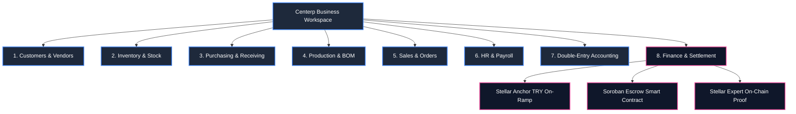
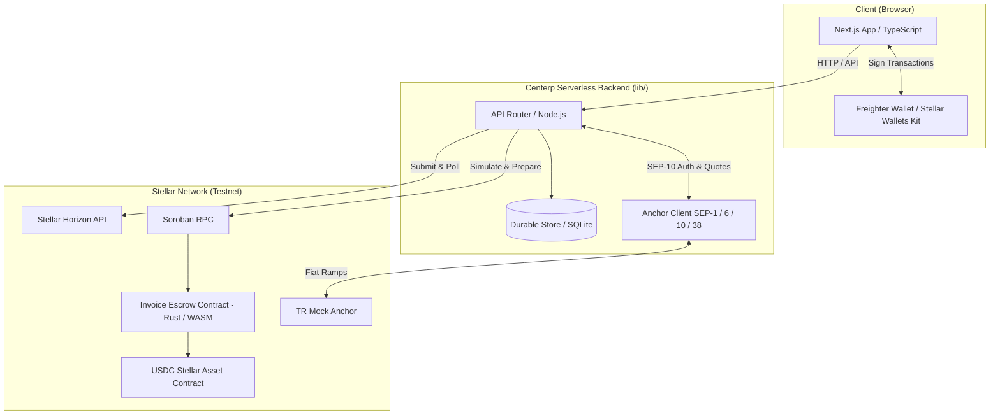
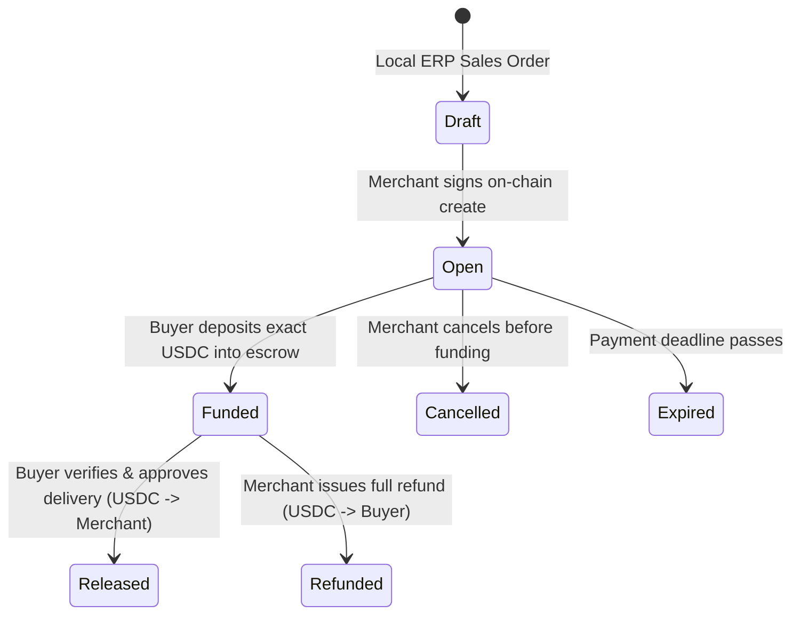

# Centerp

> **The Decentralized Enterprise Resource Planning (ERP) Engine Powered by Stellar & Soroban.**  
> *Connecting real-world operational workflows with instant, low-cost, trustless cryptographic settlements.*

[](https://stellar.org/testnet)
[](artifacts/deployment.json)
[](lib/anchor.ts)
[](tests)
[](package.json)
[](docs/hackathon-tracks.md)

---

## 💡 What Problem Does Centerp Solve?

### The Core Problem: The Fracture Between Business Operations & Financial Settlement
In traditional trade (SMEs and manufacturers), **operational events** (sales orders, production runs, warehouse receipts, payroll) and **financial settlements** (bank wires, invoices, receipts) live in completely isolated silos:

1. **B2B Counterparty Trust Deficit:**
   - **Buyers ask:** *"If I pay upfront, will the supplier deliver on time and with the right specs?"*
   - **Sellers ask:** *"If I manufacture and ship the goods on credit, will the buyer actually pay, or delay payment for months?"*
   - *Traditional Solution:* Bank Letters of Credit (Akreditif). Slow (weeks to process), bureaucratic, and extortionate (**2% to 5% bank fees**).
2. **Reconciliation Hell:**
   - Invoices are generated in one system; bank statements arrive via manual Excel exports, WhatsApp receipts, or PDF emails. Accountants spend days manually cross-referencing invoice numbers with bank deposits.
3. **Banking Friction & Currency Barriers:**
   - Domestic clearing is slow; international wire transfers cost $25–$50 per transaction and take 3–5 business days with hidden FX markups.
   - Traditional businesses cannot adopt crypto because of volatile assets, complex exchange accounts, and tax reporting headaches.

---

### The Centerp Solution: Operational ERP + Programmed On-Chain Proof
Centerp bridges the gap by building a **full-featured business workspace directly wired into Stellar's payment rails and Soroban smart contracts**:

```mermaid
flowchart LR
    subgraph Operational_ERP ["Centerp Workspace (Real Operations)"]
        SO[Sales Order] --> INV[Invoice Generated]
        PO[Purchase Order] --> REC[Inventory Receipt] --> AP[Vendor Liability]
        HR[Employee Payroll] --> SAL[Salary Liability]
    end

    subgraph Stellar_Rails ["Stellar & Soroban Payment Lifecycle"]
        INV --> ROUTE{Route Choice}
        ROUTE -->|TRY (Fiat)| ANCHOR[TR Stellar Anchor] -->|SEP-38 Quote / SEP-6| USDC[Testnet USDC]
        ROUTE -->|USDC| USDC
        USDC --> ESCROW[Soroban Invoice Escrow]
        ESCROW -->|Delivery Approved| RELEASE[USDC Released to Merchant]
        AP & SAL --> DIRECT[Direct Stellar USDC Settlement]
    end

    subgraph Accounting ["Automated Reconciliation"]
        RELEASE & DIRECT --> HASH[Cryptographic Stellar Tx Hash]
        HASH --> GL[Auto Double-Entry General Ledger]
    end
```

- **Smart Escrow for Trade:** Sales orders automatically generate escrow-backed invoices. Funds remain locked in a Soroban smart contract until the buyer approves delivery.
- **Seamless Local Currency On/Off Ramp:** Through Stellar Anchors, users can pay in local Turkish Lira (TRY) via bank transfer, which converts seamlessly into USDC without ever touching a crypto exchange.
- **Cryptographic Reconciliation:** Every payment produces a verifiable transaction hash on the Stellar ledger, instantly updating stock, invoices, and accounting journals with zero manual work.

---

## 🎥 2-Minute Presentation & Demo Video

<div align="center">
  <a href="https://github.com/ugurrcoskun/Centerp/raw/main/presentation.mp4" target="_blank">
    
  </a>
  <p><em>Click the preview above or the button below to watch the full 108-second video with audio narration.</em></p>
  <p>
    <a href="https://github.com/ugurrcoskun/Centerp/raw/main/presentation.mp4">
      
    </a>
  </p>
</div>

<video src="https://github.com/ugurrcoskun/Centerp/raw/main/presentation.mp4" controls="controls" width="100%">
  Your browser does not support inline video. <a href="https://github.com/ugurrcoskun/Centerp/raw/main/presentation.mp4">Click here to download and view presentation.mp4</a>.
</video>

```
0:00 - 0:18  | Executive introduction & the core enterprise problem
0:18 - 0:50  | Complete Workspace Tour: CRM, Sales, Purchasing, Stock, Production, HR, Accounting
0:50 - 1:24  | Payments & Reconciliation: Stellar Anchor bridge (TRY ⇄ USDC) & Soroban escrow
1:24 - 1:48  | Invoice settlement, cryptographic proof on Stellar Expert explorer & conclusion
```

---

## ⚡ Comparative Analysis: Traditional ERP vs. Centerp

| Capability | Traditional ERP (SAP, Logo, NetSuite, Netsis) | Centerp (Stellar + Soroban Powered) |
|---|---|---|
| **Core Paradigm** | Centralized internal database; records entered retroactively after work is done. | **Hybrid Workspace + Programmable Real-Time On-Chain Settlement.** |
| **Payment Protection** | **None.** Open accounts or post-dated checks. High risk of disputes and lawsuits. | **Soroban Smart Escrow.** Funds locked trustlessly until delivery criteria are verified. |
| **Settlement Time** | **3 to 5 Business Days** (bank wires, clearing houses, SWIFT). | **3 to 5 Seconds** with sub-second Stellar consensus. |
| **Transaction Fees** | **High.** 1.5%–4% POS/gateway fees; $25–$50 per international wire. | **Near Zero.** ~0.00001 XLM (~$0.0001) network fee per transaction. |
| **Fiat ⇄ Web3 Bridge** | Proprietary bank APIs, complex MT940 imports, or manual statements. | **Stellar Anchor Standards (SEP-1, 6, 10, 38).** Native fiat on/off ramping. |
| **Audit Trail & Immutability** | Database administrators or software owners can modify historical rows. | **Cryptographic Proof.** Every event tied to a SHA-256 commitment & Stellar Tx Hash. |
| **Accounting Reconciliation** | **Manual Hell.** Days spent matching bank slips with invoice line items. | **Instant & Automated.** On-chain confirmation immediately triggers balanced journal entries. |
| **Counterparty Identity** | Paper tax numbers, email confirmations, unverified IBANs. | **Cryptographic Wallets.** Freighter Ed25519 signature proof of control. |
| **Data Privacy** | Monolithic server silos. | **Privacy-Preserving Hybrid Architecture.** Business secrets stay local; only commitments touch the ledger. |

---

## 🏢 The 8 Core Business Modules

Centerp is not just a payment button—it is an all-in-one operational system:



1. **Customers & Vendors:** Full B2B partner directory linking business profiles to verifiable Stellar public keys (`G...`).
2. **Inventory & Warehouses:** Real-time multi-product stock management distinguishing raw materials (`raw`) from finished goods (`finished`), complete with automated stock movement logs.
3. **Purchasing & Procurement:** Purchase orders linked to vendors. Receiving goods automatically updates inventory stock levels and registers an Accounts Payable liability.
4. **Production & Manufacturing:** Bill of Materials (BOM) work orders. Completing a production run atomically consumes required raw materials and increments finished product inventory.
5. **Sales Management:** Multi-line sales orders tied to customer accounts. Orders directly transition into on-chain escrow invoices.
6. **Human Resources & Payroll:** Employee directory with department roles, base salaries, and registered recipient wallets. Monthly payroll generation creates isolated payment liabilities.
7. **Accounting & General Ledger:** Complete automated double-entry bookkeeping (debit/credit) recording sales revenue, inventory asset valuation, trade payables, and wage expenses.
8. **Finance, Anchor & Escrow:** Dual-rail payment dashboard. Select between local fiat TRY (via SEP-6/38 Anchor) or direct Stellar USDC, fund escrows, and execute single-click vendor/salary settlements.

---

## 🛡️ Architecture & Stellar Integration



### 1. Soroban Invoice Escrow Smart Contract (Rust)
* **Verified Contract ID:** [`CCDPQPUS5SIBJF6YK2FZZV65P45U5FK7A3TMUE25T62VS3GQ22OG76IL`](https://stellar.expert/explorer/testnet/contract/CCDPQPUS5SIBJF6YK2FZZV65P45U5FK7A3TMUE25T62VS3GQ22OG76IL)
* **Source Code:** [contracts/invoice-escrow/src/lib.rs](contracts/invoice-escrow/src/lib.rs)
* **Immutable Security:** The contract is initialized with a fixed USDC Stellar Asset Contract (SAC). It has **no upgrade backdoor, no owner drain function, and no admin sweep keys**.



### 2. Stellar Anchor Implementation (SEP-1, 6, 10, 38)
* **SEP-1 (Discovery):** Resolves `stellar.toml` from the Anchor's domain to verify signing keys, auth endpoints, and supported currencies.
* **SEP-10 (WebAuth):** Cryptographic challenge-response authentication using Freighter wallet signatures (no passwords or centralized credentials).
* **SEP-38 (Quotes):** Locks a guaranteed exchange rate between local Turkish Lira (TRY) and USDC using real-time oracle feeds.
* **SEP-6 (Deposit & Withdrawal):** Generates virtual bank transfer instructions and orchestrates fiat-to-crypto bridging.

### 3. Privacy-Preserving Hybrid Architecture
Centerp stores sensitive commercial data (employee salaries, recipes, customer contact info) in the enterprise workspace database. Only cryptographic commitments (`SHA-256(invoice_metadata)`), escrow states, and financial amounts are published to the public blockchain, ensuring regulatory compliance and corporate privacy.

---

## 📋 Live Testnet Evidence & Artifacts

All integration proofs, test runs, and deployments are saved as machine-verifiable records:

| Record | Path | Description |
|---|---|---|
| **Contract Deployment** | [artifacts/deployment.json](artifacts/deployment.json) | On-chain deployment hash, contract ID, and constructor token binding. |
| **End-to-End Escrow Proof** | [artifacts/testnet-proof.json](artifacts/testnet-proof.json) | Complete lifecycle: Trustline -> SEP-10 -> SEP-38 -> Escrow Fund -> Delivery Release. |
| **ERP Workflow Proof** | [artifacts/erp-testnet-proof.json](artifacts/erp-testnet-proof.json) | Purchase receipt -> Vendor payment -> Salary settlement -> Linked Journal entries. |

---

## 🏃 Quick Start for Hackathon Judges

### Live Web Demo
Access the live deployment on Vercel: **[https://centerp.vercel.app](https://centerp.vercel.app)**  
*(Ensure Freighter wallet is switched to **Test Net** in your browser).*

---

### Running Locally

**Prerequisites:** Node.js 22.5+ or 24+, npm.

```bash
# 1. Clone repository
git clone https://github.com/ugurrcoskun/Centerp.git
cd Centerp

# 2. Install dependencies
npm ci

# 3. Configure environment
cp .env.example .env.local

# 4. Start development server
npm run dev
```

Open [http://127.0.0.1:3000](http://127.0.0.1:3000) in Chrome or Edge with Freighter installed.

---

### Automated Verification Suite

Run our comprehensive automated test suites covering unit tests, smart contract tests, and on-chain integration:

```bash
# Run unit & workflow test suite (19 passing tests)
npm test

# Verify TypeScript types
npm run typecheck

# Run Rust smart contract tests (requires Rust & cargo)
npm run contract:test

# Run full end-to-end Testnet integration test
npm run test:integration
```

---

## 🗺️ Project Structure

```text
├── app/                      # Next.js 15 App Router
│   ├── page.tsx              # Landing page & value proposition
│   ├── workspace/            # Core 8-module ERP interface
│   ├── finance/              # Payments, Anchor TRY ↔ USDC & Escrow dashboard
│   └── api/                  # Serverless API routes (bridge, erp)
├── components/               # Radix UI primitives & responsive layout system
├── contracts/
│   └── invoice-escrow/       # Rust Soroban smart contract source & Cargo manifest
├── lib/
│   ├── anchor.ts             # SEP-1, SEP-6, SEP-10, SEP-38 Anchor client
│   ├── stellar.ts            # Soroban RPC, Horizon, and contract adapters
│   ├── erp.ts                # ERP operational engine, state machines, and journal logic
│   ├── wallet.ts             # Stellar Wallets Kit & Freighter wallet bridge
│   └── db.ts                 # Database persistence & state hydration
├── artifacts/                # Verified on-chain Testnet deployment & integration proofs
├── docs/                     # In-depth architectural & comparative research reports
│   └── demo-preview.gif      # High-framerate visual walkthrough preview
└── presentation.mp4          # 108-second full HD walkthrough video
```

---

## ⚖️ License & Acknowledgments

Built with ❤️ for the **Rise In × Stellar Pro Hackathon 2026 (Genesis Track)**.

* **Stellar Development Foundation (SDF)** for the stellar-sdk, Soroban SDK, and Freighter.
* **Creit Tech** for the Stellar Wallets Kit.
* **TR Mock Anchor Team** for the SEP-6/38 sandbox bridge.
