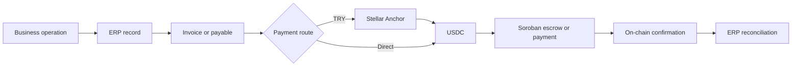
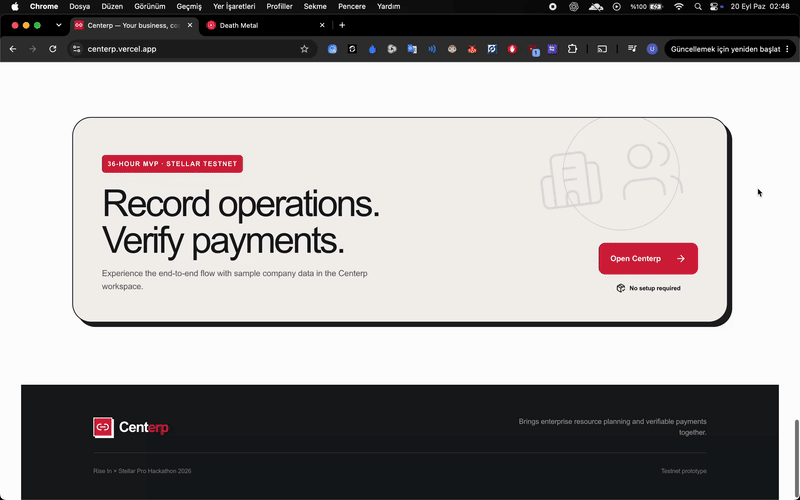
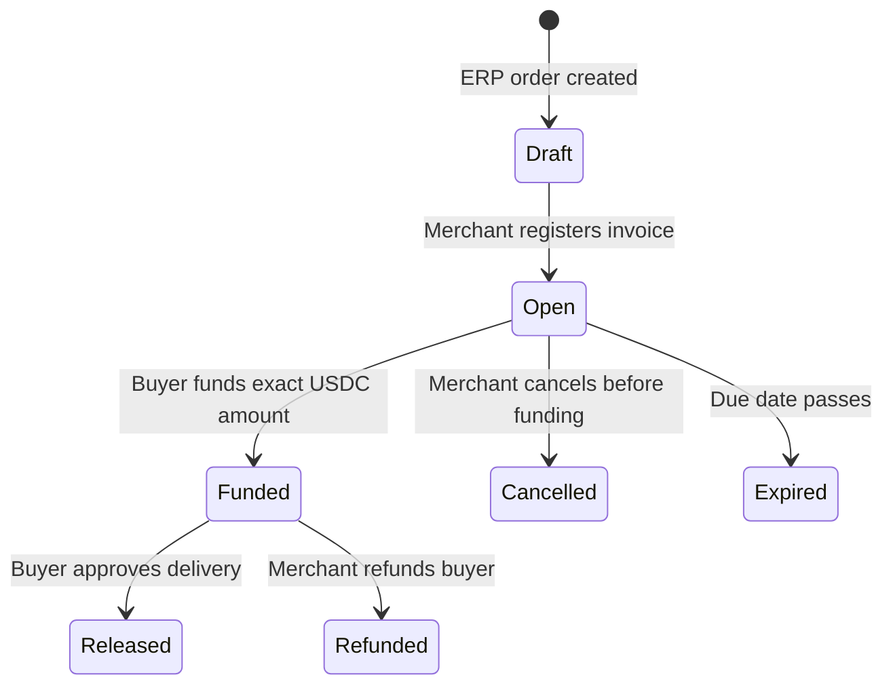
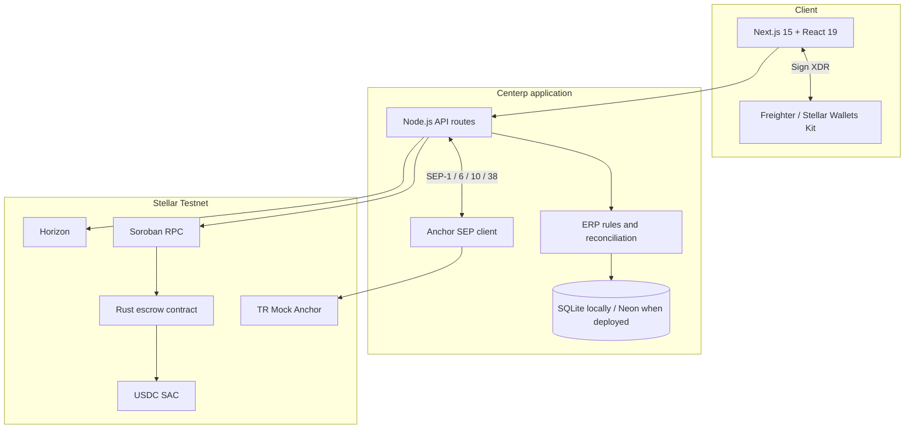

<div align="center">
  
  <h1>Centerp</h1>
  <p><strong>The operating center for a business. The proof behind every payment.</strong></p>
  <p>
    Centerp connects day-to-day ERP operations with fast, low-cost and verifiable settlement on Stellar.<br/>
    Orders become invoices, invoices become protected payments, and confirmed transactions return to the accounting record automatically.
  </p>

  [](https://centerp.vercel.app)
  [](https://centerp.vercel.app/presentation.mp4)
  [](https://stellar.expert/explorer/testnet)

  <br/>

  [](artifacts/deployment.json)
  [](lib/anchor.ts)
  [](tests)
  [](package.json)
</div>

---

## The problem

For many businesses, the operational record and the payment live in different worlds.

An order is created in an ERP. An invoice is shared as a document. Payment moves through a bank. Someone later matches a statement, a reference number and a spreadsheet row by hand. Meanwhile, buyers do not want to pay before delivery, and sellers do not want to ship without payment assurance.

This creates three recurring problems:

| Business friction | What it causes |
|---|---|
| **Disconnected records** | Orders, invoices, bank movements and accounting entries must be reconciled manually. |
| **Counterparty risk** | Buyers and sellers must trust each other before either delivery or payment is secured. |
| **Slow, expensive settlement** | Legacy payment rails add waiting time, banking steps, fees and paperwork. |

## The Centerp solution

Centerp is a working ERP prototype where **the business event and its financial settlement share the same source record**.

- Sales, purchasing, inventory, production, employees and accounting operate in one company workspace.
- A sales order can become a Stellar invoice without re-entering its customer, amount or terms.
- USDC can be locked in a Soroban escrow until the buyer approves delivery.
- Businesses can use direct USDC or enter through a TRY ↔ USDC Anchor flow.
- Confirmed Stellar transactions update the related ERP record and management ledger with a verifiable hash.
- Sensitive commercial data stays off-chain; only the minimum settlement data and cryptographic commitment reach Stellar.

> **Centerp does not add blockchain as a separate dashboard. It makes settlement part of the ERP workflow.**



---

## See it working

| Experience | Link |
|---|---|
| **Live application** | [centerp.vercel.app](https://centerp.vercel.app) |
| **108-second product walkthrough** | [Watch the product demo](https://centerp.vercel.app/presentation.mp4) |
| **Deployed escrow contract** | [Open on Stellar Expert](https://stellar.expert/explorer/testnet/contract/CCDPQPUS5SIBJF6YK2FZZV65P45U5FK7A3TMUE25T62VS3GQ22OG76IL) |
| **Testnet execution evidence** | [`artifacts/testnet-proof.json`](artifacts/testnet-proof.json) |
| **ERP-to-Stellar evidence** | [`artifacts/erp-testnet-proof.json`](artifacts/erp-testnet-proof.json) |

<p align="center">
  <a href="https://centerp.vercel.app/presentation.mp4">
    
  </a>
  <br/>
  <em>Click the preview to watch the full walkthrough with narration.</em>
</p>

### Walkthrough timeline

| Time | What the video shows |
|---|---|
| **0:00–0:18** | The problem, the product idea and the Centerp landing experience. |
| **0:18–0:50** | Overview, customers and vendors, sales, purchasing, inventory, production, HR, accounting and company settings. |
| **0:50–1:24** | Payments and reconciliation, including the TRY route and direct USDC option. |
| **1:24–1:48** | Invoice details and independent transaction proof on Stellar Expert. |

> The TRY and bank-transfer experience uses an external Mock Anchor sandbox. Direct USDC, Soroban escrow and the linked transaction evidence run on Stellar Testnet.

---

## From order to verifiable settlement

### 01 — Record the operation

The company creates customers, products and a multi-line sales order. The amount is calculated on the server with decimal-safe arithmetic, and the customer wallet is taken from the business record.

### 02 — Create the invoice

Centerp carries the order into the finance module. The merchant signs the invoice registration with Freighter, and the invoice terms are committed to the Soroban contract.

### 03 — Fund protected escrow

The buyer can pay from an existing USDC balance or acquire Testnet USDC through the TRY Anchor route. The exact invoice amount is deposited into the escrow contract—not sent directly to the seller.

### 04 — Deliver and release

Shipping changes the ERP stock record but does not release the money. When the buyer confirms delivery, the contract releases USDC to the merchant.

### 05 — Reconcile with proof

The verified transaction hash returns to the invoice and the management accounting ledger. Anyone can independently inspect the transaction on Stellar Expert.



---

## Product surface

Centerp is more than a payment demo. Its ERP modules create connected, stateful business records:

| Module | Working behavior | Financial connection |
|---|---|---|
| **Overview** | Company activity, open work and operational summaries | Displays verified balances and collection state |
| **Customers & vendors** | Counterparty records with contact and wallet details | Supplies invoice buyer and payment recipient identities |
| **Sales management** | Multi-line sales orders with server-calculated totals | Converts an order into an escrow-backed invoice |
| **Purchasing** | Purchase orders and one-time goods receipt | Creates stock entries and supplier liabilities |
| **Inventory & warehouse** | Raw material and finished-product quantities with movement history | Keeps physical movement separate from payment release |
| **Production** | Multi-input work orders with atomic consumption and output | Feeds sellable stock without exposing recipes on-chain |
| **Human resources** | Employee records and period-based payment obligations | Links salary obligations to individual USDC transfers |
| **Accounting & finance** | Balanced management entries tied to source records | Records verified invoice and payable settlement hashes |
| **Company profile** | Isolated company workspace and wallet binding | Requires a signed wallet session for financial authority |
| **Payments & reconciliation** | Invoices, balances, Anchor transfers, escrow and transaction ledger | Connects ERP records to Stellar settlement |

---

## Why Stellar

Stellar gives Centerp the payment properties that conventional ERP records cannot provide on their own:

| Stellar capability | How Centerp uses it |
|---|---|
| **Fast, low-cost settlement** | USDC invoice and payable transactions settle without the operational overhead of traditional bank reconciliation. |
| **Soroban smart contracts** | Invoice funds remain in escrow until an authorized release or refund action occurs. |
| **Freighter signatures** | Users authorize transactions without sharing secret keys with the application server. |
| **Stellar Asset Contract** | The escrow is bound to the configured Testnet USDC asset. |
| **Horizon and Soroban RPC** | Centerp verifies transaction and contract outcomes before changing ERP financial state. |
| **Stellar Anchors** | Standard SEP flows provide a path between local currency and a usable on-chain USDC balance. |
| **Public transaction proofs** | Every confirmed payment can be independently verified by its hash. |

### Anchor standards

- **SEP-1 — Discovery:** validates the Anchor domain, endpoints, signing key and supported asset.
- **SEP-10 — Authentication:** proves wallet control through a signed challenge.
- **SEP-38 — Quotes:** requests a firm TRY ↔ USDC conversion quote.
- **SEP-6 — Transfers:** creates deposit or withdrawal instructions and tracks their status.

The Anchor is non-custodial from Centerp's perspective: wallet keys remain in Freighter, while the application stores only the server-side Anchor session needed for the sandbox flow.

---

## Architecture and privacy boundary



### What stays off-chain

Customer contact details, employee information, product recipes, unit-price breakdowns, stock movements and internal accounting context remain in the ERP data store.

### What goes on-chain

The escrow receives the merchant and buyer addresses, exact USDC amount, lifecycle timestamps and a `SHA-256` commitment to the invoice snapshot. Transaction hashes and verified contract state are then linked back to the ERP record.

This hybrid design gives the business an auditable settlement proof without publishing its full commercial data.

---

## Escrow safety model

The Rust contract has a deliberately small authorization surface:

| Action | Required authority | Result |
|---|---|---|
| `create` | Merchant | Registers the invoice commitment and commercial terms |
| `fund` | Buyer | Transfers the exact USDC amount into contract custody |
| `release` | Buyer | Releases escrowed USDC to the merchant after approval |
| `refund` | Merchant | Returns the full escrow balance to the buyer |
| `cancel` | Merchant | Closes an unfunded invoice |
| `expire` | Permissionless after due date | Closes an overdue, unfunded invoice |

The contract is initialized with a fixed USDC Stellar Asset Contract address and contains no fee extraction or hidden administrative release path.

---

## Verifiable Testnet evidence

The repository includes machine-readable artifacts from completed end-to-end runs.

| Proof | Reference |
|---|---|
| **Contract** | [`CCDP…76IL`](https://stellar.expert/explorer/testnet/contract/CCDPQPUS5SIBJF6YK2FZZV65P45U5FK7A3TMUE25T62VS3GQ22OG76IL) |
| **Contract deployment** | [`7a6bc8…8d99`](https://stellar.expert/explorer/testnet/tx/7a6bc9fe8e942c63aa99a0ead77aaeff631d40fc411410a7447c4c7bf08f8d99) |
| **Invoice creation** | [`94ccb2…908f`](https://stellar.expert/explorer/testnet/tx/94ccb21fb713c45f09d4042c0778891077351817965a4e8de89f8221fa63908f) |
| **Escrow funding** | [`46f02d…a522`](https://stellar.expert/explorer/testnet/tx/46f02da2907bfdfebf78f0fdedf90292f6c570dcf39ba0d94c2591b28746a522) |
| **Escrow release** | [`45e7e1…e97e`](https://stellar.expert/explorer/testnet/tx/45e7e17304743a56a6734553e287085f38ccacafad571661dabbc1004470e97e) |
| **Supplier payment** | [`c408a3…fa4c`](https://stellar.expert/explorer/testnet/tx/c408a39840fbd4ade79b47ce80bf27c6d1cb8ab6d7e9766173f8b468de7ffa4c) |
| **Employee payment** | [`10e83a…6928`](https://stellar.expert/explorer/testnet/tx/10e83ab31d8c745609c62963f30fd46cb7b48a7bb3e99f07caf237a9f65a6928) |

The verified workflow covers signed sessions, trustlines, Anchor authentication and quotes, a simulated TRY bank deposit, escrow funding and release, direct supplier and employee payments, duplicate-action rejection, and ERP journal reconciliation.

---

## Run locally

### Requirements

- Node.js 22.5 or newer
- npm
- Freighter configured for Testnet when exercising signed flows
- Rust and Stellar CLI only when rebuilding or testing the contract

### Application

```bash
git clone https://github.com/ugurrcoskun/Centerp.git
cd Centerp
npm ci
cp .env.example .env.local
npm run dev
```

Open `http://127.0.0.1:3000`.

### Verification

```bash
npm run typecheck        # TypeScript verification
npm test                 # 19 application and workflow tests
npm run build            # Production build
npm run contract:test    # Rust escrow tests
npm run test:integration # Full Testnet flow; requires external services
npm run test:erp         # ERP-to-Stellar Testnet flow
```

---

## Repository map

```text
app/
├── page.tsx                 Landing page
├── workspace/               Connected ERP workspace
├── finance/                 Payments, Anchor, escrow and reconciliation
└── api/                     Server-side ERP and bridge endpoints

contracts/invoice-escrow/    Soroban escrow contract in Rust
lib/anchor.ts                SEP-1, SEP-6, SEP-10 and SEP-38 integration
lib/stellar.ts               Horizon, Soroban and payment orchestration
lib/erp.ts                   ERP rules, atomic workflows and ledger updates
lib/wallet.ts                Freighter and Wallets Kit integration
lib/db.ts                    Local and deployed persistence
artifacts/                   Deployment and end-to-end proof records
docs/                        Product, architecture and research documentation
public/presentation.mp4      108-second narrated walkthrough
```

## Prototype scope

Centerp is a hackathon MVP running on **Stellar Testnet**. The TRY bank transfer and KYC experience is simulated by the external TR Mock Anchor; no real TRY or Mainnet assets are used.

The accounting view is a management ledger for demonstrating source-linked reconciliation. It is not a statutory Turkish accounting, tax, payroll or e-invoicing system. Production deployment would additionally require organization membership and roles, recovery flows, audit logs, regulatory integrations, a production Anchor, background reconciliation workers and operational monitoring.

These boundaries are intentional: the prototype focuses on proving that real ERP events can safely drive verifiable Stellar settlement end to end.

---

<div align="center">
  <p><strong>Built for the Rise In × Stellar Pro Hackathon 2026 — Genesis Track</strong></p>
  <p>Operations recorded. Payments protected. Settlement verified.</p>
</div>
