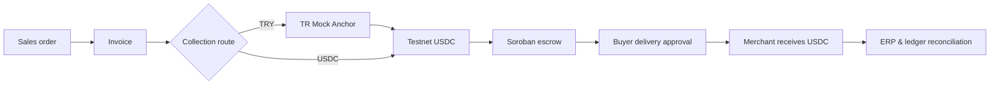
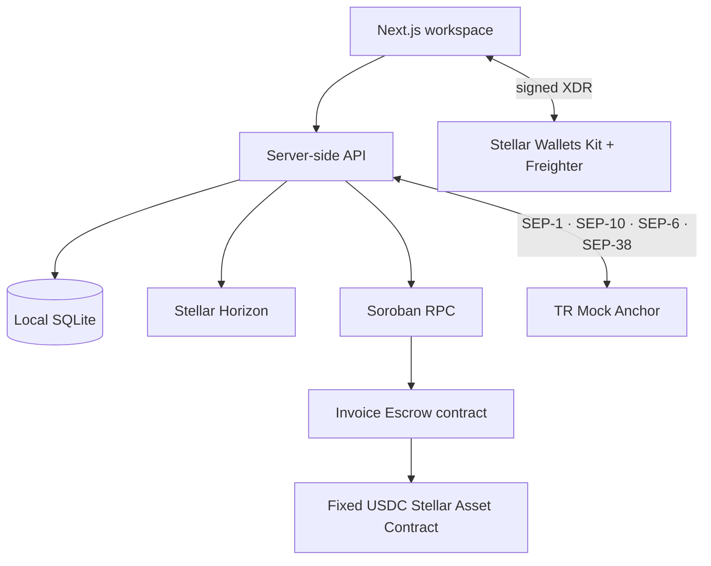
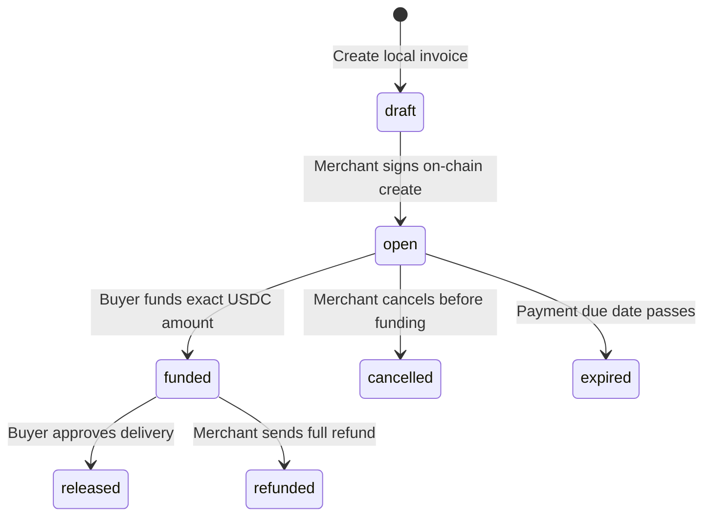

# Centerp

> **The operations centre for a business. Proof for every payment.**

Centerp is a Testnet-only business workspace that connects daily ERP records to a verifiable Stellar payment lifecycle. Sales, purchasing, inventory, production, people, and management accounting remain connected to the same record—from a Turkish lira collection choice to USDC escrow and delivery-approved release.

[](https://stellar.org/testnet)
[](artifacts/deployment.json)
[](tests)
[](package.json)

## What problem does Centerp solve?

Operational records and payment evidence normally live in separate places. A business may know that an order was shipped, while still needing to reconcile a bank transfer, a wallet payment, and a delivery confirmation by hand.

Centerp makes the relationship explicit:



The app keeps the route choice clear: **TRY** starts with a mock bank-to-USDC Anchor flow; **USDC** pays Stellar directly. Both routes converge at the same fixed-USDC Soroban escrow.

## Product at a glance

| Area | What the user can do | Why it matters |
|---|---|---|
| Business workspace | Manage contacts, products, stock, purchasing, production, employees, and accounting | Operations start from a shared business record |
| Sales | Create multi-line orders and turn them into invoices | The invoice amount stays bound to the order |
| Collections | Choose TRY → USDC via Anchor or direct USDC | The payment entry route is visible, not implicit |
| Escrow | Fund, release after delivery approval, refund, cancel, or expire | Funds are protected until the correct business event |
| Reconciliation | Link ERP records to on-chain transaction hashes | Payment proof returns to the original business context |

## Where Stellar is used



### Stellar layer

- **Wallet connection and signatures:** Stellar Wallets Kit opens the connection flow; Freighter signs XDRs in a real Chrome or Edge profile.
- **Testnet balances:** XLM, the USDC trustline, and asset balances are read from Stellar infrastructure.
- **Soroban escrow:** the Rust contract fixes the USDC token at construction and enforces the invoice state machine on-chain.
- **Proof:** submitted transaction hashes are stored with their ERP event and are only treated as complete after network confirmation.

### Anchor layer

The TR Mock Anchor is the local-currency bridge in the demo.

| Standard | Role in Centerp |
|---|---|
| SEP-1 | Discover the Anchor configuration from its home domain |
| SEP-10 | Authenticate a wallet with a signed challenge |
| SEP-38 | Lock a TRY ↔ USDC quote |
| SEP-6 | Create and track mock deposit/withdraw exchange instructions |

Bank and KYC steps are intentionally simulated. USDC and escrow transactions are Testnet transactions.

## Live Testnet deployment

The invoice escrow contract is deployed and verified on Stellar Testnet.

| Item | Value |
|---|---|
| Network | Stellar Testnet |
| Escrow contract | [`CCDP…76IL`](artifacts/deployment.json) |
| Token | Testnet USDC Stellar Asset Contract |
| Deployment evidence | [artifacts/deployment.json](artifacts/deployment.json) |
| End-to-end evidence | [artifacts/testnet-proof.json](artifacts/testnet-proof.json) |

The deployment signer is ephemeral and is never written to disk. The contract does not include a privileged fund sweep or upgrade path.



## Judge demo path

1. Open `/workspace`. Centerp starts with practical sample customers, vendors, products, employees, sales, purchasing, production, and ledger records.
2. Show that a purchasing receipt raises stock and creates a vendor payable; show the planned production job and open sales orders.
3. Open `/finance` and choose **TRY** or **USDC** as the collection route.
4. For TRY, authenticate to the Anchor, request a quote, create the bank simulation instruction, and receive Testnet USDC. For USDC, use a prepared Testnet balance directly.
5. Create or open an invoice, fund the Soroban escrow as the buyer, then approve delivery.
6. Return to the finance and ERP views: the merchant’s collection, the invoice status, and the linked ledger evidence reconcile together.

> Freighter extensions do not run inside Codex’s embedded browser. Use Chrome or Edge with Freighter on **Testnet** for the real signing flow. A Testnet account needs sufficient XLM for transaction fees.

## Run locally

Requirements: Node.js 24+, npm, and (only for contract work) Rust plus Stellar CLI.

```sh
npm ci
cp .env.example .env.local
npm run dev
```

Open [http://127.0.0.1:3000](http://127.0.0.1:3000). If port 3000 is occupied, Next.js will print the alternative local URL.

```env
NEXT_PUBLIC_STELLAR_NETWORK=TESTNET
NEXT_PUBLIC_ESCROW_CONTRACT_ID=CCDPQPUS5SIBJF6YK2FZZV65P45U5FK7A3TMUE25T62VS3GQ22OG76IL
DATABASE_PATH=./data/bridge.sqlite
APP_ORIGIN=http://127.0.0.1:3000
```

`NEXT_PUBLIC_ESCROW_CONTRACT_ID` is public. The app is deliberately hard-wired to the Testnet network passphrase and service endpoints; it cannot become a Mainnet app by changing this variable.

## Verification and contract commands

Stop the development server before a production build to avoid competing over the `.next` cache.

```sh
npm run typecheck
npm test
npm run contract:test
npm run contract:build
npm run contract:deploy    # deploys a new Testnet contract and rewrites .env.local
```

`npm run contract:deploy` should only be used when a fresh deployment is intended. It creates a new public contract ID, so existing SQLite invoice records are not migrated automatically. The current deployment is already live.

For the full external Testnet and Anchor journey, run the app first and then:

```sh
npm run test:integration
npm run test:erp
```

These integration commands create temporary Testnet test wallets and write public evidence to `artifacts/`; they never use a user wallet or store a secret key.

## Project map

```text
app/                       Landing, ERP workspace, finance UI, API routes
components/                Language provider and UI primitives
lib/                       ERP rules, auth, exact amounts, Anchor and Stellar adapters
contracts/invoice-escrow/  Rust Soroban escrow contract and contract tests
scripts/                   Deploy and Testnet smoke-test scripts
tests/                     Unit and workflow coverage
artifacts/                 Public contract and Testnet proof records
docs/                      Product, design, Anchor, track, and research documentation
```

## Documentation

| Document | Purpose |
|---|---|
| [Product scope](docs/project/product-scope.md) | Product goals, ERP scope, and architecture notes |
| [Comparative analysis](docs/project/comparative-analysis.md) | Positioning and alternatives |
| [Stellar research](docs/research-stellar.md) | Detailed Anchor, escrow, and Testnet research |
| [Anchor reference](docs/anchor-reference.md) | TR Mock Anchor integration reference |
| [UI design system](docs/UI_DESIGN_SYSTEM.md) | Visual decisions and design tokens |
| [Brand master](docs/design/brand-master.md) | Brand and editorial direction |

## Scope and safety notes

Centerp is a hackathon prototype, not a production banking, payroll, tax, or regulated accounting system. It intentionally does not claim GİB e-Invoice compatibility, real-bank settlement, Mainnet support, enterprise access control, or a public multi-tenant deployment. Local SQLite data is persistent but unencrypted; do not put sensitive production data into this demo.

## Credits and references

- [Stellar JavaScript SDK](https://github.com/stellar/js-stellar-sdk)
- [Stellar Wallets Kit](https://stellarwalletskit.dev/)
- [Freighter API](https://docs.freighter.app/extension-freighter-api/signing)
- [Stellar smart-contract resources](https://developers.stellar.org/docs/build/smart-contracts)
- [Stellar ecosystem standards](https://developers.stellar.org/docs/learn/encyclopedia/sep)

Built for the Rise In × Stellar Pro Hackathon 2026, Genesis Track.
