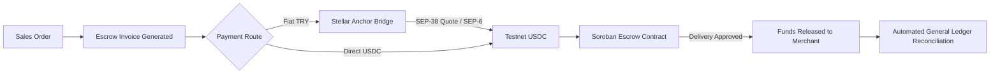
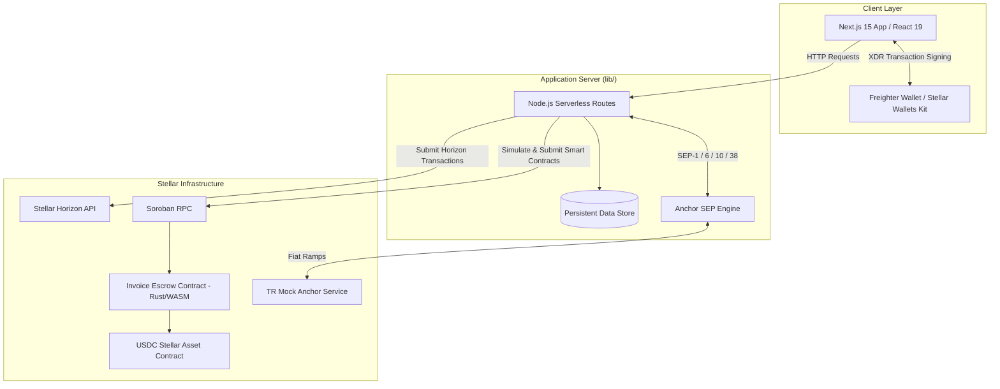
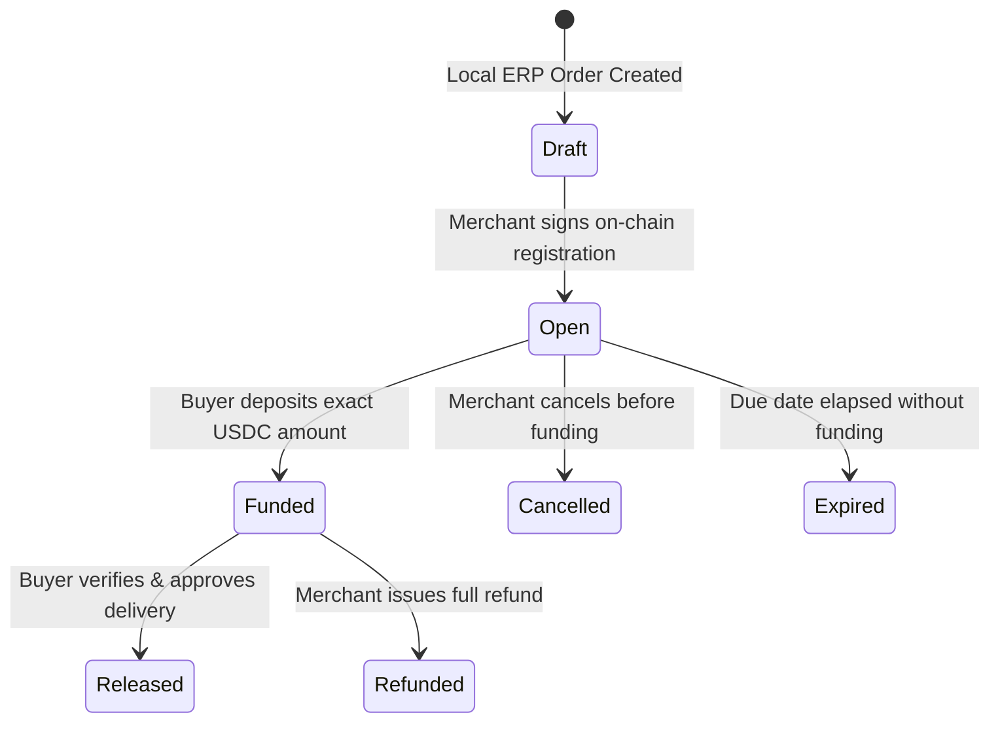

# Centerp

The decentralized Enterprise Resource Planning (ERP) platform connecting real-world business operations with verifiable cryptographic settlements on the Stellar network.

[](https://stellar.org/testnet)
[](artifacts/deployment.json)
[](lib/anchor.ts)
[](tests)
[](package.json)
[](docs/hackathon-tracks.md)

---

## 1. Executive Summary & Problem Context

### The Business Problem
In commercial trade, operational management and financial execution are physically separated:

* **Counterparty Risk:** In business-to-business transactions, buyers hesitate to pay before goods are inspected, while sellers hesitate to manufacture and ship without guaranteed payment. Traditional instruments like bank Letters of Credit take weeks to issue and incur 2% to 5% in institutional fees.
* **Manual Reconciliation:** Invoices exist inside an ERP system, while payments clear through separate banking rails. Matching bank deposits with invoice line items requires manual human labor, spreadsheet cross-referencing, and delayed audits.
* **Payment Friction:** Cross-border business transfers through legacy correspondent banking take 3 to 5 business days and lose value to wire fees and foreign exchange markups.

### The Centerp Paradigm
Centerp unifies the enterprise operating system with programmable settlement:

* Operational events (purchase orders, physical goods receipts, manufacturing completion, and payroll) automatically create corresponding financial obligations.
* Invoices lock commercial terms into a Soroban smart contract escrow, holding buyer funds trustlessly until delivery is approved.
* Dual settlement rails allow enterprises to onboard via local fiat (TRY) using regulated Stellar Anchors or settle directly in USDC on-chain.
* Every payment generates an immutable transaction hash on the Stellar ledger, instantly updating inventory ledgers and double-entry accounting journals without manual intervention.



---

## 2. Product Walkthrough

### Demonstration Video
The following recording demonstrates the complete operational lifecycle: navigating the enterprise modules, creating an invoice, funding via the Anchor TRY route, locking funds in Soroban escrow, approving delivery, and verifying the on-chain receipt on the Stellar Expert explorer.

<p align="center">
  <a href="https://github.com/ugurrcoskun/Centerp/raw/main/presentation.mp4">
    
  </a>
  <br />
  <em>Animated preview. Watch or download the full video with audio: <a href="https://github.com/ugurrcoskun/Centerp/raw/main/presentation.mp4">presentation.mp4 (108 seconds)</a>.</em>
</p>

### Timeline Breakdown
* **0:00 - 0:18:** Problem overview and core architecture.
* **0:18 - 0:50:** Enterprise modules: CRM, Sales, Purchasing, Stock, Production, HR, and Accounting.
* **0:50 - 1:24:** Finance dashboard: Stellar Anchor integration (TRY to USDC) and Soroban escrow.
* **1:24 - 1:48:** Delivery approval, settlement, and cryptographic proof verification on Stellar Expert.

---

## 3. Comparative Analysis: Traditional ERP vs. Centerp

| Operational Dimension | Traditional ERP (SAP, NetSuite, Logo) | Centerp (Stellar + Soroban Architecture) |
|---|---|---|
| **System Architecture** | Centralized database; entries recorded after external settlement clears. | Unified operating workspace directly integrated with on-chain settlement. |
| **Counterparty Security** | None. Post-dated checks or open credit; high default and litigation risk. | Soroban Smart Escrow. Funds are locked on-chain prior to shipment. |
| **Settlement Velocity** | 3 to 5 business days through domestic or international clearing houses. | 3 to 5 seconds with Stellar ledger consensus. |
| **Transaction Overhead** | High banking wire fees ($25–$50) or credit card processing fees (1.5%–3.5%). | Sub-cent network fees (~0.00001 XLM per transaction). |
| **Fiat-to-Crypto Bridge** | Manual bank statement exports, third-party middleware, or external exchanges. | Standardized Stellar Anchors (SEP-1, SEP-6, SEP-10, SEP-38). |
| **Audit Verification** | Mutable database logs subject to administrative alteration or data loss. | Cryptographic verification via SHA-256 commitments and Stellar transaction hashes. |
| **Reconciliation Overhead** | Manual human review of accounting records against bank statements. | Automated; on-chain confirmation immediately triggers balanced journal entries. |
| **Identity Verification** | Paper tax documents and unverified bank account numbers. | Cryptographic wallet verification using Freighter Ed25519 signatures. |
| **Data Confidentiality** | Monolithic server access with all details stored centrally. | Hybrid model: commercial secrets stay off-chain; cryptographic proofs live on-chain. |

---

## 4. Enterprise Functional Modules

Centerp provides a complete, operational management system divided into eight functional areas:

1. **Customers & Vendors:** Directory tracking trade counterparties, commercial terms, and associated Stellar public keys (`G...`).
2. **Inventory & Warehouse:** Real-time stock control tracking raw materials and finished goods, complete with automated stock movement logs.
3. **Purchasing & Procurement:** Purchase orders for raw materials. Goods receipts increment inventory and instantiate Accounts Payable liabilities automatically.
4. **Production & Manufacturing:** Work orders based on Bills of Materials (BOM). Production atomically consumes raw material inventory and deposits finished goods into stock.
5. **Sales Management:** Multi-line commercial orders linked to customer records, automatically convertible into escrow-backed invoices.
6. **Human Resources & Payroll:** Employee directory tracking departmental roles, fixed salaries, and registered recipient wallets. Monthly payroll runs create individual salary obligations.
7. **Double-Entry General Ledger:** Automated accounting engine creating balanced debit and credit entries upon purchase receipt, payroll accrual, and on-chain invoice settlement.
8. **Finance & Settlement:** Treasury interface managing dual payment routes (TRY via Anchor or direct USDC), escrow status tracking, and single-click payable disbursements.

---

## 5. Technical Architecture



### Off-Chain vs. On-Chain Data Boundary
To satisfy regulatory standards and business privacy requirements, Centerp enforces a strict data separation:

* **Off-Chain Data:** Sensitive trade information (client contact information, unit pricing breakdowns, employee wages, and BOM recipes) remains within the enterprise workspace data store.
* **On-Chain Commitments:** The contract receives only the merchant address, buyer address, integer token amounts, delivery timestamps, and a cryptographic `SHA-256` commitment of the invoice payload:
  $$\text{Commitment} = \text{SHA-256}(\text{Invoice Metadata} \parallel \text{Line Items})$$
  This guarantees that neither party can alter invoice terms post-agreement without invalidating the on-chain hash.

---

## 6. Smart Contract Engineering: Soroban Escrow

The invoice escrow contract is written in Rust using `soroban-sdk` and compiled to WebAssembly (`wasm32-unknown-unknown`).

### Contract State Machine



### Safety and Security Guarantees
* **Immutable Construction:** The contract binds to the official USDC Stellar Asset Contract (SAC) address at initialization (`__constructor`).
* **Zero Administrative Backdoors:** The contract contains no admin upgrade keys, fee extraction logic, or emergency pause mechanisms.
* **Strict Authorization:** 
  * `create`: Requires merchant signature (`merchant.require_auth()`).
  * `fund`: Requires buyer signature (`buyer.require_auth()`); transfers tokens from buyer directly into contract custody.
  * `release`: Requires buyer signature (`buyer.require_auth()`); transfers tokens from contract custody to the merchant.
  * `refund`: Requires merchant signature (`merchant.require_auth()`); returns custody to the buyer.

---

## 7. Stellar Anchor Protocol Integration

Centerp integrates standard Stellar Ecosystem Proposals (SEPs) to bridge traditional bank transfers with blockchain payments:

* **SEP-1 (Anchor Discovery):** Resolves the Anchor's `stellar.toml` file to verify signing keys, authentication endpoints, and supported currency issuers.
* **SEP-10 (Stellar Web Authentication):** Implements challenge-response authentication using Freighter wallet signatures. Eliminates custodial user credentials.
* **SEP-38 (Anchor Quote Service):** Requests firm, locked currency exchange quotes between fiat Turkish Lira (TRY) and USDC, referencing live oracle price feeds.
* **SEP-6 (Deposit & Withdrawal):** Manages banking instructions, virtual account references, and status polling for fiat deposits and withdrawals.

---

## 8. Testnet Verification & Evidence

The smart contract is deployed, verified, and operational on the Stellar Testnet:

| Verification Target | Reference / Identifier |
|---|---|
| **Contract ID** | [`CCDPQPUS5SIBJF6YK2FZZV65P45U5FK7A3TMUE25T62VS3GQ22OG76IL`](https://stellar.expert/explorer/testnet/contract/CCDPQPUS5SIBJF6YK2FZZV65P45U5FK7A3TMUE25T62VS3GQ22OG76IL) |
| **Token Address (USDC SAC)** | `CBIELTK6YBZJU5UP2WWQEUCYKLPU6AUNZ2BQ4WWFEIE3USCIHMXQDAMA` |
| **Deployment Artifact** | [artifacts/deployment.json](artifacts/deployment.json) |
| **End-to-End Escrow Proof** | [artifacts/testnet-proof.json](artifacts/testnet-proof.json) |
| **ERP Workflow Integration Proof** | [artifacts/erp-testnet-proof.json](artifacts/erp-testnet-proof.json) |

---

## 9. Local Setup & Verification

### Prerequisites
* Node.js 22.5.0 or higher
* npm
* (Optional for contract development) Rust toolchain with `wasm32-unknown-unknown` target and Stellar CLI

### Installation

```bash
# 1. Clone the repository
git clone https://github.com/ugurrcoskun/Centerp.git
cd Centerp

# 2. Install dependencies
npm ci

# 3. Initialize local environment
cp .env.example .env.local

# 4. Start local development server
npm run dev
```

The application will be accessible at `http://127.0.0.1:3000`.

### Test Execution

Run the automated verification suite:

```bash
# Run unit and workflow tests (19 passing)
npm test

# Verify TypeScript types
npm run typecheck

# Run Rust smart contract tests (requires cargo)
npm run contract:test

# Run full Testnet integration suite
npm run test:integration
```

---

## 10. Repository Organization

```text
├── app/                      # Next.js 15 application routes
│   ├── page.tsx              # Landing interface
│   ├── workspace/            # 8-module ERP operational workspace
│   ├── finance/              # Treasury, Anchor TRY, and Escrow management
│   └── api/                  # Backend handlers (bridge, erp)
├── components/               # UI components and layout systems
├── contracts/
│   └── invoice-escrow/       # Soroban Rust contract source and Cargo configuration
├── lib/
│   ├── anchor.ts             # Stellar Anchor (SEP-1, 6, 10, 38) engine
│   ├── stellar.ts            # Soroban RPC and Horizon integration
│   ├── erp.ts                # Core ERP business logic and state machine
│   ├── wallet.ts             # Freighter and Stellar Wallets Kit connectors
│   └── db.ts                 # Database persistence and synchronization
├── artifacts/                # Verified deployment records and Testnet execution proofs
├── docs/                     # Architectural specifications and comparative analysis
└── presentation.mp4          # 108-second full walkthrough video
```

---

## 11. Acknowledgments

Developed for the **Rise In x Stellar Pro Hackathon 2026 (Genesis Track)**.

* Stellar Development Foundation for the `stellar-sdk` and `soroban-sdk`.
* Creit Tech for Stellar Wallets Kit.
* TR Mock Anchor team for sandbox fiat bridging infrastructure.
