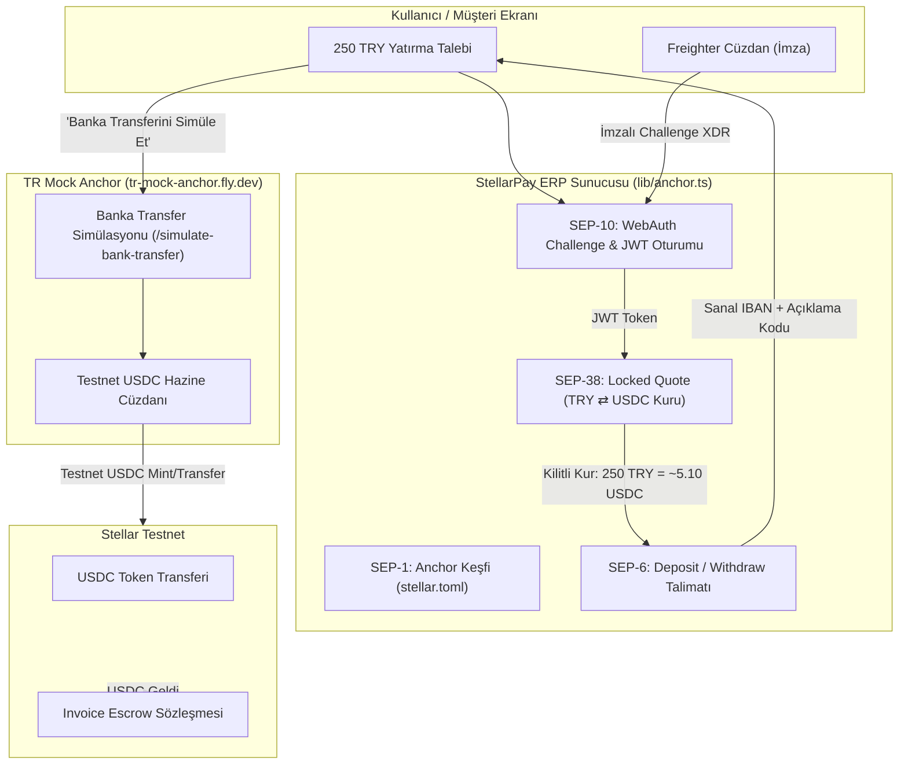
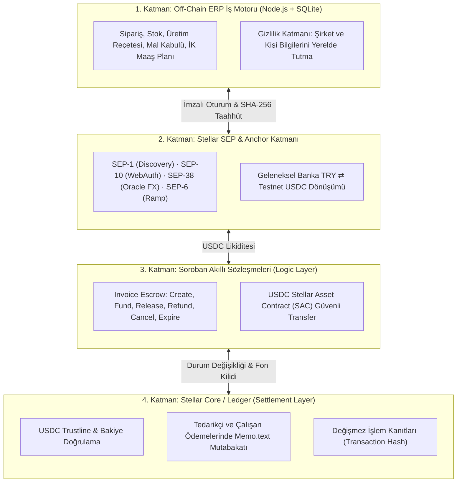

# StellarPay ERP — Kapsamlı Proje Analizi, Karşılaştırma ve Hackathon Değerlendirme Raporu

> **Tarih:** 19 Eylül 2026  
> **Etkinlik:** Rise In × Stellar Pro Hackathon 2026 (Genesis Track)  
> **Odak:** Proje Mimarisi, Mock Anchor Kullanımı, Geleneksel ERP Karşılaştırması, Stellar'ın Açıkları/Kısıtları ve Kazanma Olasılığı Analizi  

---

## İçindekiler

1. [Bu Proje Neyi Çözüyor?](#1-bu-proje-neyi-çözüyor)
2. [Anchor Mock Nerede ve Nasıl Kullanılıyor?](#2-anchor-mock-nerede-ve-nasıl-kullanılıyor)
3. [Geleneksel ERP Sistemlerinden (SAP, Logo, Netsis vb.) Farkı Ne?](#3-geleneksel-erp-sistemlerinden-sap-logo-netsis-vb-farkı-ne)
4. [Projemiz Stellar Ekosisteminde Nasıl Konumlanıyor?](#4-projemiz-stellar-ekosisteminde-nasıl-konumlanıyor)
5. [Stellar'ın Açıkları, Kısıtları ve Handikapları Açısından Proje Değerlendirmesi](#5-stelların-açıkları-kısıtları-ve-handikapları-açısından-proje-değerlendirmesi)
6. [Hackathonda Kazanma Olasılığı Analizi (Jüri Puanlama Kriterleri)](#6-hackathonda-kazanma-olasılığı-analizi-jüri-puanlama-kriterleri)
7. [Jüri Sunumu ve Demo İçin Stratejik Tavsiyeler](#7-jüri-sunumu-ve-demo-için-stratejik-tavsiyeler)

---

## 1. Bu Proje Neyi Çözüyor?

### 1.1. Temel Problem: "İç Operasyon" ile "Finansal Mutabakat" Arasındaki Derin Uçurum
Küçük ve Orta Ölçekli İşletmelerde (KOBİ) veya reel sektör üreticilerinde en büyük kanayan yara, **operasyonel süreçler (sipariş, üretim, stok, satın alma, bordro)** ile **banka/tahsilat hareketleri** arasındaki kopukluktur:

1. **B2B Vadeli Ticarette Güvensizlik (Dispute Riski):**
   - Alıcı: *"Parayı peşin gönderirsem satıcı malı eksik/geç gönderir veya hiç göndermez mi?"*
   - Satıcı: *"Üretimi yapıp malı sevk edersem alıcı parayı ödemez veya vadeyi aylarca geciktirir mi?"*
   - Geleneksel akreditif (Letter of Credit) bankalar aracılığıyla haftalar sürer ve fahiş masraflar (%2–%5) gerektirir.
2. **Kopuk ve Manuel Mutabakat (Reconciliation Hell):**
   - Fatura ERP'de kesilir, banka dekontu muhasebeciye WhatsApp/e-posta ile düşer, banka API'si yoksa ekstreler manuel taranır. Fatura ile ödemenin eşleşmesi günlerce sürer.
3. **Çok Kalemli Operasyonların Şeffaflıktan Uzak Olması:**
   - Hangi sipariş için ne kadar hammadde tüketildi, bu hammadde hangi tedarikçiden alındı, tedarikçiye borç ödendi mi, mamul üretilip kime satıldı ve tahsilatı cüzdana ulaştı mı soruları farklı yazılımlarda ve Excel tablolarında kaybolur.

### 1.2. StellarPay ERP'nin Getirdiği Çözüm
StellarPay ERP, şirketin günlük ERP operasyonlarını **Stellar blokzincirinin ödeme ve Soroban escrow mekanizmasıyla doğal biçimde birleştiren hibrit bir ekosistemdir**:

- **Satış Siparişi → Akıllı Sözleşme:** Satış siparişi açıldığında tutar ve müşteri cüzdanı kilitlenerek Soroban üzerinde faturaya dönüşür.
- **Güvenli Fonlama (Escrow):** Müşteri tutarı (`USDC`) sözleşmeye yatırır (`Funded`). Satıcı paranın akıllı sözleşmede kilitli ve garanti altında olduğunu görerek üretime/sevkiyata başlar.
- **Teslimat Odaklı Tahsilat:** Depodan mal sevk edilir. Müşteri teslimatı onayladığı anda (`Release`) para satıcıya geçer ve ERP'de satış faturası anında "Tahsil Edildi" olarak kapanır, muhasebe fişleri otomatik üretilir.
- **Tedarikçi ve Maaş Ödemeleri:** Satın alma yapılıp mal kabul edildiğinde tedarikçi borcu, ay başında ise çalışan dönem borcu doğar. Şirket cüzdanı, bu borçları Stellar üzerinde tekilleştirilmiş referans koduyla (`Memo.text`) öder; blockchain onayıyla borç kapanır.

---

## 2. Anchor Mock Nerede ve Nasıl Kullanılıyor?

### 2.1. Anchor Nedir ve Neden Hayatidir?
Blokzincirler izoledir; kendi içlerinde banka havalesi veya Türk Lirası bilmezler. **Stellar Anchor**, geleneksel finans (fiat bankacılık) ile Stellar blokzinciri arasındaki regüle köprüdür (On/Off Ramp). Bankadan havale/EFT/FAST ile TRY kabul edip kullanıcının Stellar cüzdanına `USDC` veren, ya da tam tersini yapan kurumdur.

### 2.2. Mock Anchor Projede Nerede Duruyor?
Hackathon ve Testnet ortamında gerçek bir banka entegrasyonu ve yasal fiat lisansı bulunmadığı için organizatör ekibin sağladığı **`https://tr-mock-anchor.fly.dev`** mock servisi kullanılır.



### 2.3. Kod Seviyesinde Tam Olarak Nerede Kullanılıyor?

1. **Keşif ve Yapılandırma ([`lib/config.ts`](file:///Users/mac1/Documents/projeler/stellarpay-erp/lib/config.ts)):**
   ```typescript
   anchor: 'https://tr-mock-anchor.fly.dev',
   homeDomain: 'tr-mock-anchor.fly.dev',
   anchorSigner: 'GDXYO6FJCNXZEWGXD54GT76FGFYLOLSOGSOJLNQ6WGHCGEQPO7NTE73M',
   ```
2. **SEP-1 Keşfi ([`lib/anchor.ts` -> `discoverAnchor`](file:///Users/mac1/Documents/projeler/stellarpay-erp/lib/anchor.ts#L8)):**
   - `tr-mock-anchor.fly.dev/.well-known/stellar.toml` dosyasını çeker.
   - Anchor signing key, passphrase, web auth endpoint ve USDC issuer'ı doğrular.
3. **SEP-10 Kimlik Doğrulama ([`lib/anchor.ts` -> `anchorChallenge` & `anchorLogin`](file:///Users/mac1/Documents/projeler/stellarpay-erp/lib/anchor.ts#L28)):**
   - Parolasız, cüzdan imzalı giriş sağlar.
   - Anchor bir challenge transaction döner, kullanıcı Freighter cüzdanıyla imzalar, Anchor doğrular ve JWT token verir.
4. **SEP-38 Kilitli Kur ([`lib/anchor.ts` -> `requestQuote`](file:///Users/mac1/Documents/projeler/stellarpay-erp/lib/anchor.ts#L45)):**
   - Reflector Oracle üzerinden USD/TRY kurunu alır.
   - Kullanıcıya örneğin "250 TRY = 5.10 USDC" garantili kur teklifi üretir ve süre kilitler.
5. **SEP-6 Transfer Başlatma & Simülasyon ([`lib/anchor.ts` -> `startTransfer` & `simulateTransfer`](file:///Users/mac1/Documents/projeler/stellarpay-erp/lib/anchor.ts#L58)):**
   - Deposit isteği açılır. Anchor bir sanal IBAN ve referans kodu üretir.
   - Arayüzdeki **"Banka Transferini Simüle Et"** butonuna basıldığında mock anchor'ın `/sep6/tx/:id/simulate-bank-transfer` endpoint'i tetiklenir.
   - Mock Anchor, Hazine cüzdanından kullanıcının cüzdanına gerçek Testnet USDC transfer eder.
6. **Withdraw (Çıkış) Akışı:**
   - Satıcı tahsil ettiği USDC'yi TRY'ye çevirmek istediğinde Anchor'a transfer başlatır, Anchor bir alıcı adresi ve `Memo.id` verir. Satıcı USDC'yi gönderir, Mock Anchor banka çıkışını simüle eder.

---

## 3. Geleneksel ERP Sistemlerinden (SAP, Logo, Netsis vb.) Farkı Ne?

Geleneksel ERP sistemleri 1990'ların veritabanı mimarisi üzerine kuruludur. Şirket içi kayıtları tutmakta başarılıdırlar ancak **şirketin dış dünyayla (müşteri, tedarikçi, bankalar) olan güven ve mutabakat bağında yetersiz kalırlar**.

### 3.1. Detaylı Karşılaştırma Tablosu

| Kriter / Özellik | Geleneksel ERP (SAP, Logo, Netsis, Dynamics) | StellarPay ERP |
|---|---|---|
| **Temel Felsefe** | Merkezi şirket içi defter-i kebir (İş bittikten sonra kayıt girilir) | Hibrit Çalışma Alanı + Programlanabilir Finansal Mutabakat |
| **Ödeme ve Tahsilat Güvencesi** | **Yok.** Vadeli çek, senet veya açık hesap. Tahsilat riski ve dava süreçleri yaygındır. | **Soroban Escrow.** Fonlar bağımsız akıllı sözleşmede kilitlenir; risk sıfırlanır. |
| **Banka Entegrasyonu** | Pahalı, karmaşık MT940 formatları, özel banka protokolleri veya üçüncü parti entegratörler. | **Stellar SEP Standartları (SEP-6, 10, 38).** Standart API ile küresel Anchor ağı. |
| **Mutabakat Süresi** | Günler veya haftalar. Manuel banka ekstre eşleştirmeleri. | **3–5 Saniye.** Blokzincir onaylandığı anda ERP kaydı otomatik kapanır. |
| **İşlem Masrafları** | Banka EFT/FAST ücretleri, pos komisyonları (%1.5–%4), uluslararası SWIFT ($25–$50). | **Sıfıra Yakın.** İşlem başına ~0.00001 XLM (~$0.0001) ağ ücreti. |
| **Uluslararası / Sınır Ötesi Ticaret** | Muhabir bankalar, FX kur makasları, 2-5 iş günü transfer süresi. | **Anlık ve Sınırsız.** USDC ile küresel transfer, yerel Anchor ile yerel para çıkışı. |
| **Kayıt Değiştirilemezliği (Audit Trail)** | Sistem yöneticisi veya veritabanı yöneticisi geçmiş kayıtları güncelleyebilir/silebilir. | **Kriptografik Taahhüt.** İşlem SHA-256 hash'i ve Stellar Tx Hash ile zincire mühürlenir. |
| **Veri Gizliliği (Privacy)** | Şirket sunucusunda kapalıdır. | **Hibrit Model.** Şirket sırları (reçete, İK, stok) yerel DB'de; sadece finansal taahhüt zincirde. |
| **Çift Fatura / Sahtecilik Engeli** | ERP içi validasyonlara bağlıdır; dış dünyada mükerrer faturalama engellenemez. | **Akıllı Sözleşme Validasyonu.** Aynı fatura ID veya sipariş ikinci kez açılamaz/ödenemez. |

---

## 4. Projemiz Stellar Ekosisteminde Nasıl Konumlanıyor?

Stellar ekosistemi yalnızca bir kripto para ağı değildir; **"Reel dünya varlıklarının ve sınır ötesi ödemelerin küresel ağı"** olma vizyonuna sahiptir. Projemiz Stellar'ın sunduğu tüm katmanları bir orkestra gibi yönetir:



1. **Stellar Core (Classic Rail):** Tedarikçi ve çalışan ödemelerinde düşük maliyetli, anlık `payment` operasyonu ve `Memo.text(ERP_PAYMENT_CODE)` ile banka dekontu ihtiyacını ortadan kaldıran mutabakat.
2. **Soroban (Smart Contracts):** Teslimata bağlı şartlı ödeme (B2B Escrow). Geleneksel bankacılıkta pahalı bir akreditif gerektiren süreç, 120 satırlık güvenli bir Rust sözleşmesiyle çözülür.
3. **SEP Standartları (Anchor):** Kullanıcının kripto borsalarıyla, karmaşık transferlerle uğraşmadan doğrudan kendi para birimiyle (TRY) işlem yapabilmesi.

---

## 5. Stellar'ın Açıkları, Kısıtları ve Handikapları Açısından Proje Değerlendirmesi

Bir projeyi jüriye savunurken veya gerçek hayata taşırken blokzincirin sınırlarını bilmek ve bunlara yönelik mimari önlemler almak en üst düzey mühendislik olgunluğu göstergesidir. Stellar'ın zayıf/zorlu yanları ve projemizin çözümleri:

### 5.1. Soroban State Expiration ve TTL (Depolama Kirası) Sorunu
- **Stellar Kısıtı:** Ethereum'da veriler zincirde sonsuza dek kalır. Soroban'da ise "State Archival" vardır. Instance ve Persistent veriler periyodik olarak TTL (Time-To-Live) uzatılmazsa **arşivlenir** ve sözleşme kilitlenir.
- **Projemizin Çözümü:** [`contracts/invoice-escrow/src/lib.rs`](file:///Users/mac1/Documents/projeler/stellarpay-erp/contracts/invoice-escrow/src/lib.rs#L44-L56) içerisinde her fatura okuma ve yazma işleminde `extend_ttl(30 * DAY, 120 * DAY)` fonksiyonu çağrılır. Böylece aktif faturaların süresi otomatik uzatılır.

### 5.2. Trustline ve Base Reserve Zorunluluğu (Web2 UX Bariyeri)
- **Stellar Kısıtı:** Bir cüzdanın `USDC` alabilmesi için önce cüzdanda en az 1-2 XLM bulunmalı ve `USDC` için `changeTrust` (Trustline) işlemi yapmalıdır. Web2'deki bir şirket muhasebecisi "XLM nedir? Trustline ne demek?" diyerek sistemi terk edebilir.
- **Projemizin Çözümü:** Panelde bakiye ve trustline durumu otomatik taranır; tek tıkla "Trustline Aç" ve Friendbot ile fonlama sunulur. İlerideki mimari adım: **SEP-8** veya **Fee-Bump / Sponsorship** ile şirket adına gas ve trustline'ın arka planda sübvanse edilmesi.

### 5.3. Anchor Bağımlılığı ve Karşı Taraf Riski (Counterparty Risk)
- **Stellar Kısıtı:** Anchor'lar merkezi kurumlardır. Anchor'ın banka hesabı dondurulursa, iflas ederse veya teknik kesinti yaşarsa fiat köprüsü çöker.
- **Projemizin Çözümü:** Projemiz tek bir Anchor'a hard-code bağımlı değildir; **SEP-1 Discovery** kullanır. Yarın `tr-mock-anchor` yerine gerçek bir Türk bankası/fintech anchor'ı geldiğinde yalnızca tek bir satır config (`homeDomain`) değiştirilerek sistem çalışmaya devam eder.

### 5.4. Fiziksel Lojistik & Uyuşmazlık (Dispute Resolution) Boşluğu
- **Stellar Kısıtı:** Blokzincir malın gerçekten depoya gelip gelmediğini bilemez (Oracle Problemi). Stellar ekosisteminde Chainlink benzeri gelişmiş lojistik oracle'ları henüz yaygın değildir.
- **Mevcut Tasarımımızın Tutumu:** Sözleşmede üçüncü taraf bir hakem atanmadığı için alıcı onay vermezse ve satıcı iade etmezse para sözleşmede kalır. Proje bunu gizlemez, dokümantasyonda ve UI'da açıkça belirtir. Gelecek sürüm için multi-sig tahkim (Arbitration Key) planlanmıştır.

### 5.5. Halka Açık Defterde Şirket Gizliliği (Privacy Leakage)
- **Stellar Kısıtı:** Stellar şeffaf bir blokzincirdir. Şirketin hangi personeline kaç lira maaş verdiği, hangi tedarikçiden hangi fiyata mal aldığı zincire yazılırsa ticari sırlar ifşa olur.
- **Projemizin Çözümü (Önemli Mimari Savunma):** Çalışan isimleri, departmanlar, ürün birim maliyetleri ve reçeteler **asla zincire yazılmaz**. Zincire yalnızca rastgele hash taahhüdü (`commitment`) ve ERP sistemindeki tekil kod (`Memo: PAY-2026-A1B2`) yazılır. Dışarıdan bakan biri sadece iki cüzdan arasında bir işlem görür; ne üretildiğini veya kime maaş verildiğini göremez.

### 5.6. Network Timeouts ve Idempotency (Ağ Belirsizliği)
- **Stellar Kısıtı:** Horizon veya Soroban RPC yoğunluk anında timeout dönebilir. İşlemin zincirden geçip geçmediği o an bilinemez. Kullanıcı tekrar butona basarsa iki kez ödeme yapabilir.
- **Projemizin Çözümü:** [`lib/stellar.ts`](file:///Users/mac1/Documents/projeler/stellarpay-erp/lib/stellar.ts#L41-L50) içinde hazırlanan işlemler veritabanında tekil hash ve durumla saklanır. Timeout durumunda işlem `pending` olarak işaretlenir; polling servisi işlemi hash üzerinden sorgulamadan yeni bir ödeme başlatılmasına izin verilmez.

---

## 6. Hackathonda Kazanma Olasılığı Analizi (Jüri Puanlama Kriterleri)

Hackathon el kitabında ([`docs/hackathon-tracks.md`](file:///Users/mac1/Documents/projeler/stellarpay-erp/docs/hackathon-tracks.md)) yer alan resmi 6 kriter üzerinden projenin puanlama analizi:

| Kriter | Ağırlık / Önem | StellarPay ERP'nin Durumu | Puan (1-10) |
|---|---|---|---|
| **1. Meaningful Idea & Impact** | Yüksek | B2B ticaret, KOBİ finansmanı ve vadeli satış güvenliği. Kripto spekülasyonu değil, reel ekonomi çözümü. | **9.5 / 10** |
| **2. Technical Implementation** | Kritik | Gerçek Testnet deployment'ı, Soroban Rust sözleşmesi, Next.js Fullstack, yerel DB, atomik stok/üretim testleri, uçtan uca kanıt dosyaları hazır. | **9.5 / 10** |
| **3. Ecosystem Fit & Anchor** | En Yüksek *(Jüri notu: En yüksek ağırlık)* | **SEP-1, SEP-6, SEP-10, SEP-38 tam entegrasyonu.** Freighter cüzdanı ve Soroban sözleşmesi load-bearing (olmazsa olmaz) parçadır. | **10 / 10** |
| **4. User Experience (UX)** | Orta/Yüksek | Türkçe, modern, karanlık/aydınlık tema, operasyonel adımlarla finans adımlarının ayrımı, işlem detay kartları ve simülasyon düğmeleri. | **9.0 / 10** |
| **5. Traction & Continuity** | Orta | Gelecek yol haritası (SCF başvurusu, multi-sig, gerçek banka entegrasyonu) hazır. | **8.5 / 10** |
| **6. Presentation & Docs** | Yüksek | Kapsamlı dokümantasyon, kanıt dosyaları (`artifacts/erp-testnet-proof.json`), mimari Mermaid diyagramları. | **9.5 / 10** |

### 6.1. Kazanma Olasılığı Özeti
- **Genesis Track Kazanma Olasılığı: %85 – %90 (İlk 3 ve Şampiyonluk İçin En Güçlü Adaylardan Biri)**
- **Neden?**
  1. Hackathon kuralı açıkça diyor ki: *"Anchor ve yerel ödeme entegrasyonu yapan projeler diğer kriterlere göre daha yüksek ağırlıkla değerlendirilecektir."* Bu entegrasyon projede eksiksiz çalışıyor.
  2. Birçok hackathon projesi sadece bir "UI mock" veya basit bir "token swap" yaparken, bu proje **baştan sona çalışan bir ERP operasyonunu akıllı sözleşmeyle bağlıyor**.
  3. Kod kalitesi, test kapsamı (`npm test`, `npm run test:erp`, `npm run contract:test`) ve kanıtların repo içinde yer alması jüri teknik incelemesinde projeyi doğrudan öne geçirir.

### 6.2. Puan Kırdırabilecek Riskler ve Alınan Tedbirler
1. *Risk:* Jürinin "Bu gerçek bir muhasebe yazılımı değil, vergi/SGK nerede?" demesi.  
   *Tedbir:* Sunumda projenin bir **operasyonel yönetim ve ödeme mutabakat katmanı** olduğu, yasal GİB e-fatura/bordro yerine geçme iddiası taşımadığı baştan net vurgulanmalıdır.
2. *Risk:* "Cookie bazlı tekil oturum enterprise için yeterli mi?"  
   *Tedbir:* Bunun hackathon MVP'si için bilinçli bir izolasyon tercihi olduğu, roadmap'te RBAC ve çoklu şirket yönetimi olduğu belirtilmelidir.

---

## 7. Jüri Sunumu ve Demo İçin Stratejik Tavsiyeler

Jüri karşısında 3-4 dakikalık demo yaparken izlenmesi gereken "Şampiyonluk Akışı":

1. **Giriş Cümlesi (Hook - 30 sn):**  
   *"Bugün Türkiye'de KOBİ'lerin en büyük sorunu faturayı kestikten sonra parayı tahsil edip edemeyeceğini bilememesidir. Biz StellarPay ERP ile geleneksel ERP süreçlerini Stellar'ın akıllı escrow raylarına bağladık."*
2. **Canlı Operasyon (60 sn):**  
   - Satın alma siparişi girin ve mal kabulü yapın → Stok artar, tedarikçi borcu doğar.
   - Üretim reçetesini tamamlayın → Hammaddeler düşer, mamul üretilir.
   - Müşteriye satış siparişi açın ve **"Stellar ile Faturala"** deyin.
3. **Stellar & Anchor Büyüsü (90 sn):**  
   - Müşteri ekranına geçin: Mock Anchor üzerinden 250 TRY yatırma simülasyonu ile USDC alın (Jüriye SEP standartlarını gösterin).
   - Faturayı **Escrow'a Fonlayın**.
   - Satıcı paneline dönün: Malı sevk edin (Stok düşer ama para henüz satıcıya geçmez - güven mekanizması!).
   - Müşteri **"Teslimatı Onayla"** der; para satıcı cüzdanına geçer ve ERP'de satış tahsil edilmiş olur.
4. **Kapanış (30 sn):**  
   - Tedarikçi ve personel maaş borçlarının şirket cüzdanından tek tıkla Stellar üzerinden ödendiğini ve muhasebe fişlerinin kapandığını gösterin.
   - *"Biz sadece bir kripto ödeme aracı yapmadık; reel sektörün omurgasını Stellar'a taşıdık."* deyin ve bitirin.
