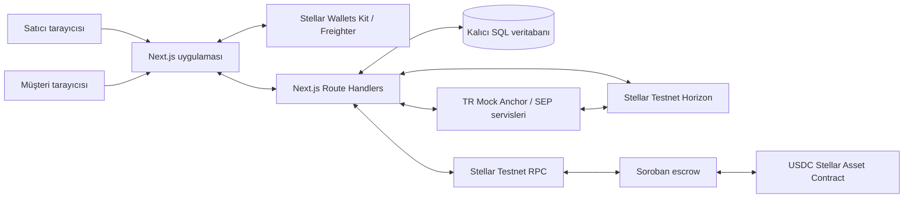
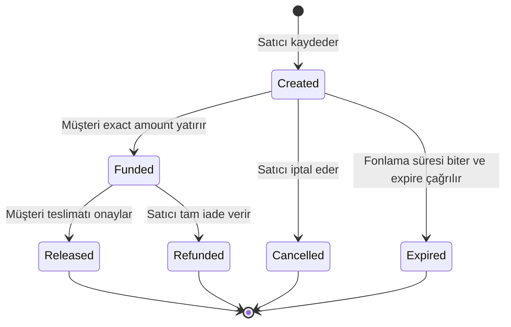

> **19 Eylül 2026 kapsam düzeltmesi:** Ana ürün artık **Centerp** şirket çalışma alanıdır. Bu belge finans/Anchor/escrow modülünün teknik araştırmasıdır. Güncel ERP kapsamı için [ürün kapsamı belgesine](project/product-scope.md) bakın.

# Centerp — Stellar Araştırması ve Hackathon MVP Tasarımı

**Araştırma tarihi:** 18 Eylül 2026  
**Etkinlik:** Rise In × Stellar Pro Hackathon, 19–20 Eylül 2026, Grand Pera / İstanbul  
**Track:** Genesis  
**Ağ:** Yalnızca Stellar Testnet  
**Ürün adı:** Centerp; önceki çalışma adları Stellar Invoice Bridge ve StellarPay ERP  
**Belgenin durumu:** Kaynaklarla desteklenen araştırma ve önerilen uygulama tasarımı. Henüz geliştirilmiş veya uçtan uca test edilmiş bir ürünün raporu değildir.

> Projenin ana fikri: Bir şirketin ödeme talebini, müşterinin TRY ile test USDC edinmesini, USDC'nin escrow'a yatırılmasını, teslimat onayından sonra satıcıya geçmesini ve satıcının TRY çekimini tek bir faturaya bağlı işlem dosyasında izlemek.

Bu proje gerçek para veya Mainnet kullanmayacak. Banka hareketleri ve KYC, TR Mock Anchor tarafından simüle edilecek; USDC transferleri ve Soroban sözleşme çağrıları Stellar Testnet üzerinde gerçekleşecek. Web arayüzünün demo için erişilebilir olması, finansal sistemin Mainnet'e geçirilmesi anlamına gelmez.

## İçindekiler

1. [Projenin özeti ve konumlandırma](#1-projenin-özeti-ve-konumlandırma)
2. [Problem, hedef kullanıcı ve varsayımlar](#2-problem-hedef-kullanıcı-ve-varsayımlar)
3. [Hackathon kuralları ve proje uyumu](#3-hackathon-kuralları-ve-proje-uyumu)
4. [Araştırmada doğrudan doğrulananlar](#4-araştırmada-doğrudan-doğrulananlar)
5. [Benzer projeler ve farklılaşma](#5-benzer-projeler-ve-farklılaşma)
6. [Stellar neden uygun?](#6-stellar-neden-uygun)
7. [Kapsam ve öncelikler](#7-kapsam-ve-öncelikler)
8. [Roller ve ürün kuralları](#8-roller-ve-ürün-kuralları)
9. [Uçtan uca kullanıcı akışı](#9-uçtan-uca-kullanıcı-akışı)
10. [Mimari](#10-mimari)
11. [Teknoloji kararları](#11-teknoloji-kararları)
12. [Cüzdan ve Testnet hazırlığı](#12-cüzdan-ve-testnet-hazırlığı)
13. [Anchor keşfi ve SEP-10](#13-anchor-keşfi-ve-sep-10)
14. [TRY → USDC yatırma](#14-try--usdc-yatırma)
15. [SEP-38 ve kur yönetimi](#15-sep-38-ve-kur-yönetimi)
16. [USDC → TRY çekme](#16-usdc--try-çekme)
17. [Soroban escrow tasarımı](#17-soroban-escrow-tasarımı)
18. [Sözleşme durum makinesi](#18-sözleşme-durum-makinesi)
19. [Timeout, iptal ve iade](#19-timeout-iptal-ve-iade)
20. [Soroban işlem yaşam döngüsü](#20-soroban-işlem-yaşam-döngüsü)
21. [Veri modeli](#21-veri-modeli)
22. [Mutabakat ve kanıt modeli](#22-mutabakat-ve-kanıt-modeli)
23. [API ve modül sınırları](#23-api-ve-modül-sınırları)
24. [Ekranlar ve arayüz](#24-ekranlar-ve-arayüz)
25. [Güvenlik ve veri gizliliği](#25-güvenlik-ve-veri-gizliliği)
26. [Hatalar, devam etme ve idempotency](#26-hatalar-devam-etme-ve-idempotency)
27. [Doğrulama ve test planı](#27-doğrulama-ve-test-planı)
28. [Geliştirme sırası ve zaman planı](#28-geliştirme-sırası-ve-zaman-planı)
29. [Demo senaryosu](#29-demo-senaryosu)
30. [Jüri anlatısı ve başarı ölçümü](#30-jüri-anlatısı-ve-başarı-ölçümü)
31. [Klasör yapısı ve ortam değişkenleri](#31-klasör-yapısı-ve-ortam-değişkenleri)
32. [Teslim paketi](#32-teslim-paketi)
33. [Riskler ve açık kararlar](#33-riskler-ve-açık-kararlar)
34. [Hackathon sonrasına bırakılanlar](#34-hackathon-sonrasına-bırakılanlar)
35. [İlk yapılacak işler](#35-ilk-yapılacak-işler)
36. [Kaynaklar ve araştırma sınırları](#36-kaynaklar-ve-araştırma-sınırları)

## 1. Projenin özeti ve konumlandırma

### 1.1. Ürün tanımı

Stellar Invoice Bridge, küçük şirketler ve hizmet sağlayıcıları için tasarlanan bir fatura tahsilat ve mutabakat prototipidir. Satıcı ödeme talebi oluşturur, müşteri Stellar cüzdanıyla ödemeyi yapar, teslimat onayıyla ödeme satıcıya aktarılır ve uygulama bütün adımları aynı kayıt altında toplar.

Ürünün merkezinde cüzdan bakiyesi değil, **faturanın finansal yaşam döngüsü** bulunur. Bakiye yüklemek, faturayı ödemek ve tahsilatı banka tarafına çıkarmak farklı iş olaylarıdır.

### 1.2. Önerilen kısa açıklamalar

**Türkçe:** “TRY girişinden teslimat onayına ve TRY çıkışına kadar, şirket tahsilatlarını faturaya bağlı ve doğrulanabilir hale getiriyoruz.”

**İngilizce:** “A testnet invoice settlement bridge connecting a Turkish lira sandbox ramp, USDC escrow, and verifiable reconciliation.”

İngilizce sunumda sandbox ve testnet ifadeleri korunmalı. Gerçek bankayla anlaşma veya gerçek para transferi varmış gibi sunulmamalı.

### 1.3. Adlandırma kararı

Önerilen ad **Stellar Invoice Bridge**. “ERP” adı stok, satış, satın alma, muhasebe ve vergi entegrasyonu gibi daha geniş beklentiler yaratır. MVP bunları kapsamaz. “StellarPay” ise mevcut Stellar projelerinde de kullanılan bir ad; ayırt edici bir ekip markası seçilecekse ayrıca isim taraması yapılmalı.

Ödeme talebi/fatura, uygulamanın iş kaydıdır. Bu belge GİB e-Fatura, e-Arşiv veya vergi uyumluluğu iddiası içermez; bu alanlar MVP kapsamı dışındadır.

## 2. Problem, hedef kullanıcı ve varsayımlar

### 2.1. Ele alınan problem

Önerilen problem hipotezi: Küçük hizmet şirketleri ödeme talebini, banka hareketini, müşterinin onayını ve tahsilat durumunu ayrı yerlerde takip etmek zorunda kalıyor. Bir ödeme geldiğinde hangi faturayı kapattığını ve gerçekten satıcının kullanımına geçip geçmediğini anlamak manuel iş gerektiriyor.

Burada ödeme hızı kadar **eşleştirme, görünürlük ve durumların doğru ayrılması** önemlidir. Bu hipotez henüz kullanıcı görüşmeleriyle doğrulanmış bir pazar bulgusu değildir.

### 2.2. İlk hedef segment

İlk demo için hedef: Türkiye'de çalışan küçük yazılım ajansları, tasarım stüdyoları ve proje bazlı hizmet sağlayıcıları. Tek teslimat, tek müşteri, tek ödeme senaryosu bu segment üzerinden anlaşılır şekilde anlatılabilir.

MVP'nin iki tarafı:

- **Satıcı:** Hizmeti veren ve faturayı oluşturan şirket/kişi.
- **Müşteri:** Ödemeyi yapan, hizmeti alan ve teslimatı onaylayan şirket/kişi.

Üçüncü bir yönetici gerçek kullanıcı gibi davranmayacak. Sunumda iki ayrı cüzdan kullanılacak; uygulamadaki rol seçimi kimliği değiştirmeyecek.

### 2.3. Doğrulanacak kullanıcı soruları

1. Bugün tahsilatın hangi faturaya ait olduğunu nasıl eşleştiriyorsunuz?
2. Tam veya eksik ödeme ayrımını kim yapıyor?
3. Teslimat ve ödeme arasında hangi anlaşmazlıklar oluyor?
4. USDC ile ödeme almak sizin için kabul edilebilir mi?
5. TRY giriş/çıkışı olursa bu çözümü denemek ister misiniz?
6. İlk ihtiyaç escrow mu, doğrudan tahsilat ve otomatik eşleştirme mi?

Hackathonda birkaç kısa görüşme değerli olabilir. Görüşme yapılmadıysa “pazar doğrulandı” denmeyecek. Ekip arkadaşlarıyla yapılan testler, bağımsız müşteri doğrulaması olarak sayılmayacak.

## 3. Hackathon kuralları ve proje uyumu

Bu bölümün etkinlik kuralları, kullanıcının klasöre eklediği **docs/hackathon-tracks.md** dosyasına dayanır. Organizasyonun etkinlik içi son açıklamaları farklıysa bunlar esas alınmalı.

### 3.1. Önemli gereksinimler

| Gereksinim | Belgedeki anlamı | Projedeki karşılık |
| --- | --- | --- |
| Genesis | Yeni ürün, sıfırdan geliştirme | Yeni fatura tahsilat ve mutabakat MVP'si |
| Takım | En fazla 4 kişi | Küçük ekip; önerilen görev paylaşımı bölüm 28'de |
| Mevcut ekosistem entegrasyonu | Uygun protokol/partner ve gerçek kullanım | Stellar Wallets Kit + Freighter; TRY Mock Anchor |
| Anchor/local payments | Ürünün para giriş/çıkış işlevi | SEP tabanlı TRY ⇄ test USDC |
| Core feature | Entegrasyonun ürün işlevinde gerekli olması | Fatura ödeme, escrow ve mutabakat |
| Teknik çıktı | Testnet sözleşmesi ve çalışan uygulama | Soroban escrow + Next.js arayüz |
| Belgeler | README, kod, contract ID'ler, demo ve teknik açıklama | Bu araştırmadan türetilecek teslim belgeleri |
| Skills | Kullanılan belirli skill yolları | Anchor skill ve gerçekten kullanılan geliştirme skill'leri |

Handbook'ta **Stellar Wallets Kit** uygun partner listesinde yer alıyor. Freighter'ı bu kit üzerinden bağlamak, cüzdan entegrasyonunu kayda geçirmenin en az ek kapsam isteyen yoludur. Bu, otomatik uygunluk garantisi değildir; jüri özellikle entegrasyonun üründe gerekli olmasına bakar.

Sadece listedeki bir partnerin logosunu göstermek, swap fiyatı çekmek veya kullanılmayan bir SDK kurmak anlamlı entegrasyon sayılmamalı. Sırf ekstra partner olsun diye bir DeFi protokolü eklemek ürünün odağını bozabilir.

### 3.2. Teslim zamanı

Handbook gündemine göre:

- Cumartesi kayıt: 09.00–10.00.
- Açılış ve teknik briefing: 10.15–11.00.
- Anchor workshop: 11.00–11.30.
- **Pazar proje teslimi: 12.00.**
- Genesis sunumları: 13.00–14.30.

Pazarlama metninde 36 saat denmesine rağmen açılış ile teslim arasında yaklaşık 25–26 saat var. Operasyonel plan teslim saatine göre kurulmalı. Zaman çizelgesi son briefing'de tekrar kontrol edilecek.

### 3.3. Track kararına etkisi

Scale'e ait yatırımcı/Lounge Day çıktıları Genesis için zorunlu kabul edilmeyecek. Bununla birlikte kısa bir mimari çizimi ve makul devam planı Genesis anlatısını da güçlendirir.

Kullanıcının kararı nettir: bu çalışma bir **Testnet hackathon projesidir**. Gerçek TRY hizmeti, Mainnet, bankacılık sözleşmeleri ve üretim operasyonu geliştirme kapsamına alınmayacak. Mock Anchor'ın etkinlikte kabul edilen sandbox olması ve partner yorumunun netleştirilmesi, kapsamı büyütmek için değil doğru teslim beyanı için yapılacak.

## 4. Araştırmada doğrudan doğrulananlar

### 4.1. Canlı Anchor gözlemleri

18 Eylül 2026'da aşağıdaki herkese açık adresler salt okunur şekilde sorgulandı. Hesap oluşturulmadı, imza atılmadı, deposit/withdraw başlatılmadı.

| Adres | Gözlem |
| --- | --- |
| `/.well-known/stellar.toml` | Testnet passphrase, SEP endpoint'leri, signing key ve test USDC issuer yayımlanıyor |
| `/health` | `ok: true`, `environment: sandbox`, `stellar_mode: live` döndü |
| `/sep6/info` | Deposit, withdraw ve iki exchange varyantı etkin; kimlik doğrulaması gerekli |
| `/sep38/info` | Test USDC ve `iso4217:TRY` ile `bank_account` teslim yöntemleri listeleniyor |
| `/sep` | Standart SEP akışını ve SEP-24'ün bu mock'ta bulunmadığını açıklıyor |
| `/llms-full.txt` | Banka/KYC simülasyonu ve gerçek Testnet USDC hareketini açıklıyor |

`/health` yanıtındaki sunucu zamanı **2026-09-18T17:53:37.324Z** idi. Bu tek anlık gözlem, etkinlik boyunca servis garantisi veya uçtan uca entegrasyon testi değildir.

Kaynaklar: [Anchor teknik akışı](https://tr-mock-anchor.fly.dev/sep), [yapılandırma](https://tr-mock-anchor.fly.dev/.well-known/stellar.toml), [health](https://tr-mock-anchor.fly.dev/health), [SEP-6 capabilities](https://tr-mock-anchor.fly.dev/sep6/info), [SEP-38 capabilities](https://tr-mock-anchor.fly.dev/sep38/info).

### 4.2. Doğrulanan yapılandırma

```text
Home domain: tr-mock-anchor.fly.dev
Asset code: USDC
Asset issuer: GBBD47IF6LWK7P7MDEVSCWR7DPUWV3NY3DTQEVFL4NAT4AQH3ZLLFLA5
Network passphrase: Test SDF Network ; September 2015
Auth: https://tr-mock-anchor.fly.dev/auth
Transfer: https://tr-mock-anchor.fly.dev/sep6
Quotes: https://tr-mock-anchor.fly.dev/sep38
KYC: https://tr-mock-anchor.fly.dev/sep12
Signing public key: GDXYO6FJCNXZEWGXD54GT76FGFYLOLSOGSOJLNQ6WGHCGEQPO7NTE73M
Treasury public address: GCLCZEQZ2THTEDAOFI66LACNPLY4OBKN7VKLEZFMBIHYKYQOW2W7T3Z6
Horizon: https://horizon-testnet.stellar.org
Soroban RPC hedefi: https://soroban-testnet.stellar.org
```

Signing key ve treasury adresi **public** değerlerdir; secret key değildir. İşlemde kullanılacak withdraw adresi yine de ilgili withdraw yanıtından alınmalı, yalnızca bu listedeki adrese körlemesine gönderilmemeli.

### 4.3. Limit tutarsızlığı

Kaynaklar aynı sınırları söylemiyor:

| Kaynak | Bildirilen sınırlar |
| --- | --- |
| Paylaşılan hackathon SKILL.md | Deposit 50–3.000 TRY; withdraw en az 1 USDC |
| Canlı `/health` | Aynı TRY sınırları ve minimum 1 USDC |
| Canlı `/sep6/info` | USDC deposit/withdraw ve exchange bloklarında min `0.5`, max `300` |

Bu değerlerin bir kısmı on-chain asset cinsinden metadata olabilir; bunun böyle olduğu bu araştırmada doğrulanmadı. `0.5` değerini TRY sınırı kabul etmek hatalı olabilir.

**Uygulama kararı:** Birimleri açık tut; runtime capabilities'i oku; TRY için mock'a özgü health sınırlarını da karşılaştır; çelişkide “dokümantasyon ve runtime limitleri farklı” tanısı üret. Birimi doğrulanmamış limitten otomatik dönüşüm türetme. Demo tutarını açıkça ilan edilmiş aralık içinde seç ve ilk smoke testte sınır davranışını kontrol et.

### 4.4. Salt okunur fiyat örneği

`GET /sep38/price` üzerinde `context=sep6`, `sell_delivery_method=bank_account` ve `buy_amount=20.0000000` kullanıldı. O anda gösterge yanıtı:

| Alan | Gözlenen değer |
| --- | --- |
| Satılan varlık | TRY |
| Alınan varlık | Test USDC |
| `sell_amount` | `980.59` TRY |
| `buy_amount` | `20.0000000` USDC |
| `price` | `48.785078` |
| `total_price` | `49.0295000` |
| `fee.total` | `4.89` TRY |

Bu bir **gösterge fiyatıdır**, rezervasyon veya kilitli quote değildir. Uygulamada bu tutarlar sabit yazılmayacak. Gerçek demo sırasında taze fiyat ve gerekiyorsa authenticated firm quote alınacak.

### 4.5. Henüz doğrulanmamış davranışlar

- Freighter ile SEP-10 imzasının mock tarafından kabul edilmesi.
- Authenticated `POST /quote` ve quote'un exchange işleminde kullanılması.
- Deposit'in banka simülasyonundan sonra cüzdana USDC göndermesi.
- Withdraw memo'sunun eşleştirilmesi ve `completed` olması.
- Doğru Testnet SAC adresinin mevcut/deploy edilmiş olması.
- Bizim escrow sözleşmemizin Testnet üzerinde çalışması.
- Hosted demo ortamında kalıcı veritabanı ve tarayıcı uyumluluğu.

Bu davranışlar planın ilk teknik doğrulama adımlarıdır; çalıştıkları şimdiden iddia edilmeyecek.

## 5. Benzer projeler ve farklılaşma

### 5.1. Araştırmanın sonucu

“Blockchain üzerinde fatura, ödeme ve mutabakat” boş bir kategori değildir. Benzer altyapılar ve başvurular bulundu. Bu proje özgünlüğünü yalnızca ERP veya USDC kelimelerinden elde etmeyecek.

| Proje/kaynak | Doğrulanan yakınlık | Bizim için sonuç |
| --- | --- | --- |
| ElementPay SCF başvurusu | Stellar transaction ID'lerini fatura, collection, payout ve settlement referanslarına bağlamayı planlıyor | Referans eşleştirme tek başına yeni bir fikir değil |
| Trustless Work | Soroban üzerinde escrow altyapısı ve geliştirici araçları sunuyor | “Escrow icat ettik” iddiası kullanılmamalı |
| Grade ERP, SCF #35 kayıt listesi | “Grade App Onchainification on Stellar” adlı başvuru listeleniyor | ERP adıyla Stellar'a yönelmek daha önce düşünülmüş; ayrıntılı işlev eşitliği doğrulanmadı |
| StellarPay, São Paulo Builder Summit | Makine ödeme protokollerini ortak arayüzde birleştiren ödüllü proje | Aynı adın kullanılması ürünleri karıştırabilir |

ElementPay bilgisi **başvurudaki ekip beyanı ve yol haritasıdır**; planlanan bütün Stellar özelliklerinin canlıda çalıştığı sonucu çıkarılmamalı. Grade kaydında listelenen $125K da verilmiş fon olarak sunulmamalı; sayfa başvuruyu `Not Awarded` olarak gösteriyor.

Kaynaklar: [ElementPay başvurusu](https://communityfund.stellar.org/submissions/rech5LZCLUxZCNwaa), [Trustless Work geliştirici rehberi](https://docs.trustlesswork.com/trustless-work/introduction/developer-resources), [SCF #35 kayıtları](https://communityfund.stellar.org/awards/rechucpqB2hktcEm7), [StellarPay sonucu](https://developers.stellar.org/meetings/2026/08/13).

### 5.2. Önceki İstanbul hackathonundan alınan ders

Haziran 2026 İstanbul etkinliğinde SenseChain donanım bağlantısıyla ana kategoride birinci, Terminal8 DeFi yönetimiyle üçüncü, Constella veri lisanslama/gizliliğiyle kendi kategorisinde ikinci olmuş. Bu örnekler yeni bir fatura arayüzü kadar ürünün temel davranışının da anlatılması gerektiğini düşündürüyor; bu çıkarım bizim yorumumuzdur.

Kaynak: [ÇOMÜ resmî proje ve sonuç açıklaması](https://muhendislik.comu.edu.tr/arsiv/haberler/comuchain-toplulugu-ibw-kapsaminda-duzenlenen-stel-r816.html).

### 5.3. Önerilen farklılaşma

1. **Türkiye'ye özgü TRY sandbox koridoru:** Ürünün ilk ve son adımı anlaşılır bir yerel para akışı.
2. **Faturaya bağlı kanıt zinciri:** Deposit, ödeme ve cash-out ayrı referanslarla aynı kayıt altında.
3. **Dürüst durumlar:** Emanette para ile satıcının tahsil ettiği para karıştırılmıyor.
4. **Teslimat koşullu ödeme:** Tek teslimat için tarafları belli escrow.
5. **Muhasebe için kullanılabilir çıktı:** Bir fatura için CSV/JSON işlem dökümü; bağımsız ERP connector'ları ileri aşama.
6. **İşlemden sonra toparlanabilme:** Sayfa yenilense bile aynı transferin durumuna geri dönülüyor.

Bu birleşimin güçlü bir hackathon anlatısı olabileceği tasarım değerlendirmesidir. “Dünyada ilk”, “Türkiye'de tek” veya kesin kazanma iddiası yoktur.

## 6. Stellar neden uygun?

### 6.1. Teknik uyum

Stellar'da on/off-ramp işlemleri için ortak SEP standartları bulunur. SEP-6 uygulamanın kendi arayüzüyle deposit/withdraw yönetmesine, SEP-10 cüzdan sahipliğine dayalı Anchor oturumuna, SEP-38 ise farklı para birimleri arasındaki fiyat teklifine hizmet eder. Bu model proje akışına doğrudan karşılık verir. [SEP rehberleri](https://developers.stellar.org/docs/platforms/anchor-platform/sep-guide)

USDC gibi Stellar issued asset'ler, SAC üzerinden Soroban token arayüzüyle kullanılabilir. Klasik cüzdandan sözleşmeye transferde cüzdan trustline bakiyesi azalır, sözleşmenin token bakiyesi artar. Bu yüzden iki ayrı “USDC token” tasarlamaya gerek yoktur. [SAC açıklaması](https://developers.stellar.org/docs/tokens/stellar-asset-contract)

### 6.2. Ürün açısından katkı

Bizim tasarımımızda üç ayrı güven sınırı vardır:

- **Anchor:** TRY simülasyonu ve USDC giriş/çıkışını yönetir.
- **Sözleşme:** USDC'nin saklanması ve transfer kurallarını uygular.
- **Uygulama:** Fatura bilgilerini, erişimi ve kayıtların eşleştirilmesini yönetir.

Zincir, yanlış fatura açıklamasını veya gerçekte teslim edilmemiş hizmeti kendiliğinden tespit etmez. Teslimat onayı insana ait iş kararıdır. Bu ayrım projenin sınırlaması ve mimarisinin parçasıdır.

### 6.3. “Neden normal veritabanı yetmiyor?” cevabı

Fatura metni, müşteri adı ve dashboard için normal veritabanı uygundur. Ancak paranın hangi tarafın kontrolünde olduğu ve kimin hangi koşulla alabileceği yalnızca veritabanı bayrağına dayanmayacak. Bu kısım Soroban sözleşmesinin doğrulanabilir durumuna bağlı olacak.

Bu, herkesin blockchain'e ihtiyacı olduğu iddiası değildir. MVP, stablecoin ile ödeme kabul eden taraflar için programlanabilir tahsilat senaryosunu gösterecek.

### 6.4. Ekosisteme sağlanan değer

- Mock Anchor'a bağlı, tekrar kullanılabilir bir SEP istemci katmanı.
- Klasik Stellar varlığı ile Soroban escrow arasında örnek entegrasyon.
- İşlem hash'ini iş kaydına bağlayan açık veri modeli.
- İki cüzdanla çalışan Testnet demo ve hata toparlama akışları.
- Test edilebilir sözleşme kuralları ve yeniden kullanılabilir UI bileşenleri.

## 7. Kapsam ve öncelikler

### 7.1. Zorunlu MVP

| Özellik | Sınırı | Kabul ölçütü |
| --- | --- | --- |
| Cüzdan | Kit üzerinden Freighter, yalnızca Testnet G-address | İki kullanıcı doğru hesapla imzalıyor |
| Bakiye/trustline | XLM ve doğru issuer USDC | Trustline eksikliği açık eylem gösteriyor |
| Fatura | Tek müşteri, tek tutar, tek USDC varlığı | Kalıcı kayıt ve paylaşılabilir detay |
| Deposit | TRY → test USDC, SEP-1/10/6 | Banka simülasyonundan sonra doğrulanan transfer |
| Escrow | Create, fund, release, güvenli refund/cancel | USDC aynı fatura şartlarıyla hareket ediyor |
| Withdraw | USDC → simüle TRY, memo ile | Anchor durumu ve transfer kanıtı görülüyor |
| Mutabakat | Fatura referansları ve doğrulanmış zincir kanıtları | Yenilemeden sonra doğru durum korunuyor |
| Teslim | README, contract ID, demo, sunum | Jüri kurup/inceleyip akışı anlayabiliyor |

### 7.2. Zaman kalırsa

- SEP-38 firm quote ve standart exchange endpoint'leri; çalışırsa ana akışa dahil.
- Faturaya ait CSV/JSON dökümü.
- Kısa demo onboarding rehberi.
- Küçük hacimli aktivite günlüğü.
- Basit arama ve durum filtresi.

Quote'un görüntülenmesi ile gerçekten işlemde kullanılması ayrılacak. Firm quote tamamlanamazsa kilitli kur varmış gibi gösterilmeyecek; ana on/off-ramp akışı ve açıklanan fiyat davranışı korunacak.

### 7.3. İlk sürümden çıkarılanlar

Tam ERP, stok, vergi hesabı, GİB entegrasyonu, gerçek banka/KYC, Mainnet, kredi, yield, cross-chain, abonelik, çoklu token, kısmi ödeme, çok aşamalı teslimat, AI ajanları, passkey, otomatik arbitraj ve iki tema geliştirme kapsamı dışındadır.

Soroban sözleşmesi handbook teknik çıktısı nedeniyle korunur. Escrow büyütülmez; tek teslimat ve tam ödeme modeli kullanılır.

## 8. Roller ve ürün kuralları

### 8.1. Yetki matrisi

| Eylem | Satıcı | Müşteri | Diğer adres |
| --- | --- | --- | --- |
| Fatura/escrow oluşturma | Kendi adresi için evet | Hayır | Kendi satıcı kaydı için oluşturabilir |
| Fonlama | Hayır | Yalnızca kayıtlı payer | Hayır |
| Teslimat onayı ve release | Hayır | Yalnızca kayıtlı payer | Hayır |
| Fonlanmış işlemi iade | Satıcı, tamamını müşteriye | Tek başına süre öncesinde hayır | Hayır |
| Fonlanmamış kaydı iptal | Evet | İstenirse ret işlemi ayrı | Hayır |
| Fonlanmamış süreyi kapatma | Evet | Evet | Permissionless expire olabilir |
| Cash-out | Yalnızca kendi bakiyesi | Yalnızca kendi bakiyesi | Hayır |
| Gizli fatura metnini okuma | Evet | Evet | Hayır |

Kullanıcı UI'da “satıcı görünümü” seçerek başka satıcının yetkisini edinmez. Backend oturumu ve sözleşme imzası yetkinin kaynağıdır.

### 8.2. İş kuralları

- Fatura tutarı USDC cinsinden sabittir; TRY karşılığı o anki Anchor teklifidir.
- Payer ve payee farklı olmalıdır.
- Tutar sıfırdan büyük ve supported precision içinde olmalıdır.
- Fatura/escrow yayımlandıktan sonra tutar, payer, payee ve ödeme koşulları değiştirilemez.
- Hatalı fatura iptal edilip yeni fatura oluşturulur.
- Bir fatura yalnızca bir başarılı escrow fund işlemi alır.
- Müşterinin bakiye yüklemesi faturayı kapatmaz.
- Escrow fund işlemi satıcı tahsilatı sayılmaz.
- Release başarılıysa fatura tahsil edilmiştir; withdraw bunun devamındaki ayrı iştir.
- Withdraw hatası tamamlanmış release'i geriye çevirmez.

## 9. Uçtan uca kullanıcı akışı

### 9.1. Önerilen ana sıra

Faturayı müşterinin bakiye yüklemesinden **önce** oluşturmak daha güçlüdür. Böylece müşteri neyi ödeyeceğini bilir ve gereken TRY tahmini faturaya göre hesaplanır.

1. Satıcı Testnet cüzdanıyla bağlanır.
2. Müşteri public key'i, açıklama, tutar ve tarihlerle fatura oluşturur.
3. Satıcı, koşulları sözleşmeye kaydeden create işlemini imzalar.
4. Müşteri fatura bağlantısını açar ve kendi cüzdanıyla bağlanır.
5. Uygulama müşterinin doğru payer olduğunu doğrular.
6. XLM hesabı, USDC trustline ve mevcut USDC kontrol edilir.
7. Bakiye yetersizse gereken miktar için TRY deposit başlatılır.
8. Sandbox banka transferi kullanıcı eylemiyle simüle edilir.
9. Anchor ve zincir transferi doğrulanır.
10. Müşteri “Ödemeyi emanete yatır” işlemini imzalar.
11. Sözleşme Funded olur; satıcı müşterinin fonlama yaptığını görür.
12. Müşteri teslimatı onaylar, sözleşme USDC'yi satıcıya aktarır.
13. Satıcı isterse tutarı Anchor üzerinden TRY'ye çeker.
14. Fatura sayfasında iki tarafın ödeme/tahsilat kanıtları görünür.

### 9.2. Alternatif mevcut bakiye akışı

Müşteride yeterli USDC varsa deposit atlanabilir. Bu durumda faturanın “Anchor deposit kanıtı” zorunlu bir ödeme doğrulama koşulu değildir. Ana jüri demosu Anchor'ı gösterir; ürün gereksiz bakiye yüklemeye zorlamaz.

### 9.3. İki farklı para hareketinin ayrımı

Deposit müşteriye ait funding işlemidir. Withdraw satıcının cash-out işlemidir. Aynı cüzdanla her iki tarafı taklit etmek ürünün yetki mantığını kanıtlamaz; iki farklı hesap kullanılır.

## 10. Mimari

### 10.1. Bileşenler



Diyagram mantıksal bağlantıları gösterir. Cüzdan imzası kullanıcı tarayıcısında oluşur. Backend kullanıcı anahtarını taşımaz; imzalı XDR'yi doğrulayarak yayınlayabilir. Wallet SDK kullanılırsa bazı SEP istekleri doğrudan browser tarafında olabilir; seçilen yöntem tek bir adapter arkasında tutulur.

### 10.2. Yetkili veri kaynakları

| Veri | Yetkili kaynak | Uygulamanın rolü |
| --- | --- | --- |
| Fatura adı, açıklama, vade | Veritabanı ve kabul edilen immutable snapshot | Oluşturma ve erişim yönetimi |
| Payer/payee, tutar, escrow durumu | Soroban sözleşmesi | Doğrulama ve dashboard projection |
| Anchor banka simülasyonu | Anchor işlem API'si | Durumu gösterme |
| Zincir transferinin başarısı | Testnet RPC/Horizon | Kanıtı doğrulama |
| Cüzdan adresi | Kullanıcı imzasıyla doğrulanan oturum | Kullanıcı kimliği |
| Kur teklifi | SEP-38 yanıtı | Saklama ve doğru birimde gösterme |

Backend'in “paid” yazması parayı hareket ettirmez. RPC'de başarı, doğru token/adres/tutar ve sözleşme durumu görülmeden fatura tahsil edildi kabul edilmeyecek.

### 10.3. Basit izleme yaklaşımı

Hackathonda Kafka veya bağımsız indexer kümesi kurmak gereksiz. Öneri:

- Her işlemden önce operation kaydı oluştur.
- İmzalı işlem hash'ini submit'ten önce sakla.
- Submit'ten sonra status kontrolü yap.
- Fatura detayındaki refresh API'si ilgili işlemleri tekrar doğrulasın.
- Soroban event cursor ve doğrulanmış sonucu DB'ye yaz.
- Dashboard yüklenince sonuçlanmamış kayıtları yenile.

Bu yöntem basit hacimde yeterlidir. Uzun süreli kurumsal indexleme bu MVP'nin iddiası değildir.

## 11. Teknoloji kararları

### 11.1. Önerilen stack

| Katman | Karar | Neden |
| --- | --- | --- |
| Frontend/backend | Next.js App Router + TypeScript | Tek repo ve hızlı entegrasyon |
| UI | Tailwind + seçilmiş shadcn/ui bileşenleri | Form, tablo, dialog ve durum kartları |
| Wallet | Stellar Wallets Kit; ilk modül Freighter | Handbook partner listesi ve kullanıcı imzası |
| Stellar işlemleri | `@stellar/stellar-sdk` | Horizon/RPC/XDR/SAC işlemleri |
| Anchor | SEP adapter; Wallet SDK değerlendirilecek | Mock'a bağımlı kodu sınırlamak |
| Contract | Rust + Soroban SDK | Escrow kurallarının zincirde uygulanması |
| Amount arithmetic | Decimal kütüphanesi + integer token units | Kesin miktar karşılaştırması |
| Validation | Zod veya eşdeğer schema | Backend ve form sınırları |
| DB | Kalıcı SQL; local geliştirmede SQLite mümkün | İki kullanıcının ortak kayıtları |
| Test | Rust contract testleri + odaklı TS testleri | Para ve yetki kuralları |

### 11.2. Sürüm politikası

Ekip taslağı Next.js 14/15 öneriyor. Araştırma anındaki güncel resmî Next.js rehberi 16 davranışlarını da içeriyor; örneğin minimum Node.js 20.9 ve build'in linter'ı otomatik çalıştırmaması. Bu yüzden `create-next-app@latest` ile 15 kurulduğunu varsaymak yanlış olur. [Next.js kurulum rehberi](https://nextjs.org/docs/app/getting-started/installation)

Öneri: Ekip 15'e aşinaysa desteklenen, yamalı bir 15.x seç; değilse mevcut stable sürümle cüzdan/SDK smoke test yap. Kesin patch sürümleri bu araştırmada paket registry üzerinden doğrulanmadı. Geliştirme başlangıcında seçilen sürümler lockfile ve README'ye kaydedilecek. SDK/Wallets Kit major sürümleri karıştırılmayacak.

### 11.3. Paket adı tuzağı

Wallets Kit'in güncel kendi dokümanı **`@creit-tech/stellar-wallets-kit`** kullanıyor. Anchor sayfasında yazımı farklı bir paket adı görülüyor; kurulumda SDK'nın kendi dokümanı esas alınmalı.

Güncel Kit örneklerinde static `StellarWalletsKit.init()` ve wallet module importları bulunuyor. Eski constructor/openModal örnekleri aynı major sürümde çalışır kabul edilmeyecek. [Kit yapısı](https://stellarwalletskit.dev/kit-structure.html), [Stellar ekosistem wallet rehberi](https://github.com/stellar/ecosystem-resources/blob/main/wallet-integration/stellar-wallets-kit.md).

### 11.4. Database ortamı

SQLite, local Node.js sunucusunda iki tarayıcının aynı kayıtları görmesi için uygundur. Stateless/serverless demo ortamında yerel dosyaya güvenilmez; kalıcı SQL bağlantısı gerekir. Demo yalnızca tek tarayıcı localStorage'ıyla hazırlanmayacak.

Kullanıcı adına imzalama ve backend cüzdanı tutma yerine non-custodial model seçilecek. Contract deployment için geliştirme kimliği ayrı CLI ortamında kalacak.

## 12. Cüzdan ve Testnet hazırlığı

### 12.1. Hazırlık kontrolü

Her iki hesap için:

1. Freighter var mı ve uygulamaya erişim verilmiş mi?
2. Public key geçerli bir G-address mi?
3. Ağ passphrase'i beklenen Testnet mi?
4. Testnet hesabı ledger'da mevcut mu?
5. XLM işlem ücreti ve reserve için yeterli mi?
6. Doğru issuer için USDC trustline var mı?
7. Gereken bakiye ve token kimliği doğru mu?

Eksik hesabı Friendbot ile fonlamak kullanıcı tarafından başlatılan sandbox hazırlık eylemi olabilir. Anchor'ın `/info` yanıtı `account_creation: false` bildiriyor; hesabı Anchor'ın yaratacağını varsaymayacağız.

### 12.2. İmzalama davranışı

Freighter güncel API'sinde transaction imzası `signedTxXdr`, `signerAddress` ve olası `error` içeren yanıt döndürüyor. Ağ ve beklenen hesap imza talebinde belirtilecek, dönen signer kontrol edilecek. [Freighter signing](https://docs.freighter.app/extension-freighter-api/signing)

Adres ve ağ bilgisi için güncel `getAddress`, `getNetwork` / `getNetworkDetails` metotları referans alınmalı. Hesap değişiminde eski kullanıcıya ait oturum/token ve bekleyen UI eylemi temizlenecek. [Freighter reading data](https://docs.freighter.app/extension-freighter-api/reading-data)

### 12.3. İki işlem türü

- **Klasik:** Trustline açma ve Anchor treasury'ye memo'lu payment.
- **Soroban:** Create, fund, release, refund sözleşme invocation'ları.

Her ikisi cüzdanda imzalanır ama fee, simulation ve yayınlama akışları aynı varsayılmayacak.

## 13. Anchor keşfi ve SEP-10

Bu bölümde paylaşılan [hackathon Anchor SKILL.md](https://github.com/yigitcangokmen/stellar-hackathon-turkiye/blob/main/SKILL.md) ve handbook'un önerdiği [Cheesecake Labs Anchor skill](https://github.com/CheesecakeLabs/stellar-anchor-skill/blob/main/SKILL.md) kullanıldı. İkinci skill'in client discovery/auth, SEP-6 ve SEP-38 referansları da incelendi. Referanslardaki örnekler tasarım rehberidir; üretim kodu veya bizim cüzdan modeliyle birebir uyum garantisi değildir.

### 13.1. SEP-1 discovery

Başlangıç konfigurasyonu yalnızca allowlist'teki home domain ve seçilen asset olmalı. Runtime'da TOML'dan:

- `WEB_AUTH_ENDPOINT`
- `SIGNING_KEY`
- `TRANSFER_SERVER`
- `ANCHOR_QUOTE_SERVER`
- `KYC_SERVER`
- `NETWORK_PASSPHRASE`
- `CURRENCIES` içindeki code/issuer

alınır. Ağ passphrase'i beklenen Testnet değeriyle karşılaştırılır; farklıysa imza yolu durdurulur. “TOML öyle dedi” diye Mainnet'e geçilmez.

Home domain ve endpoint adreslerini fatura sahibinin serbestçe değiştirmesine izin verilmez. Backend proxy'si arbitrary URL kabul etmeyecek; HTTPS ve allowlist kontrolü olacak.

### 13.2. SEP-10 challenge

Önerilen akış:

1. Anchor'dan kullanıcının public key'i için challenge al.
2. Server signature, sequence `0`, doğru kullanıcı, home domain, auth domain, manage-data yapısı ve zaman sınırlarını SDK/spec kurallarıyla doğrula.
3. Yalnızca doğrulanan challenge'ı cüzdana gönder.
4. Kullanıcı imzasını al.
5. İmzalı XDR'yi Anchor auth endpoint'ine POST et.
6. Anchor JWT'sini bu account/domain oturumuna bağla.

Challenge network'e gönderilmez; login için imzalanıp auth servisine geri verilir. Kimlik doğrulama işlemi USDC transferi değildir. [SEP-10 resmî spesifikasyonu](https://github.com/stellar/stellar-protocol/blob/master/ecosystem/sep-0010.md)

SDK'da kullanılan challenge verification helper'ının tam parametreleri seçilen sürümün type tanımlarından kontrol edilecek. Yalnızca `TransactionBuilder.fromXDR` ile açıp körlemesine imzalamak yeterli değildir.

### 13.3. Uygulama oturumu ile Anchor oturumu

İki ayrı kavram:

- **App session:** Fatura okuma/yazma yetkisi.
- **Anchor token:** Deposit/withdraw API yetkisi.

App session için backend'in ürettiği tek kullanımlık nonce, domain, network ve kısa süre içeren mesaj cüzdanda imzalanabilir; backend imzayı doğrulayıp HttpOnly cookie oluşturur. Alternatif tam SEP-10 app auth daha fazla kurulum ister. Hangi yöntem seçilirse seçilsin body'de `publicKey` yazmak oturum sayılmayacak.

Anchor JWT'sini sadece decode etmek kullanıcı kimliği doğrulaması değildir. App auth için kullanılıyorsa imza, issuer/audience, expiry ve beklenen account bağları ayrıca doğrulanmalıdır. En basit ayrım kendi wallet-proof session ve ayrı Anchor JWT tutmaktır.

### 13.4. Token saklama

Öneri: Anchor JWT backend session storage'da, browser'a görünmeyen oturum ilişkisiyle saklansın. User secret key hiçbir zaman backend'e gelmesin. Local-only daha basit demo tercih edilirse token memory'de tutulabilir; localStorage ve loglara yazılmaz.

Token süresi dolarsa kullanıcıdan yeniden Anchor auth imzası istenebilir. Wallet consent gerektiren imza “sessizce” üretilemez. Mevcut transaction ID korunur, baştan deposit açılmaz.

## 14. TRY → USDC yatırma

### 14.1. Temel mock akışı

Mock'un yayımladığı basit deposit örneğinde `amount` TRY girdisidir:

```text
GET /sep6/deposit
  asset_code=USDC
  account=<müşteri public key>
  amount=<TRY decimal string>
  funding_method=bank_account
Authorization: Bearer <Anchor JWT>
```

Yanıtın `id`, banka talimatı ve `more_info_url` alanları saklanır. Sandbox simülasyonu:

```text
POST /sep6/tx/<anchor transaction id>/simulate-bank-transfer
Content-Type: application/json
Body: { amount: <TRY decimal string> }
```

Sonra aynı ID ile `/sep6/transaction` sorgulanır. Endpoint'e Authorization eklenebilir; gerçek gereksinim ilk smoke testte kontrol edilir. Banka simülasyon butonu yeni bir deposit oluşturmaz.

Kaynak: [Mock SEP akışı](https://tr-mock-anchor.fly.dev/sep), [mock machine reference](https://tr-mock-anchor.fly.dev/llms-full.txt).

### 14.2. Önemli taşınabilirlik sınırı

Standart plain SEP-6 deposit'in amount anlamı ile bu mock'un TRY kolaylık akışı aynı kabul edilmeyecek. Farklı para birimi dönüşümünü daha açık modellemek için exchange endpoint'i tercih edilir. Mock'a özgü request oluşturma ayrı adapter'da tutulacak.

### 14.3. Deposit durumları

| Durum | Kullanıcı mesajı | Sonraki eylem |
| --- | --- | --- |
| `pending_user_transfer_start` | Sandbox banka transferi bekleniyor | Talimat/simülasyon |
| `pending_anchor` | Anchor işlemi hazırlıyor | Aynı ID'yi izle |
| `pending_trust` | USDC almak için trustline gerekli | Cüzdanda changeTrust imzala |
| `completed` | Anchor yatırmayı tamamladı | USDC transfer kanıtı ve bakiye yenile |
| `error` | İşlem tamamlanamadı | Hata detayını normalleştir |
| Bilinmeyen durum | Anchor ek işlem bekliyor | Ham durum sakla, başarıya çevirmeden göster |

Claimable balance desteği metadata'da etkin olsa da MVP önce trustline açacak ve doğrudan transfer kullanacak. Claimable balance'ı oluşturan işlem her zaman harcanabilir USDC bakiyesi anlamına gelmez.

### 14.4. Faturaya tam tutar yükleme

Fatura 20 USDC ise kullanıcıya “rastgele 1.000 TRY yatır” önerilmez. Önce mevcut kullanılabilir USDC ölçülür, eksik tutar belirlenir ve Anchor fiyatına göre TRY gereksinimi gösterilir.

Firm quote desteklenirse `buy_amount` ile tam eksik tutarı hedeflemek denenir. Mock bunu reddederse TRY tutarı kontrollü yuvarlanır ve sonuçtaki gerçek USDC bakiyesi doğrulanır. Küsurat kalabilir; faturaya gereğinden fazla ödeme gönderilmez.

## 15. SEP-38 ve kur yönetimi

### 15.1. Asset kimlikleri

SEP-38 fiyat çağrılarında:

```text
TRY = iso4217:TRY
USDC = stellar:USDC:GBBD47IF6LWK7P7MDEVSCWR7DPUWV3NY3DTQEVFL4NAT4AQH3ZLLFLA5
context = sep6
delivery method = bank_account
```

Gösterge fiyatı ve firm quote farklıdır. `POST /quote` kimlik doğrulaması gerektirir, quote ID ve expiration üretir. Downstream transferde bu quote'a referans verilmelidir. Kaynak: [SEP-38 spesifikasyonu](https://github.com/stellar/stellar-protocol/blob/master/ecosystem/sep-0038.md).

### 15.2. Önerilen firm quote akışı

1. Faturadaki eksik USDC için `/price` gösterge sonucu al.
2. Kullanıcı devam edince `POST /quote` ile `context=sep6`, doğru delivery method ve tek amount yönü gönder.
3. Yanıtın ID, amount, asset, fee ve expiry değerlerini sakla.
4. `/deposit-exchange` veya `/withdraw-exchange` işlemini quote değerlerinden üret.
5. Transfer zamanı/süre koşullarını göster.
6. Expired quote'ta fiyatı güncelle, gerekiyorsa kullanıcı yeniden onaylasın.

Quote'un uzun vadeli faturayı sabitlediği söylenmez. Fatura USDC tutarını sabitler; TRY kuru işlem sırasında alınır. Satıcının çekim kuru müşterinin yatırma kurundan farklı olabilir.

### 15.3. Exchange parametreleri: önemli ayrım

Güncel SEP-6 spesifikasyonunda exchange endpoint'lerinin on-chain varlık parametreleri **code** kullanır:

| İşlem | `source_asset` | `destination_asset` | `amount` birimi |
| --- | --- | --- | --- |
| Deposit exchange | `iso4217:TRY` | `USDC` | TRY |
| Withdraw exchange | `USDC` | `iso4217:TRY` | USDC |

SEP-38 quote tarafı ise tam Stellar asset identifier kullanır. Bu iki wire format birbiriyle karıştırılmamalı. `funding_method=bank_account`, account ve quote ID ilgili request'e eklenir; issuer bağını SDK/adapter'da koru. Parametre kabulü mock ile ayrıca test edilecek. [SEP-6 spesifikasyonu](https://github.com/stellar/stellar-protocol/blob/master/ecosystem/sep-0006.md)

### 15.4. Fee ve rounding

- TRY hesaplamaları decimal string; en fazla iki ondalık.
- USDC hesaplamaları decimal string; en fazla yedi ondalık.
- Sözleşme token miktarı integer `i128`; USDC için doğrulanan token decimals kullanılır.
- `parseFloat` ile finansal karşılaştırma yapılmaz.
- Decimal'den token units'e dönüşümde fazla precision sessizce kesilmez; reddedilir.
- Spread zaten quote sonucuna dahilse ikinci kez yüzde fee eklenmez.
- TRY dönüş miktarı yatırılan TRY'ye eşit olmak zorunda değildir; spread ve iki farklı kur yönü etkiler.

## 16. USDC → TRY çekme

### 16.1. Önerilen akış

1. Release başarısını ve satıcının kullanılabilir USDC'sini doğrula.
2. Satıcı kendi Anchor oturumunu açar.
3. Withdraw veya quote destekli withdraw-exchange başlatılır.
4. Yanıttaki transaction ID, hedef account, memo ve memo type kaydedilir.
5. Satıcı, doğru USDC issuer ile hedef account'a payment imzalar.
6. Memo **aynen** response'tan alınır; fatura numarasıyla değiştirilmez.
7. Zincir işlemi başarıyla tamamlanır.
8. Anchor aynı transferi algıladığında status izlenir.
9. Anchor `completed` derse “TRY çekimi sandbox'ta tamamlandı” görünür.

### 16.2. Neden escrow'dan doğrudan Anchor'a göndermiyoruz?

MVP'de escrow önce satıcının G-address cüzdanına release yapar. Satıcı Anchor withdraw payment'ını ayrı olarak imzalar. Böylece memo'lu klasik payment ve kullanıcı hesabına bağlı SEP-10 akışı anlaşılır şekilde çalışır.

Doğrudan contract → Anchor ödeme, contract authentication, memo/iş kaydı eşleştirme ve Anchor'ın C-address desteği gibi ek bağımlılıklar yaratabilir. Bunlar MVP kapsamı dışındadır.

### 16.3. İdempotency ve tekrar

Withdraw request oluşturulup payment başarılıysa HTTP timeout nedeniyle ikinci payment yapılmaz. Önce hash ve Anchor ID kontrol edilir. Memo number olarak `Number`'a çevrilmez; `Memo.id` için decimal string korunur.

Withdraw başarısızlığı faturanın tahsil edilmediği anlamına gelmez. Fatura Released, cash-out Pending/Error olarak ayrı gösterilir.

## 17. Soroban escrow tasarımı

Bu bölüm **önerilen kendi sözleşmemizin tasarımıdır**. Trustless Work sözleşmesinin birebir açıklaması veya audit edilmiş bir protokol değildir.

### 17.1. En küçük güvenli model

Tek sözleşmede birden fazla fatura tutulur. Her fatura tek payer, tek payee, tek USDC token ve tek tam tutar içerir. Admin'in istediği hesaba fon çekebildiği fonksiyon olmayacak.

Önerilen sözleşme alanları:

```text
InvoiceEscrow:
  merchant: Address
  invoice_id: BytesN<32>
  payer: Address
  payee: Address
  amount_units: i128
  invoice_commitment: BytesN<32>
  funding_deadline: u64
  delivery_due_at: u64
  created_at: u64
  state: Created | Funded | Released | Refunded | Cancelled | Expired
```

Token adresi sözleşme seviyesinde init/constructor ile belirlenir; her faturada serbest token seçilmez. Domain için network ve sözleşme sürümü commitment'a eklenir.

### 17.2. Anahtar ve fatura kimliği

DB'de UUID, UI'da okunabilir `INV-...` kodu kullanılır. Zincir ID'si domain ayrımıyla UUID'den türetilen 32 byte identifier olur. Storage key önerisi `(merchant, invoice_id)`.

Merchant namespace, başka bir kullanıcının rastgele bir ID'yi önceden alıp satıcının kaydını engellemesini azaltır. Create işlemi merchant/payee yetkisini gerektirir; müşteri fund sırasında imzaladığı koşulları görür.

### 17.3. Önerilen fonksiyonlar

| Fonksiyon | Yetki | Davranış |
| --- | --- | --- |
| `create_invoice` | Merchant/payee auth | Koşulları immutable kaydeder |
| `fund` | Kayıtlı payer auth | Exact amount'u payer'dan escrow'a transfer eder |
| `release` | Kayıtlı payer auth | Tutarı payee'ye aktarır; terminal state |
| `refund` | Kayıtlı payee auth | Tam tutarı payer'a iade eder; terminal state |
| `cancel_unfunded` | Merchant auth | Fonlanmamış kaydı iptal eder |
| `expire_unfunded` | Public olabilir | Funding deadline geçen fonlanmamış kaydı kapatır |
| `get_invoice` | Public read | Zincir koşullarını/durumunu döndürür |

Soroban `require_auth()` yetkilendirmesi fonksiyon bazında uygulanmalı; contract çağrılarının kendiliğinden yetkili olduğu varsayılmaz. Kaynak: [contract authorization](https://developers.stellar.org/docs/build/guides/auth/contract-authorization).

### 17.4. Fon koruma kuralları

- Create sonrasında token/adres/tutar değiştirilemez.
- `amount_units > 0`; decimals ve üst limit uygulama/sözleşme seviyesinde düşünülür.
- Payer/payee aynı olamaz; MVP G-address taraflarını kullanır.
- Duplicate create/fund/release/refund reddedilir.
- Refund her zaman kayıttaki payer'a; release her zaman kayıttaki payee'ye gider.
- Başarısız token transferi ve state değişimi aynı invocation'da rollback olur.
- State kontrolü ve terminal state yazımı transferle atomik yürütülür.
- Funds transfer sonrası event çıkar; yanlış fonksiyon çağrıları terminal state'i bozmaz.
- Toplam açık funded yükümlülük token bakiyesinden büyük olamaz.
- Sözleşmeye doğrudan gönderilen fazladan USDC herhangi bir faturanın ödeme tutarı sayılmaz.
- MVP'de unrestricted sweep/admin withdraw bulunmaz.

`fund` için payer transaction source ise source-account authorization yolu kullanılabilir; gereksiz çok taraflı auth ve fee sponsorship ilk sürüme eklenmez. Signature/auth entegrasyonu Testnet smoke testle doğrulanır.

### 17.5. Storage ve TTL

Öneri: global token config instance storage; fatura kayıtları ayrı persistent entries. Bütün faturaları büyüyen instance Vec'e doldurmayacağız. Uzun ömürlü fon sahipliği için temporary storage uygun değil; TTL dolunca kayıt kalıcı silinebilir. [Storage türleri](https://developers.stellar.org/docs/build/guides/storage/choosing-the-right-storage)

Business deadline contract timestamp ile kontrol edilir. TTL business timeout değildir. Persistent/instance archival olduğunda restore akışı transaction simulation/client üzerinden ele alınır; contract fonksiyonu arşivdeki veriyi kendi kendine restore etmez. [State archival](https://developers.stellar.org/docs/learn/fundamentals/contract-development/storage/state-archival)

TTL helper'ları access/create sonrası makul bump uygular. Bu davranış test edilir; expiry, paranın sahibini değiştiren iş kuralı olarak kullanılmaz.

## 18. Sözleşme durum makinesi



Ledger'da kendi kendine zamanlayıcı çalışmaz. Süre geçince expire/refund/release otomatik invocation oluşmaz; ilgili eylem için transaction gerekir.

### 18.1. UI projection durumları

Sözleşmenin terminal state'leri ile arayüzün geçici durumları ayrılır:

| UI etiketi | Anlamı |
| --- | --- |
| Taslak | DB kaydı var, create henüz doğrulanmadı |
| Ödeme bekliyor | On-chain Created |
| İmza bekliyor | Wallet consent bekleniyor |
| Zincir onayı bekliyor | Hash var, inclusion henüz doğrulanmadı |
| Emanette | On-chain Funded |
| Teslimat gecikmiş | Funded ve delivery_due_at geçmiş; ownership değişmedi |
| Tahsil edildi | On-chain Released |
| İade edildi | On-chain Refunded |
| TRY çekimi bekliyor | Ayrı Anchor withdrawal iş akışı |
| TRY çekimi tamamlandı | Anchor sandbox tamamlanması |

“Teslimat gecikmiş” ek bilgi olarak hesaplanır; release'i veya paranın sahipliğini tek başına değiştirmez.

## 19. Timeout, iptal ve iade

### 19.1. Kritik iş problemi

Süre geçince müşteri tek başına parayı geri alabiliyorsa, teslim edilmiş işin bedelini de geri alabilir. Süre geçince satıcı otomatik alabiliyorsa, teslim edilmemiş işin bedelini alabilir. Blockchain bu uyuşmazlığı yalnızca zaman bilgisiyle çözmez.

Bu nedenle MVP'nin timeout modeli bilinçli olarak dar tutulur:

1. **Fonlanmamış fatura:** Funding deadline sonrası expire; para yok.
2. **Fonlanmış fatura:** Delivery deadline sonrası gecikmiş etiketi; otomatik fon transferi yok.
3. **Onay:** Müşteri release yapar.
4. **Anlaşmalı iptal:** Satıcı refund ile tam tutarı müşteriye döndürür.

Bu model tek taraflı haksız para çıkışını azaltır ancak müşteri hiç onaylamaz ve satıcı hiç refund yapmazsa fon kilitlenebilir. **MVP'de uyuşmazlık çözümü yoktur**; sunum ve README'de bu sınır açıkça yer alır.

### 19.2. Daha kapsamlı alternatifler

| Model | Ek iş | Karar |
| --- | --- | --- |
| İki tarafın refund'a auth vermesi | Çoklu auth/iki imza akışı | İlk sürümde yok |
| Hakem/dispute resolver | Yeni rol ve güven modeli | İlk sürümde yok |
| Emanette teslimat sinyali + itiraz süresi | Yeni durum makinesi | İlk sürümde yok |
| Sabit tarihte müşteri refund | Satıcı koruması zayıf | Varsayılan model olarak seçilmiyor |
| Sabit tarihte satıcı release | Müşteri koruması zayıf | Varsayılan model olarak seçilmiyor |

Kullanıcının “timeout/iptal senaryosu” isteği, fonlanmamış expiry ve satıcı tarafından onaylanan tam iade ile karşılanır. Otomatik her iki tarafı da koruyan escrow iddiası yapılmaz.

## 20. Soroban işlem yaşam döngüsü

### 20.1. İşlem oluşturma

1. Beklenen kullanıcının güncel sequence/account bilgisi alınır.
2. Invocation ve immutable args hazırlanır.
3. RPC simulate/prepare ile footprint, auth ve kaynak maliyeti hesaplanır.
4. Gerekli restore davranışı seçilen SDK sürümünde kontrol edilir.
5. UI işlemin neyi yapacağını gösterir.
6. Cüzdan imzalar.
7. Beklenen signer ve transaction içeriği doğrulanır.
8. Operation ID/hash DB'ye yazılır.
9. RPC'ye submit edilir.
10. Aynı hash üzerinden sonuç izlenir.

Simulation başarıyla sonuçlansa bile bu, transferin zincirde gerçekleştiği anlamına gelmez. [simulateTransaction](https://developers.stellar.org/docs/data/apis/rpc/api-reference/methods/simulateTransaction)

### 20.2. Submit sonucu

`sendTransaction` sonucu yalnızca kabul/kuyruğa alınma bilgisidir. `PENDING` başarıyla tamamlandı demek değildir. `DUPLICATE` aynı işlem için izlemeye devam etme, `TRY_AGAIN_LATER` kontrollü retry, `ERROR` ise reject incelemesi gerektirir. [sendTransaction](https://developers.stellar.org/docs/data/apis/rpc/api-reference/methods/sendTransaction)

`getTransaction` `SUCCESS`, `FAILED` veya `NOT_FOUND` döndürebilir. Yeni submit edilen işlemin henüz bulunmaması doğrudan başarısızlık değildir. RPC tarihçesi sınırlıdır; doğrulanan sonuçlar uygulamada saklanır. [getTransaction](https://developers.stellar.org/docs/data/apis/rpc/api-reference/methods/getTransaction)

### 20.3. Sözleşme state kontrolü

SUCCESS sonrası beklenen event ve current invoice state okunur. Contract ID, invoice key, payer, payee, token ve amount match edilmeden fatura durumu yükseltilmez.

Explorer bağlantısı destekleyici kanıttır; frontend'in verdiği hash'in doğruluğuna tek başına güvenilmez.

## 21. Veri modeli

### 21.1. Önerilen tablolar

| Tablo | Ana alanlar | İşlev |
| --- | --- | --- |
| `wallet_users` | id, public_key, network, created_at | İmzayla doğrulanan kullanıcı |
| `app_sessions` | user_id, session_id_hash, expires_at | Backend erişimi |
| `invoices` | uuid, code, seller, buyer, title, description, amount_units, issuer, dates, commitment, version | Off-chain iş belgesi |
| `escrows` | invoice_id, contract_id, merchant_key, chain_invoice_id, chain_state, last_ledger | On-chain referans/projection |
| `anchor_transactions` | id, owner, invoice_id?, kind, anchor_id, status, source/buy assets, amounts, quote_id?, hash? | Funding/cash-out |
| `quotes` | id, owner, anchor_quote_id, assets, sell/buy amounts, fee, expiry | Teklifin kabul edilen snapshot'ı |
| `chain_operations` | id, invoice_id?, actor, kind, expected_args_hash, tx_hash?, sequence?, max_time?, state | İmzalama/submit takibi |
| `settlement_allocations` | invoice_id, withdrawal_id, amount_units | Hangi tahsilatın ne kadarı çekime ayrıldı |
| `activity_log` | invoice_id, actor, event_type, source, timestamp | Audit trail; otorite değil |

MVP'de bazı tablolar aynı entity altında birleştirilebilir. Ancak business state, Anchor state ve transaction state aynı alan içinde eritilmemeli.

### 21.2. Önemli unique ve erişim kısıtları

- `(network, public_key)` unique.
- `(contract_id, merchant_key, chain_invoice_id)` unique.
- `(anchor_home_domain, owner, anchor_id)` unique.
- `tx_hash` doğrulanmış operation kayıtlarında unique.
- Aynı fatura için yalnızca bir aktif fund attempt; SQL transaction/unique guard.
- Kullanıcı yalnızca tarafı olduğu faturanın metnini okuyabilir.
- Anchor token farklı account'larla karıştırılmaz.
- Owner kontrollü Anchor transaction ID başka bir kullanıcıya bağlanamaz.

### 21.3. Fatura commitment

Immutable snapshot önerisi:

```text
schema_version
network
merchant
invoice_uuid
payer
payee
asset_code + issuer
amount_units
funding_deadline
delivery_due_at
random_nonce
hash_of_description_snapshot
```

Alan sırası ve encoding deterministik tanımlanır, SHA-256 gibi hash uygulanır ve sözleşmeye commitment yazılır. UI/DB detayının sözleşme koşullarıyla aynı snapshot'a ait olduğu kontrol edilir.

Commitment içeriğin doğruluğunu veya yasal geçerliliğini kanıtlamaz. Hash gizlilik garantisi de değildir; düşük entropili içerik tahmin edilebilir. Bu nedenle açıklama ve kişisel bilgiler zincire açık yazılmaz; rastgele nonce kullanılır ve belgenin güvenliği ayrıca yönetilir.

### 21.4. Para alanları

USDC token units DB'de integer/string veya exact numeric tutulur. API JSON'unda BigInt decimal string olarak taşınır. TRY, quote ve fee alanları exact decimal string'dir. UI'da iki hane göstermek, stored değerin iki haneye düşürüldüğü anlamına gelmez.

## 22. Mutabakat ve kanıt modeli

### 22.1. Faturanın ödeme dosyası

Her fatura için dört farklı kanıt:

1. **Funding:** Müşterinin Anchor deposit ID'si ve USDC transferi.
2. **Escrow ödeme:** Sözleşmenin Funded state'i ve fund transaction'ı.
3. **Tahsilat:** Released state ve satıcıya token transferi.
4. **Cash-out:** Satıcının Anchor withdraw ID'si, memo'lu payment ve sandbox sonucu.

Bu kanıtlardan yalnızca 2 ve 3 faturanın doğrudan ödeme/tahsilat koşullarıdır. 1 ve 4 para giriş/çıkış bağlamını sağlar.

### 22.2. Bakiyeden çıkarım yapmama

“Bakiyesi 20 USDC arttı, demek bu fatura ödendi” mantığı kullanılmaz. Cüzdana başka transfer gelebilir. Referanslar, contract state ve exact amount doğrulanır.

USDC fungible olduğu için “şu deposit'te alınan token'ın aynısı şu faturaya gitti” şeklinde coin takibi iddia edilmeyecek. Funding bağlantısı uygulamanın kullanım tahsisidir; gerçek ödeme kanıtı invoice-bound contract invocation'dır.

### 22.3. Withdraw tahsisi

Satıcının birden fazla tahsilatı tek cüzdanda birleşebilir. İlk sürüm tek invoice cash-out üzerinden demo yapar ama çekim kaydının faturalara tahsisi explicit tutulur. Aynı tahsilatın iki withdraw'a tam miktarla yazılması engellenir.

Çekim 20 USDC ise invoice allocation 20 USDC'dir. TRY output tutarı farklı birim olduğu için USDC alacak tutarından doğrudan çıkarılmaz.

### 22.4. Dashboard metrikleri

| Metrik | Hesaplama |
| --- | --- |
| Ödeme bekleyen fatura | On-chain Created; terminal değil |
| Emanette USDC | Funded invoice amount toplamı |
| Tahsil edilen USDC | Released amount toplamı |
| İade edilen USDC | Refunded amount toplamı |
| TRY çıkışı bekleyen | Owner withdrawal pending kayıtları |
| TRY çıkışı tamamlanan | Completed sandbox withdrawal'ın TRY output'u |

TRY ve USDC aynı kart toplamında karıştırılmaz. Funding deposit hacmi satış geliri gibi gösterilmez. İade edilen fatura tahsilat toplamına eklenmez.

### 22.5. ERP köprüsü çıktısı

Zaman kalırsa CSV veya JSON:

```text
invoice_code, seller, buyer, invoice_usdc,
escrow_state, fund_hash, release_hash, refund_hash,
deposit_anchor_id, withdrawal_anchor_id,
withdraw_usdc_allocated, withdraw_try_output,
quote_id, last_verified_at
```

Bu bir muhasebe aktarım örneğidir; Logo/Paraşüt/SAP entegrasyonu yapılmış gibi sunulmaz. Gerçek connector ve muhasebe kayıt şeması ileride araştırılır.

## 23. API ve modül sınırları

### 23.1. Önerilen app API

Aşağıdakiler **bizim uygulamamıza ait taslak endpoint'lerdir**; Anchor'ın gerçek endpoint'leri değildir.

| Endpoint | Eylem |
| --- | --- |
| `POST /api/session/challenge` | App wallet proof nonce üret |
| `POST /api/session/verify` | İmzayı doğrula, session oluştur |
| `DELETE /api/session` | Oturumu kapat |
| `GET /api/wallet/status` | Testnet balance/trustline durumu |
| `POST /api/invoices` | Taslak/snapshot oluştur |
| `GET /api/invoices` | Kullanıcının faturaları |
| `GET /api/invoices/:id` | Yetkili detay |
| `POST /api/invoices/:id/operations` | Beklenen create/fund/release/refund invocation hazırla |
| `POST /api/operations/:id/submit` | Eşleşen signed XDR'yi yayınla |
| `GET /api/operations/:id` | Durum kontrolü |
| `GET /api/anchor/discovery` | Allowlist Anchor TOML/capabilities |
| `POST /api/anchor/auth/challenge` | Anchor challenge al |
| `POST /api/anchor/auth/complete` | User-signed challenge ile Anchor token al |
| `POST /api/anchor/quotes` | Authenticated firm quote iste |
| `POST /api/anchor/deposits` | Deposit başlat |
| `POST /api/anchor/transactions/:id/simulate` | Sandbox bankayı simüle et |
| `POST /api/anchor/withdrawals` | Withdraw başlat ve instructions sakla |
| `GET /api/anchor/transactions/:id` | Sahipliği doğrulanmış Anchor status |
| `POST /api/invoices/:id/refresh` | Kanıtları yenile ve projection güncelle |

App tarafında para/iş kaydı başlatan çağrılar POST olacak. Anchor SEP-6 upstream request'i GET olsa bile Next.js cache/prefetch deposit yaratmamalı. Upstream request explicit kullanıcı eylemine bağlı, `no-store` ve operation guard ile yapılır.

### 23.2. İş katmanı

- `wallet-adapter`: Bağlanma ve kullanıcı imzası.
- `anchor-discovery`: TOML/capabilities ve ağ kontrolü.
- `anchor-auth`: Challenge doğrulama ve token session.
- `anchor-transfers`: Deposit, simulate, withdraw ve status.
- `quotes`: Fiyat yönü, precision ve expiration.
- `escrow-client`: Contract calls/typed bindings.
- `transaction-service`: Prepare, submit, verify, retry.
- `invoice-service`: Immutable snapshot ve erişim.
- `reconciliation-service`: Kanıtlar, durum projection ve tahsis.

### 23.3. Signed XDR sınırı

Backend, kullanıcının verdiği herhangi bir XDR'yi uygulama operation'ı olarak kabul etmez. Pending operation'ın beklenen source, network, sequence, contract, method, args ve operation sayısıyla eşleştirir. Fee/timebound sınırları kontrol edilir. Eşleşmeyen transfer, ilgili faturayı değiştiremez.

## 24. Ekranlar ve arayüz

### 24.1. Minimum ekran seti

| Ekran | İçerik |
| --- | --- |
| Başlangıç/cüzdan | Testnet badge, wallet bağlama, hesap/trustline hazırlığı |
| Faturalar | Bana gelen / oluşturduğum, tutar, vade, durum |
| Fatura oluştur | Müşteri public key, tutar, açıklama ve tarihler |
| Fatura detay | Koşullar, role göre eylem ve kanıt timeline |
| Bakiye yükle | TRY tutarı, kur/fee, banka talimatı ve simulate |
| TRY çek | USDC tutarı, kur/fee, hedef ve memo özeti |
| İşlemler | Anchor işlemleri ve zincir operation durumu |

Dashboard ayrı, büyük bir modül olmak yerine fatura listesi üzerinde birkaç anlamlı kart olabilir.

### 24.2. Kullanıcı dili

Ana eylemler:

- “Cüzdanı bağla”
- “USDC almayı etkinleştir” — trustline açıklamasıyla
- “TRY ile bakiye yükle”
- “Sandbox banka transferini simüle et”
- “Ödemeyi emanete yatır”
- “Teslimatı onayla ve ödemeyi serbest bırak”
- “Müşteriye tam iade yap”
- “TRY çekimi başlat”

“Stellar ile Öde” tek buton olarak kalırsa içinde fund ve release aşamaları ayrı anlatılır. USDC ödeme ile XLM işlem ücreti ayrımı açıklanır. Transaction hash detay drawer'ında ve explorer linkinde bulunur; kullanıcıdan manuel hash yazması beklenmez.

### 24.3. Tasarım yaklaşımı

Profesyonel açık tema, net tipografi, az renk ve tablo/timeline ağırlığı. Mobilde büyük tablolar kart görünümüne döner. Renk tek durum göstergesi değildir; metin ve icon da kullanılır. İlk sürümde tek tema yeterli.

Her para eyleminde ağ, adres, miktar ve işlem sonucu anlaşılır gösterilir. Sandbox etiketi bir kere saklanıp kaybolmaz; yatırma/çekme ekranında görünür.

## 25. Güvenlik ve veri gizliliği

Bu bölüm MVP'nin gerçek imza ve fon kuralları için gerekli mühendislik sınırlarıdır; ayrı bir üretim uyumluluk projesi değildir.

### 25.1. Temel önlemler

| Alan | Uygulama |
| --- | --- |
| Private key | Kullanıcı anahtarı yalnızca Freighter'da |
| App auth | Nonce + imza; body publicKey'sine güvenme |
| Anchor auth | Verified challenge, account/domain token bağı |
| Network | Testnet passphrase gate; Mainnet reject |
| Asset | Code+issuer ve doğru SAC |
| Contract auth | Payer/payee `require_auth` |
| PII | Açıklama/ad/IBAN blockchain'e yazılmaz |
| Server proxy | Allowlist URL; arbitrary fetch yok |
| Session | HttpOnly/SameSite; kısa lifetime, origin kontrolü |
| Logs | JWT, cookie ve secret redaction |
| Amount | Decimal string/integer units |
| Retry | Hash/ID kontrolü olmadan ikinci ödeme yok |

### 25.2. Testnet olsa da önemli olanlar

Test parası gerçek finansal kayıp yaratmasa da yanlış yetki modeli jüri demosunu ve projenin teknik doğruluğunu bozar. Başkasının invoice'ını release edebilmek veya gerçek olmayan “paid” durumu yazabilmek kabul edilemez.

### 25.3. Açık zincir ve gizlilik

On-chain payer/payee, tutar, token ve state herkese açık olabilir. Off-chain belge gizli kalsa bile ödeme metadatasının gizli olduğu iddia edilmeyecek. Confidential token veya ZK ödeme ilk sürümde bulunmaz.

## 26. Hatalar, devam etme ve idempotency

### 26.1. Operation modeli

Önerilen app operation durumları:

```text
Prepared → AwaitingSignature → Signed → Submitted → Confirmed
                    ↘ Cancelled
Signed/Submitted → Unknown/Pending → Confirmed | Failed
```

HTTP timeout, bilinmeyen sonuçtur. `Failed` yazmak için doğrulanmış reject/chain failure gerekir. Aynı invoice operasyonunu yeniden açmadan önce mevcut operation ve chain state kontrol edilir.

### 26.2. Hata tablosu

| Hata | Davranış |
| --- | --- |
| Freighter yok | Kurulum ve Testnet hazırlığı göster |
| Yanlış ağ | Para eylemini kapat, Testnet'e geçiş anlat |
| İmza reddi | İş kaydını bozmadan kullanıcıya geri dön |
| Account yok | Friendbot hazırlığı; Anchor creation varsayma |
| XLM yetersiz | Fee/reserve hazırlığı |
| Trustline yok | ChangeTrust akışı |
| Anchor 401 | Aynı ID korunarak yeniden auth |
| Quote expired | Yeni teklif al; değişen tutarı göster |
| Limit mismatch | Birimlerle tanı göster; backend response kaydet |
| Memo eksik | Submit'i engelle; yanıtı yeniden doğrula |
| Sequence mismatch | Önceki hash'i kontrol et; gerekli ise prepare yenile |
| RPC NOT_FOUND | Backoff ve state kontrolü; hemen ikinci ödeme yok |
| DB güncellemesi başarısız | Zincir kanıtından projection'ı tekrar üret |
| Unknown Anchor status | Ham durumu sakla; completion varsayma |

### 26.3. Polling politikası

Öneri: UI'da 2–5 saniyelik ilk kontrol, ardından backoff; tab kapandığında polling'i durdur. Birkaç dakikalık bounded bekleme sonunda “Kontrol sürüyor, durumu yenile” göster. Sonsuz loading bırakma.

Pending kaydı kalıcıdır. Kullanıcı tekrar girdiğinde aynı hash/ID takip edilir. Token expired olursa farklı deposit yaratmadan session tazelenir.

### 26.4. Anchor create timeout

Anchor yeni transaction yaratıp response kaybolduğunda operation sonucu belirsizdir. `/transactions` üzerinden history kontrolü yapılır. Anchor'ın idempotency key desteği varsayılmaz. Belirsizlikte sessizce ikinci deposit/withdraw açmak yerine kullanıcıya mevcut işlemi seçtiren toparlama gösterilir.

## 27. Doğrulama ve test planı

### 27.1. Sözleşme testleri

Para ve yetki kuralları için anlamlı testler:

1. Geçerli create koşulları kaydeder.
2. Merchant auth olmadan create reddedilir.
3. Sıfır/negatif amount ve aynı payer/payee reddedilir.
4. Başka namespace/state kullanarak aynı invoice'a müdahale edilemez.
5. Başka adres fund/release yapamaz.
6. Doğru payer exact amount fonlar; bakiyeler doğru değişir.
7. Duplicate fund reddedilir.
8. Doğru payer release eder; satıcı exact amount alır.
9. Duplicate release/refund ve terminal state değişimi reddedilir.
10. Satıcı refund yapar; müşteri exact amount alır.
11. Deadline sonrası unfunded expire çalışır; fund engellenir.
12. Funded invoice için expire para transfer etmez.
13. Token transfer hatası state'i kısmen değiştirmez.
14. İki farklı invoice'ın fonları birbirinden düşülmez.
15. Persistent TTL yönetimi ve storage key'leri kontrol edilir.

`mock_all_auths` ile olumlu test geçmesi yetkisiz erişimin engellendiğini kanıtlamaz. Auth requirement'ları ve olumsuz senaryolar ayrıca test edilir.

### 27.2. TypeScript testleri

- TRY/USDC string → units dönüşümü ve fazla precision reject.
- Quote fiyat yönü; spread'i iki kez eklememe.
- Domain/network/signing key hatalı challenge reject.
- App nonce reuse/expired nonce reject.
- Fatura projection: deposit completed → invoice paid olmaz.
- Funded → tahsil edildi olmaz; release doğrulanınca olur.
- Withdraw failure → Released state kaybolmaz.
- Aynı hash'i iki kere işleme duplicate kayıt çıkarmaz.
- Owner yanlış Anchor ID ile başka kullanıcının işlemine erişemez.

### 27.3. Testnet smoke test

İki cüzdanla tek akış:

1. Account funding/trustline.
2. Anchor auth.
3. Deposit + simulate + completed.
4. Contract create/fund/release.
5. Withdraw + exact memo payment + completed.
6. İki tarayıcıda aynı fatura ve kanıtlar.
7. Sayfa yenile ve pending operation'ı sürdür.

Ek ikinci fatura ile refund veya unfunded expiry gösterilir. Sonrasında broad test tekrarları ancak değişiklik/yeni hata varsa yapılır.

### 27.4. Başarı kapıları

| Kapı | Geçme koşulu |
| --- | --- |
| G1 | Freighter'da doğru hesap/ağ ile imza |
| G2 | Mock auth ve deposit gerçek test USDC üretir |
| G3 | Escrow çağrıları doğru token/adres/tutarla başarılı |
| G4 | Satıcı withdraw'u Anchor tamamlar |
| G5 | Mutabakat UI ve DB refresh sonrası tutarlı |
| G6 | Teslim paketi başka biri tarafından anlaşılır |

G2/G3 başarısızken UI polish'e saatler ayrılmayacak.

## 28. Geliştirme sırası ve zaman planı

### 28.1. Hazırlık ile etkinlik içi çalışma

Genesis yeni ürün geliştirme track'idir. Bu belge araştırma/tasarım hazırlığıdır. Etkinlik öncesi ürün kodunun ne kadarının yazılabileceği handbook'ta ayrıntılı belirtilmiyor; organizatör briefing'i esas alınacak. Commit geçmişi ve kullanılan template/library katkıları doğru beyan edilir.

### 28.2. Teslime göre yaklaşık plan

| Saat / aşama | Ana hedef | Çıkış ölçütü |
| --- | --- | --- |
| Cmt 09.00–11.30 | Kayıt, kurallar, Anchor workshop, son kararlar | Uygunluk ve flow parametreleri net |
| 11.30–14.00 | İskelet, wallet, trustline, discovery/auth | G1; minimum USDC hazırlığı |
| 14.00–17.00 | Deposit/simulate ve contract iskeleti | G2; contract local testleri |
| 17.00–21.00 | Fatura DB/UI ve escrow fund/release | G3; ilk uçtan uca ödeme |
| 21.00–00.00 | Withdraw ve reconciliation | G4; tüm iş akışı |
| Paz 00.00–03.00 | Yetki/hata testleri, README taslağı | Teknik riskler kapatılmış |
| 03.00–07.00 | Ekip içi dinlenme/nöbet paylaşımı | Kritik hatalar için tek sorumlu |
| 07.00–09.00 | Son smoke test; yalnızca gerekli düzeltmeler | G5 |
| 09.00–10.30 | Sunum, video, evidence ve UI son rötuş | Demo tekrar edilebilir |
| 10.30–11.30 | Teslim kontrolü, linkler, contract IDs | G6 |
| 11.30–12.00 | Buffer ve submission | Zamanında teslim |

Saatler iş büyüklüğü tahminidir. Yemek/mentor oturumları bu aralıklara dahildir; gerçek çalışma takviminde esneklik gerekir.

### 28.3. İki kişilik ekip önerisi

**Kişi A:** Wallet/Anchor, Next.js server katmanı, veri modeli, mutabakat.

**Kişi B:** Soroban sözleşmesi, testler/deploy/typed client, fatura ödeme ekranı.

Başta interface'ler birlikte belirlenir: amount units, invoice ID, chain state, contract methods ve API response. Ortak component ve package.json değişikliklerinde birbirine haber verilir. Ekipten biri Rust'a güçlü değilse sözleşme daha da küçük tutulur ve erken mentor yardımı alınır.

### 28.4. Gecikmede kapsam daraltma sırası

Önce filtreler, CSV, ayrı dashboard, tema ve extra animasyon çıkarılır. Sonra firm quote, açıkça kilitli kur iddiası kaldırılarak sadeleştirilebilir. Temel Anchor deposit/withdraw, çalışan testnet sözleşmesi, fatura ve mutabakat korunur.

Kısmi çalışan özellikler tamamlanmış gibi gösterilmez. Withdraw veya refund yetişmezse README ve sunumda gerçek durum yazılır; teslim gereksinimi bu doğrultuda değerlendirilir.

## 29. Demo senaryosu

### 29.1. Demo hazırlığı

- Satıcı ve müşteri için iki Testnet cüzdanı.
- İki hesapta yeterli XLM ve doğru USDC trustline.
- Satıcıda örnek şirket adı, müşteride örnek şirket adı; gerçek kişisel bilgi yok.
- Müşterinin USDC'si fatura tutarından düşük, deposit ihtiyacı görünür.
- Yeni demo faturası ve temiz operation listesi.
- Health/discovery kontrolü ve taze gösterge fiyatı.
- Contract ID ve explorer linkleri hazır.

### 29.2. Ana demo: 20 test USDC hizmet bedeli

1. **Problem, 20 sn:** Şirketler tahsilat, teslimat onayı ve transfer eşleştirmesini ayrı takip ediyor.
2. **Fatura, 30 sn:** Satıcı müşteriye 20 USDC ödeme talebi oluşturuyor; koşulları cüzdanda imzalıyor.
3. **TRY funding, 40 sn:** Müşteri bakiye yükleme ekranında taze TRY karşılığını görüyor. Sandbox banka simülasyonu çalıştırılıyor.
4. **Escrow, 30 sn:** USDC geldikten sonra müşteri ödemeyi emanete yatırıyor. Fatura “Emanette”; “Tahsil edildi” değil.
5. **Release, 25 sn:** Müşteri teslimatı onaylıyor. Satıcı exact amount alıyor.
6. **Withdraw, 30 sn:** Satıcı TRY çekimi başlatıp memo'lu payment imzalıyor. Anchor sandbox sonucu gösteriliyor.
7. **Mutabakat, 25 sn:** Aynı faturada deposit/fund/release/withdraw referansları, birimler ve kanıt linkleri görülüyor.

Transaction bekleme süresi yüzünden toplam demo uzayabilir. Kısa video üzerinde beklemeler düzenlenebilir; düzenlendiği saklanmaz. Canlı demoda tek tutarlı akış kullanılır.

### 29.3. Yan senaryo

İkinci küçük fatura: satıcı tam refund verir veya fonlanmamış kaydı deadline sonrası expire eder. Bu, ana ödeme demosunu kesmeden kısa ek gösterim olabilir.

### 29.4. Ağ sorunu yedeği

Önceden kaydedilmiş gerçek Testnet demo videosu, işlem hash'leri ve DB evidence bulunabilir. Servis kesintisinde bu kayıt “canlı transfer” diye gösterilmez. Hardcoded balance/status, çalışan ağ işleminin yerine geçirilmez.

## 30. Jüri anlatısı ve başarı ölçümü

### 30.1. Anlatı

“Bir ödeme almakla, bir faturayı doğru biçimde kapatmak farklı işler. Biz TRY sandbox girişini, USDC escrow'u ve TRY sandbox çıkışını tek invoice reference altında topluyoruz. Şirket neyin beklediğini, neyin emanette olduğunu ve neyin tahsil edildiğini ayrı kanıtlarla görüyor.”

### 30.2. Kriterlere karşılık

| Jüri kriteri | Gösterilecek şey |
| --- | --- |
| Problem/etki | Belirli hedef kullanıcı ve kısa kullanıcı görüşmeleri |
| Teknik uygulama | Testnet contract, exact token transfer ve olumsuz auth testleri |
| Ekosistem uyumu | Kit/Freighter + SEP Anchor + SAC/Soroban |
| UX | Crypto terimlerinden bağımsız açık ödeme/onay/tahsilat eylemleri |
| Traction/devam | Bağımsız denemeler; yapılmışsa gerçek geri bildirim |
| Sunum/belgeler | Yeniden kurulabilir README, evidence ve açık sınırlar |

### 30.3. Ölçülebilir demo çıktıları

- Oluşturulan test faturası sayısı.
- Başarılı escrow fund/release/refund sayısı.
- Başarılı Anchor deposit/withdraw sayısı.
- Farklı test kullanıcı/cüzdan sayısı.
- Uçtan uca tamamlanmış invoice sayısı.
- Sayfa refresh sonrası toparlanan işlem sayısı.

Testnet hacmi gerçek ticari gelir veya müşteri ödemesi sayılmaz. Bağımsız kullanıcı ve ekip test cüzdanları ayrı raporlanır.

## 31. Klasör yapısı ve ortam değişkenleri

### 31.1. Önerilen uygulama yapısı

```text
stellar-invoice-bridge/
  app/
    page.tsx
    invoices/
      page.tsx
      new/page.tsx
      [id]/page.tsx
    wallet/page.tsx
    transactions/page.tsx
    api/
      session/
      invoices/
      operations/
      anchor/
  components/
    wallet/
    invoices/
    settlement/
    ui/
  lib/
    config/
    amount/
    wallet/
    stellar/
    anchor/
    escrow/
    auth/
    db/
    reconciliation/
  contracts/
    invoice-escrow/
      Cargo.toml
      src/lib.rs
      src/test.rs
  tests/
  docs/
    architecture.md
    demo.md
    skills-used.md
  .env.example
  README.md
  package.json
  lockfile
```

Bu sadece önerilen gelecek klasör yapısıdır; araştırma görevi kapsamında bu uygulama dosyaları oluşturulmadı.

### 31.2. Örnek env kategorileri

```dotenv
# Public Testnet configuration
NEXT_PUBLIC_STELLAR_NETWORK=TESTNET
NEXT_PUBLIC_STELLAR_NETWORK_PASSPHRASE="Test SDF Network ; September 2015"
NEXT_PUBLIC_STELLAR_HORIZON_URL=https://horizon-testnet.stellar.org
NEXT_PUBLIC_STELLAR_RPC_URL=https://soroban-testnet.stellar.org
NEXT_PUBLIC_ANCHOR_HOME_DOMAIN=tr-mock-anchor.fly.dev
NEXT_PUBLIC_USDC_ISSUER=GBBD47IF6LWK7P7MDEVSCWR7DPUWV3NY3DTQEVFL4NAT4AQH3ZLLFLA5
NEXT_PUBLIC_ESCROW_CONTRACT_ID=
NEXT_PUBLIC_USDC_SAC_CONTRACT_ID=

# Server only
DATABASE_URL=
SESSION_SECRET=
APP_ORIGIN=http://localhost:3000
```

Contract ve SAC ID boş değerleri deploy/resolve sonrasında doldurulur; uydurma C-address yazılmaz. Secret key için `NEXT_PUBLIC_` alan açılmaz. User secret key env'de de bulunmaz. Deployment identity uygulama runtime'ından ayrı tutulur.

### 31.3. SAC doğrulama

USDC SAC ID seçilen ağ ve asset issuer'dan SDK/CLI ile türetilir, network'te mevcutluğu kontrol edilir ve gerekiyorsa standart asset contract deploy işlemi yapılır. SDK'daki asset contract ID helper/CLI komutları seçilen sürüm dokümanından doğrulanır.

Contract config'deki token ID'nin Anchor TOML'ındaki code/issuer ile aynı varlığa karşılık geldiği smoke testte kontrol edilir. Başka bir “USDC” token kontratı kullanmak demo zincirini koparır.

## 32. Teslim paketi

### 32.1. README minimum içeriği

1. Proje ne yapıyor, kime yardımcı oluyor?
2. Sadece Testnet ve simulated bank/KYC açıklaması.
3. Seçilen ve lock edilen sürümler.
4. Kurulum ve local çalıştırma.
5. Env değişkenleri; user secret yok.
6. İki wallet hesabı hazırlığı.
7. Trustline ve Anchor auth/deposit/withdraw adımları.
8. Contract methods, authorization ve timeout modeli.
9. Network, contract ID ve SAC ID.
10. Örnek doğrulanmış transaction hash'leri.
11. Mutabakat veri modeli ve kaynak otoriteleri.
12. Test komutları ve hangi senaryoların geçtiği.
13. Bilinen sınırlamalar.
14. Kullanılan skill/library/template kaynakları.
15. Kısa roadmap ve demo bağlantıları.

### 32.2. Skills beyanı

Araştırmada kullanılanlar:

- `yigitcangokmen/stellar-hackathon-turkiye/SKILL.md`
- `CheesecakeLabs/stellar-anchor-skill/SKILL.md`
- `CheesecakeLabs/stellar-anchor-skill/references/client/discovery-and-auth.md`
- `CheesecakeLabs/stellar-anchor-skill/references/client/sep6-programmatic.md`
- `CheesecakeLabs/stellar-anchor-skill/references/client/sep38-quotes.md`

Geliştirmede gerçekten okunup kullanılan Soroban/frontend/standards skill'leri ayrıca kaydedilir. Handbook'taki bütün skill linkleri otomatik “kullandık” listesine yazılmaz.

### 32.3. Sunum ve submission

- Resmî template'in kopyası kullanılır.
- Problem ve hedef kullanıcı.
- Tek ana demo akışı.
- Mimari ve Stellar entegrasyonları.
- Testnet contract/artifact bilgisi.
- Yapılmış testler ve varsa gerçek kullanıcı geri bildirimi.
- Bilinen sınırlar ve devam planı.
- Team, repository, uygulama/video ve presentation bağlantıları.
- Submission'da **Genesis** seçimi kontrol edilir.

Handbook'un son bölümünde sunum şablonu linki bulunuyor; önceki “TBD” satırına takılıp şablon yok sayılmayacak. [Sunum şablonu](https://docs.google.com/presentation/d/1oRWx77PH3WsQ67Is9Xhg3GVNmkwVO7lU4Ab241__ahE/edit?usp=sharing)

Submission portal dosyada hâlâ TBD. Etkinlik briefing'inde nihai adres ve saat alınmalı. Bu rapor portalı veya slayt içeriğini ayrıca incelemiş değildir.

## 33. Riskler ve açık kararlar

| Risk / karar | Etki | Çözüm / sonraki doğrulama |
| --- | --- | --- |
| Gerçek kullanılabilir sürenin 36 saatten kısa olması | Kapsam yetişmeyebilir | Pazar 12.00'ye göre buffer'lı plan |
| Partner şartının yorumlanması | Ecosystem Fit değerlendirmesi | Kit entegrasyonunu gerçek kullan; mentor feedback al |
| Anchor endpoint/limit çelişkileri | Deposit request veya UI yanlış olabilir | Adapter, canlı response ve ilk smoke test |
| Quote örneklerinin eksik context/format taşıması | Kilitli kur çalışmayabilir | Güncel SEP spec + mock doğrulaması |
| Eski SDK/Kit importları | Build veya wallet akışı bozulabilir | Sürüm sabitle, güncel type kontrolü |
| Yanlış USDC token/SAC | Anchor ve escrow bağlantısı kopar | Code+issuer+network eşleştirmesi |
| Escrow timeout'un haksız para çıkışı yaratması | Ürün güven modeli yanlış | Unfunded expiry; funded auto transfer yok |
| Funded uyuşmazlığında fon kilitlenmesi | Eksik escrow koruması | MVP sınırı açık; hakem sonraya |
| DB'de paid yazıp zinciri doğrulamama | Demo kanıtı güvenilmez | Verified state/amount/token |
| Hosted ephemeral SQLite | Kayıtlar kaybolabilir | Kalıcı SQL veya local persistent server |
| Anchor/RPC etkinlik yükü | Demo gecikebilir | Ön kontrol, bounded polling, recorded evidence |
| Generic invoice fikri | Ayrışma zayıf | TRY + invoice-bound settlement timeline |
| Kullanıcıların crypto istememesi | Adoption hipotezi zayıf | Kısa kullanıcı görüşmeleri; iddia uydurmama |

### 33.1. Kodlamadan önce sabitlenecek kararlar

1. USDC cinsinden tek fatura ve tek tam ödeme.
2. Payer müşteri; payee satıcı.
3. Satıcı create, müşteri fund/release, satıcı refund.
4. Unfunded funding deadline; funded delivery overdue etiketi.
5. Wallets Kit üzerinden Freighter.
6. Testnet-only network gate.
7. Persistent DB ve immutable snapshot.
8. Başarılı submit değil, chain confirmation esas.
9. Withdraw memo'su Anchor'dan; invoice eşleştirmesi DB'de.
10. Firm quote için exchange endpoint; fallback açıkça beyan.

## 34. Hackathon sonrasına bırakılanlar

Bu bölüm yalnızca ürünün ilerleyebileceği yönleri gösterir; kullanıcının mevcut isteği kapsamında uygulanmayacak ve Mainnet planına dönüşmeyecek.

- Gerçek ERP sistemleri için invoice import ve payment export connector'ları.
- Partial payment ve çoklu invoice allocation.
- Multi-milestone ve dispute resolution.
- İmzalanabilir invoice dokumentasyon standardı.
- Daha dayanıklı indexing/webhook ve operation queue.
- Smart wallet/passkey onboarding değerlendirmesi.
- Ayrı müşteri/satıcı erişim izinleri ve ekip rolleri.
- Audit ve güvenlik incelemesi.

Gerçek fiat veya Mainnet ilerlemesi ancak ayrı bir görev ve kapsam kararıyla ele alınabilir. Bu rapor, “home domain değiştirince tüm iş hazır” iddiasını benimsemiyor; gerçek hizmette capability, asset, KYC ve operasyon davranışları ayrıca doğrulanmak zorundadır.

## 35. İlk yapılacak işler

### A. Ortam ve paketler

- Runtime ve ekip sürümlerini kontrol et.
- Next.js/React/SDK/Kit/Soroban SDK uyumunu küçük örnekle doğrula.
- Tek repo, env example ve lockfile oluştur.
- Contract method/API interface ve amount formatlarını birlikte sabitle.

### B. En riskli entegrasyon

- Kit → Freighter → Testnet signature.
- Trustline ve iki demo hesabı.
- TOML discovery ve SEP-10 verified challenge.
- En küçük TRY deposit ve bank simulation.
- Gerçek test USDC kanıtı.
- Quote/exchange parametrelerini dene; destek durumunu kaydet.

### C. Escrow

- Doğru USDC SAC'ı çöz/doğrula.
- Create/fund/release/refund/expire contract testleri.
- Testnet deploy, contract ID ve typed client.
- CLI ve cüzdan üzerinden exact amount smoke test.

### D. İş kaydı ve mutabakat

- Kalıcı invoice/operation/Anchor kayıtları.
- App session ve erişim kontrolü.
- İki kullanıcıyla invoice akışı.
- Withdraw memo payment ve tamamlanma.
- Evidence timeline ve refresh recovery.

### E. Demo ve teslim

- Tek başarılı ana senaryo ve bir yan senaryo.
- README ve skill references.
- Resmî şablonda kısa sunum.
- Son sürüm contract ID'leri ve gerçek hash'ler.
- Pazar 12.00 öncesi tüm submission linklerini kontrol et.

## 36. Kaynaklar ve araştırma sınırları

### 36.1. Yerel kullanıcı kaynakları

1. `docs/hackathon-tracks.md` — etkinlik koşulları, agenda, partner listesi ve teslim gereksinimleri.
2. `docs/anchor-reference.md` — kullanıcının kaydettiği Anchor tanıtımı ve bağlantılar.

Yerel dokümanlardaki eski kur/bakiye değerleri canlı uygulama verisi değildir. Handbook'un resmîlik/sürüm durumu ayrıca bağımsız şekilde doğrulanmadı; kullanıcının paylaştığı etkinlik belgesi olarak kullanıldı.

### 36.2. Mock Anchor ve skills

3. [Hackathon Anchor SKILL.md](https://github.com/yigitcangokmen/stellar-hackathon-turkiye/blob/main/SKILL.md)
4. [Anchor SEP akışı](https://tr-mock-anchor.fly.dev/sep)
5. [Anchor machine reference](https://tr-mock-anchor.fly.dev/llms-full.txt)
6. [Anchor TOML](https://tr-mock-anchor.fly.dev/.well-known/stellar.toml)
7. [Anchor health](https://tr-mock-anchor.fly.dev/health)
8. [SEP-6 info](https://tr-mock-anchor.fly.dev/sep6/info)
9. [SEP-38 info](https://tr-mock-anchor.fly.dev/sep38/info)
10. [Cheesecake Labs Anchor skill](https://github.com/CheesecakeLabs/stellar-anchor-skill/blob/main/SKILL.md)
11. [Client discovery/auth referansı](https://github.com/CheesecakeLabs/stellar-anchor-skill/blob/main/references/client/discovery-and-auth.md)
12. [Client SEP-6 referansı](https://github.com/CheesecakeLabs/stellar-anchor-skill/blob/main/references/client/sep6-programmatic.md)
13. [Client SEP-38 referansı](https://github.com/CheesecakeLabs/stellar-anchor-skill/blob/main/references/client/sep38-quotes.md)

### 36.3. Birincil teknik kaynaklar

14. [SEP-10 spesifikasyonu](https://github.com/stellar/stellar-protocol/blob/master/ecosystem/sep-0010.md)
15. [SEP-6 spesifikasyonu](https://github.com/stellar/stellar-protocol/blob/master/ecosystem/sep-0006.md)
16. [SEP-38 spesifikasyonu](https://github.com/stellar/stellar-protocol/blob/master/ecosystem/sep-0038.md)
17. [Stellar SEP platform rehberleri](https://developers.stellar.org/docs/platforms/anchor-platform/sep-guide)
18. [Wallet SDK SEP-6 rehberi](https://developers.stellar.org/docs/build/apps/wallet/sep6)
19. [Wallet SDK auth rehberi](https://developers.stellar.org/docs/build/apps/wallet/sep10)
20. [Stellar Asset Contract](https://developers.stellar.org/docs/tokens/stellar-asset-contract)
21. [Contract authorization](https://developers.stellar.org/docs/build/guides/auth/contract-authorization)
22. [Storage seçimi](https://developers.stellar.org/docs/build/guides/storage/choosing-the-right-storage)
23. [State archival](https://developers.stellar.org/docs/learn/fundamentals/contract-development/storage/state-archival)
24. [simulateTransaction](https://developers.stellar.org/docs/data/apis/rpc/api-reference/methods/simulateTransaction)
25. [sendTransaction](https://developers.stellar.org/docs/data/apis/rpc/api-reference/methods/sendTransaction)
26. [getTransaction](https://developers.stellar.org/docs/data/apis/rpc/api-reference/methods/getTransaction)
27. [Freighter signing](https://docs.freighter.app/extension-freighter-api/signing)
28. [Freighter reading data](https://docs.freighter.app/extension-freighter-api/reading-data)
29. [Stellar Wallets Kit yapısı](https://stellarwalletskit.dev/kit-structure.html)
30. [Stellar resmî wallet integration resource](https://github.com/stellar/ecosystem-resources/blob/main/wallet-integration/stellar-wallets-kit.md)
31. [Next.js kurulum rehberi](https://nextjs.org/docs/app/getting-started/installation)

### 36.4. Ekosistem ve benzer ürün kaynakları

32. [ElementPay SCF başvurusu](https://communityfund.stellar.org/submissions/rech5LZCLUxZCNwaa)
33. [Trustless Work geliştirici rehberi](https://docs.trustlesswork.com/trustless-work/introduction/developer-resources)
34. [Grade ERP kaydını içeren SCF #35 listesi](https://communityfund.stellar.org/awards/rechucpqB2hktcEm7)
35. [Stellar Builder Summit kazananları](https://developers.stellar.org/meetings/2026/08/13)
36. [Haziran İstanbul proje sonuçları, ÇOMÜ](https://muhendislik.comu.edu.tr/arsiv/haberler/comuchain-toplulugu-ibw-kapsaminda-duzenlenen-stel-r816.html)
37. [Rise In Haziran Türkiye raporu](https://www.risein.com/blog/stellar-in-turkiye-the-community-grows-deeper)

### 36.5. Araştırma güven düzeyi

**Doğrudan gözlendi:** Canlı TOML, health, SEP capabilities ve tek gösterge fiyat yanıtı.

**Kaynaklarda tarif edildi:** SEP standartları, mock banka/KYC davranışı, Kit/Freighter API modeli, handbook kuralları ve benzer proje açıklamaları.

**Bizim tasarım önerimiz:** Hedef segment, sözleşme state machine, timeout modeli, schema, app API, reconciliation politikası ve geliştirme takvimi.

**Henüz yapılmadı:** Kullanıcı araştırması, uçtan uca imzalı transfer testi, contract implementation/deploy, kesin paket sürümü seçimi, mock quote/exchange authenticated testi ve gerçek ERP connector.

Bu belge gelecekteki geliştirme için karar zemini oluşturur. Kodlama sırasında başarısız bir varsayım görülürse ilgili tasarım ve bu belge güncellenmeli; başarısızlık UI'da sahte başarıya dönüştürülmemelidir.
